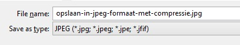
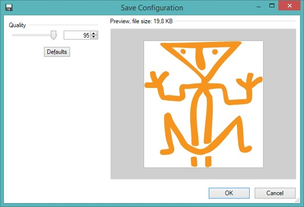
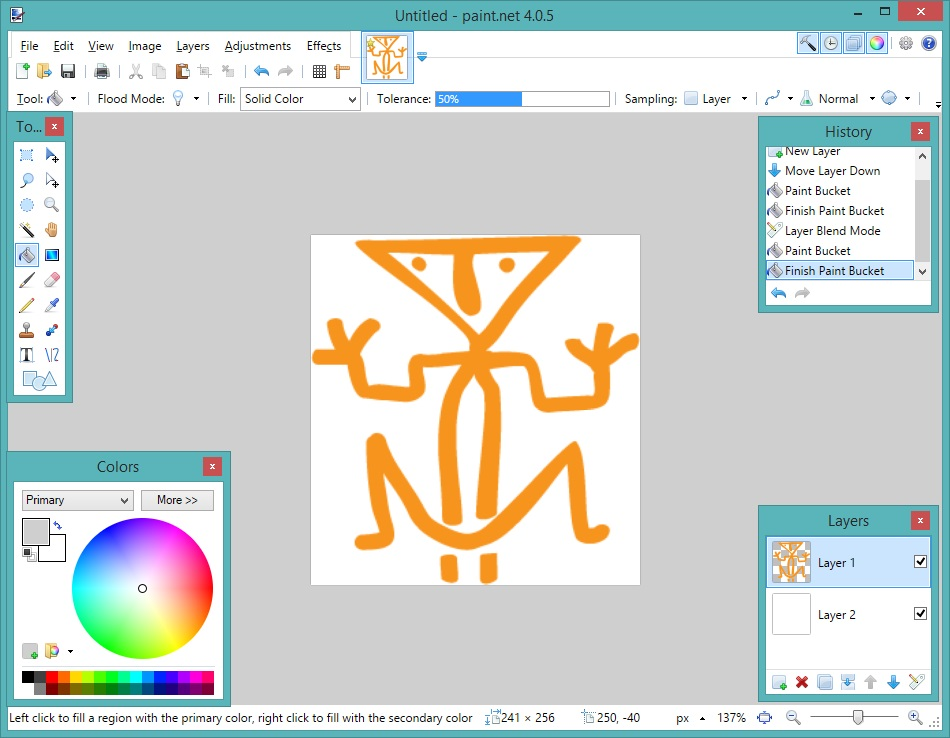

<properties>
	<page>
		<title>Afbeeldingen</title>
	</page>
	<menu>
		<position>Handleiding / Bijdragen</position>
		<title>Afbeeldingen</title>
	</menu>
</properties>

# Afbeeldingen gebruiken in pagina's #

Het gebruik van afbeeldingen maakt het voor gebruikers makkelijker. We raden aan om beschrijvingen te ondersteunen met beeldmateriaal. 

## Gebruik afbeeldingen ##

Je mag afbeeldingen gebruiken waar geen rechten van derden op rusten. 

Als je <label keyword="screenshot">screenshots</label> gebruikt, let dan op dat er geen gevoelige / klant- / bedrijfsgegevens zichtbaar zijn.

## Bestandsnaam afbeeldingen ##

De naam van het bestand moet beschrijvend zijn voor de inhoud. Je mag alleen <label>lowercase</label> gebruiken, zonder accenten en trema's. Ook moeten alle bijzondere karakters worden vermeden. Spaties moeten worden vervangen door een min-teken (**-**)

Voorbeelden van juiste bestandsnamen:
-dit-is-een-voorbeeld.jpg
-creeer-een-nieuw-bestand.jpg
-gebruik-van-getallen-zoals-123-is-ook-toegestaan.jpg

Voorbeelden van onjuiste bestandsnamen:
-dit is een voorbeeld.jpg (gebruik van spaties)
-creëer-een-nieuw-bestand.jpg (gebruik van accenten)
-gebruik-van-'bijzondere'-tekens.jpg (gebruik van bijzondere tekens, in dit geval de aanhalingstekens)

 

## Locatie afbeeldingen ##

Afbeeldingen moeten worden opgeslagen in de submap **/images** bij het artikel.   

## Afbeelding invoegen bij een artikel ##

Onze artikelen worden geschreven in <label>Markdown</label>, om een afbeelding in te voegen gebruik je de volgende opmaak.

	

## Opslaan van afbeeldingen, formaat en compressie ##
De afbeeldingen moeten worden opgeslagen in **JPEG-formaat**, de minimale kwaliteit (compressie) is **95%**, indien je een lagere kwaliteit kiest zal de afbeelding 'korrelig' worden.

## Software om afbeeldingen te bewerken ##

Om afbeeldingen te bewerken kan je elk programma gebruiken, maar als je geen voorkeur hebt, raden wij [Paint.net](http://www.dotpdn.com/downloads/pdn.html "Paint.net") aan. Deze software is gratis en makkelijk in gebruik.

