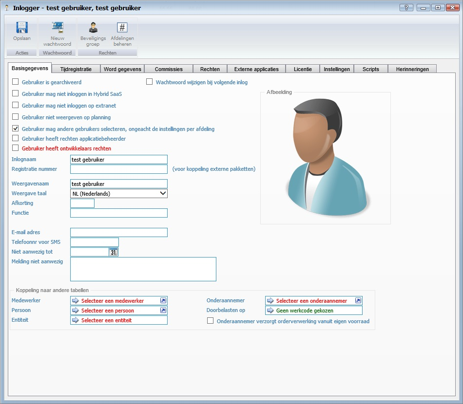

<properties>
	<page>
		<title>voorbeeldpagina</title>
		<description>voorbeeldpagina</description>
		<context></context>
	</page>
	<menu>
		<position>Handleiding / Bijdragen </position>
		<title>Voorbeeldpagina</title>
		<sort>A</sort>
	</menu>
</properties>

##De properties van de pagina::##

    <properties>
    	<page>
    		<title>voorbeeldpagina</title>
    		<description>voorbeeldpagina</description>
    		<context></context>
    	</page>
    	<menu>
    		<position>Handleiding / Bijdragen </position>
    		<title>Voorbeeldpagina</title>
    		<sort>A</sort>
    	</menu>
      </properties>

----------

##Woorden en zinnen benadrukken:##

Je kan op verschillende manieren woorden of zinnen benadrukken zie hieronder van welke:

	#Hoofdkop#
	##Kop##
    Opsommingstekens:
    
    - Rood
    - **Vetgedrukte letters**
    - *Schuine letters*
    
    Je kan ook extra informatie blokken ingeven hier zijn 3 varianten van:
    
    
Een Tip is blauw

    
Een Info is groen

    
Een Warning is rood

#Hoofdkop#
##Kop##
Opsommingstekens:

- Rood
- **Vetgedrukte letters**
- *Schuine letters*

Je kan ook extra informatie blokken ingeven hier zijn 3 varianten van:

Een Tip is blauw

Een Info is groen

Een Warning is rood

----------
Hiermee de pagina beginnen:

    #Voorbeeldpagina#

#HOOFDKOP: Voorbeeldpagina:#
Hier een algemeen verhaal over het onderwerp.

----------

    ##Alleen stukken tekst##

##KOP: Alleen stukken tekst##
Als je vele stukken tekst heb, gebruik dan ook veel nieuw koppen, zie hieronder voor een voorbeeld:

`##Wat is Hybrid SaaS?##`

##Wat is Hybrid SaaS?##
Hybrid SaaS is de online business software voor elke branche. De gebruiksvriendelijke bedrijfssoftware biedt onder andere online oplossingen op het gebied van relatiebeheer (CRM), projectbeheer, tijdregistratie, verkoopfacturatie, inkoopfacturatie en HR management. Hybrid SaaS is ontstaan vanuit de praktijk en is gebaseerd op onze jarenlange ervaring in ondernemen: wij weten dat je niet alle tijd aan je administratie en boekhouding wilt besteden. Hybrid SaaS werkt vanuit de gedachte “het moet simpeler en sneller kunnen”.

    ##Hoe werkt het?##

##Hoe werkt het?##
Onze applicatie wordt als een online dienst aangeboden volgens het SaaS-principe en is inmiddels een breed toegepaste vorm van het aanbieden van applicaties als een online dienst. De software-applicatie en de bijbehorende database met gegevens staan op een externe server. Via het internet heeft je toegang tot Hybrid SaaS. Daarnaast betekent het dat je alleen betaalt voor het deel dat je gebruikt. Daarom kunnen wij Hybrid SaaS aanbieden tegen een betaalbare prijs. Dat scheelt aanzienlijke in de kosten voor de aanschaf en het onderhoud ten opzichte van traditionele software.
    
    ##Het “Hybrid” van Hybrid SaaS##

##Het “Hybrid” van Hybrid SaaS##
Het unieke van Hybrid SaaS is het hybride gedeelte van onze online software. Doordat Hybrid SaaS gebruik maakt van een browser, die je lokaal installeert, is het werken met Hybrid SaaS te vergelijken met een applicatie die op je computer is geïnstalleerd. De Hybrid SaaS software staat echter online. Wij zorgen ervoor dat je altijd werkt met de meest recente versie en dus hoeft je zelf niets te updaten, je heeft geen omkijken naar het beheer, onderhoud en de back-ups. Geen gedoe dus.

----------

    ##Voorbeeld met afbeelding##
    

##KOP: Voorbeeld met afbeelding##
Probeer boven elke afbeelding in de kop aan te geven: of over de naam of over het onderwerp van de afbeelding,
dit leest sneller voor als je naar iets specifieks opzoek bent, dit geval zouden we kiezen voor **Basisgegevens**

    - Gebruiker is gearchiveerd
	    - Als deze gebruiker niet meer actief is zet je hem hiermee uit
    - Gebruiker niet weergeven op planning
	    - Hiermee kan je aangeven dat de gebruiker niet weergegeven mag worden op de planning
	- Inlognaam
		- Hier kan je de gebruiker een inlognaam geven
	- Registratie nummer *voor koppeling externe pakketten*
		- Hier geef je de gebruiker een registratie nummer
		
    **Afbeelding**

	- Hier kan je een foto van de gebruiker toevoegen

	**Koppeling naar andere tabellen**

	- Medewerker
		- Hier kan je een medewerker selecteren
	- Persoon
		- Hier kan je een persoon selecteren
	- Entiteit
		- Hier kan je een entiteit selecteren

- Gebruiker is gearchiveerd
	- Als deze gebruiker niet meer actief is zet je hem hiermee uit
- Gebruiker niet weergeven op planning
	- Hiermee kan je aangeven dat de gebruiker niet weergegeven mag worden op de planning
- Inlognaam
	- Hier kan je de gebruiker een inlognaam geven
- Registratie nummer *voor koppeling externe pakketten*
	- Hier geef je de gebruiker een registratie nummer

**Afbeelding**

- Hier kan je een foto van de gebruiker toevoegen

**Koppeling naar andere tabellen**

- Medewerker
	- Hier kan je een medewerker selecteren
- Persoon
	- Hier kan je een persoon selecteren
- Entiteit
	- Hier kan je een entiteit selecteren

----------

    ##Afbeelding gedeelte uitlichten##
    

##KOP: Afbeelding gedeelte uitlichten##
Om een aantal dingen duidelijker te laten maken in een afbeelding waar naar je moet kijken is een gedeelte te laten uitlichten het duidelijkst

We hebben hier gekozen om de bewerkingsknoppen te laten oplichten
voor meer informatie hoe je een afbeelding moet laten oplichten zie [Gedeelte laten uitlichten](http://hybridsaas.support/pages/bijdragen/afbeeldingen-bewerken/afbeeldingen)

    Om een link toe te voegen gebruik je
    [Gedeelte laten uitlichten](http://hybridsaas.support/pages/bijdragen/afbeeldingen-bewerken/afbeeldingen)

----------
Onderaan de pagina kan je de link zetten naar Home en eventueel naar de pagina die hier betrekking op heeft

    > - [Home](http://hybridsaas.support/pages)
    > - [Installeren]()

> - [Home](http://hybridsaas.support/pages)
> - [Voorbeeld](http://hybridsaas.support/pages/bijdragen/voorbeeld-pagina/voorbeeldpagina)

