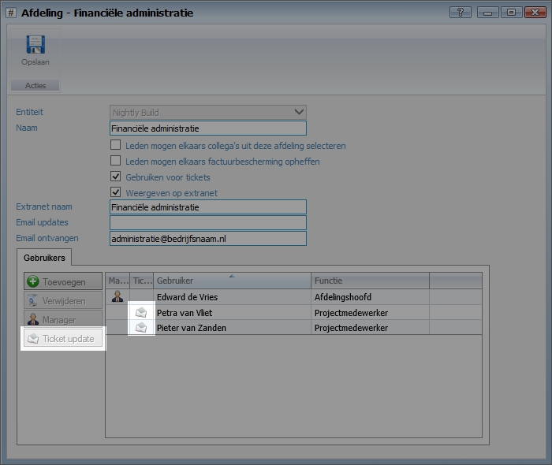
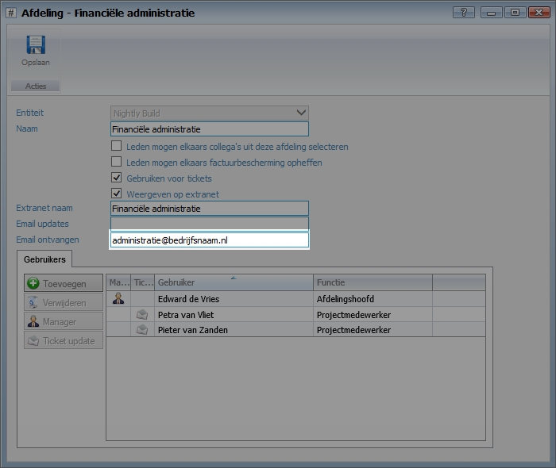

<properties>
	<page>
		<title>Ticketupdate per gebruiker instellen</title>
	</page>
	<menu>
		<position>Handleiding / Onderdeel / Modules / P-Z / Ticketsysteem </position> 
		<title>Instellen updates</title>
	</menu>
</properties>

# Ticketupdate per afdeling en/of gebruiker Instellen #

Wanneer er een ticket wordt aangemaakt, of wanneer er een wijziging of antwoord op een ticket wordt gegeven kan er een e-mail update naar gebruikers worden verzonden. Deze instellingen kunnen per gebruiker bij de "afdelingen" worden ingesteld. Daarnaast is het mogelijk in inkomende e-mail aan bepaalde mailadressen te koppelen aan afdelingen.

## Update per gebruiker instellen ##

Selecteer de gebruiker en klik op "Ticket update" 

## Tickets automatisch koppelen aan de juiste afdeling  ##

Het is mogelijk is tickets direct aan een afdeling te koppelen. Hi

Selecteer de gebruiker en klik op "update" 

Tevens is mogelijk om bij het e-mailsjabloon het antwoordadres direct door te laten verwijzen naar de afdeling. http://hybridsaas.support/pages/handleiding/systeem/spf-record/toevoegen

