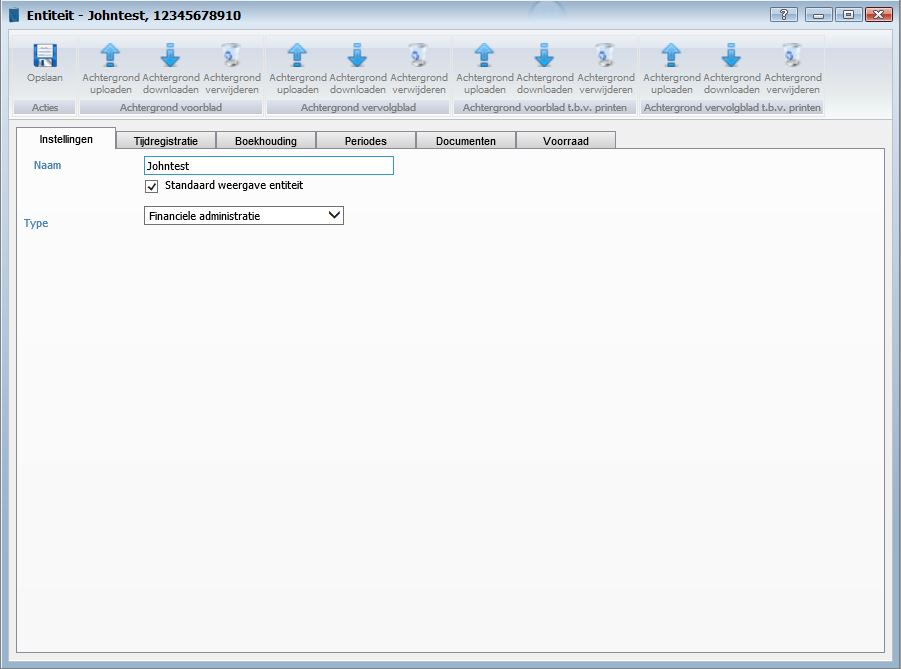

<properties>
	<page>
	</page>
	<menu>
		<title>Entiteit</title>
	</menu>
</properties>

#Extra#
<description>test
</description>

**Tabblad instellingen**

- Achtergrond uploaden
	- Hier kan je een afbeelding sjabloon aanhangen (deze zal worden weergegeven indien er aan een ander sjabloon geen afbeelding is gekoppeld
		- Je kan er voor kiezen om het vervolgblad een andere afbeelding te geven als het voorblad, ook voor het printen kan je weer een andere afbeelding aan hangen 
- Naam
	- Hier kan je de bedrijfsnaam invullen deze zal overal in het programma terug komen.

**Tabblad documenten**

*Adresgegevens voor word sjablonen*

- Adres
	- Geef hier het adres in.
- Postcode
	- Geef hier de postcode in.
- Plaats
	- Geef hier de plaats in.
- Land
	- Geef hier het land in.
- Telefoonnummer
	- Geef hier het telefoonnummer in.
- Fax
	- Geef hier het faxnummer in.
- Email
	- Geef hier het e-mailadres in.
- Website
	- Geef hier de website in.
- BTW nummer
	- Geef hier het BTW nummer in.
- KvK nummer
	- Geef hier het KvK nummer in.

*Bankrekening gegevens voor word sjablonen*

- Rekening houder
	- Geef hier het rekeninghouder in.
- Rekeningnummer
	- Geef hier het rekeningnummer in.
- IBAN
	- Geef hier het IBAN nummer in.
- SWIFT/BIC
	- Geef hier het SWIFT/BIC nummer in