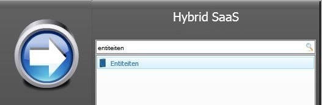
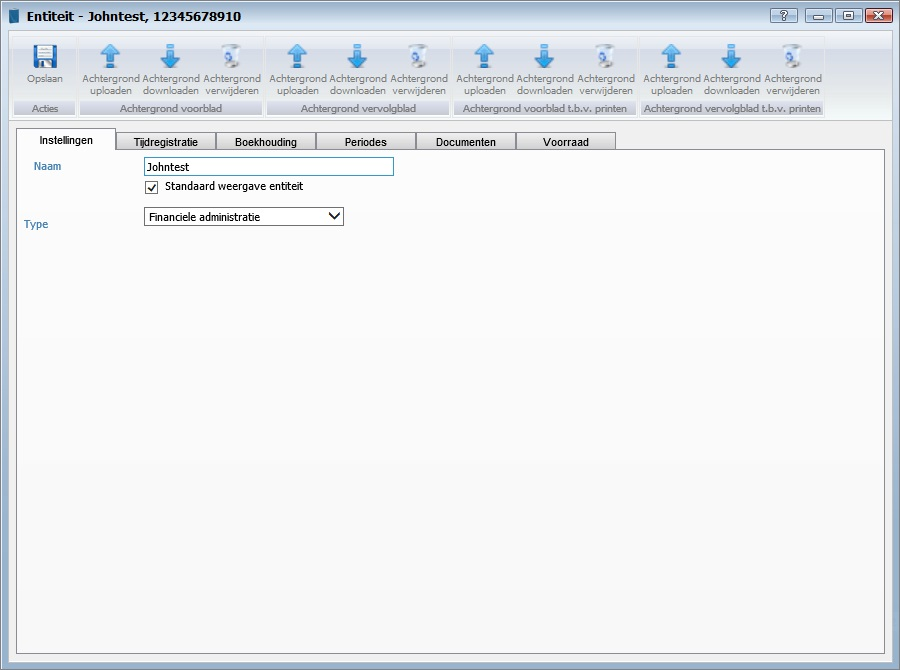
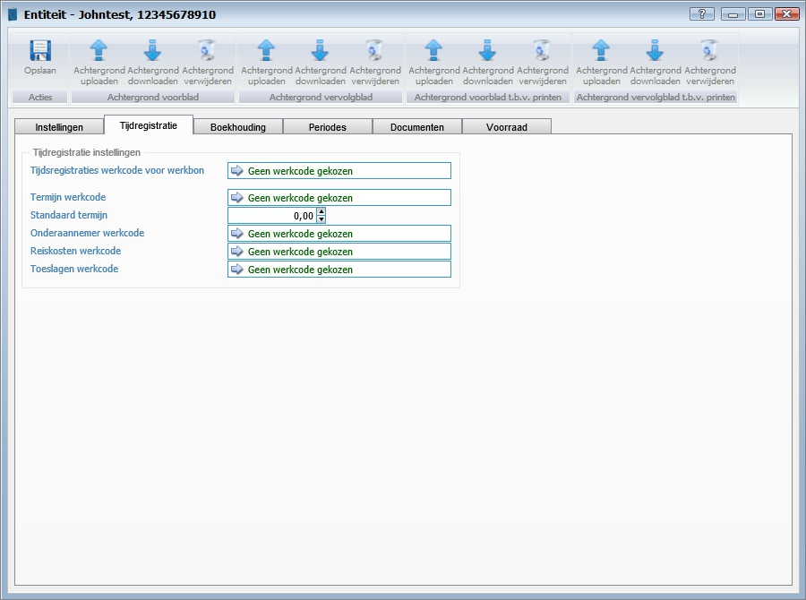
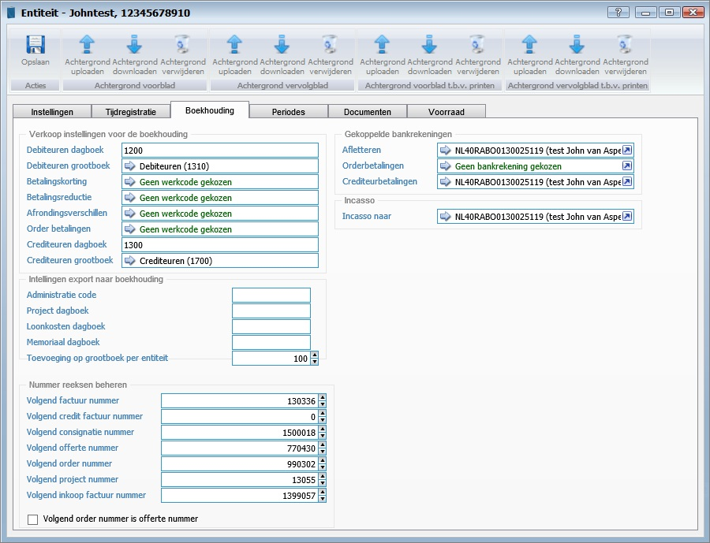
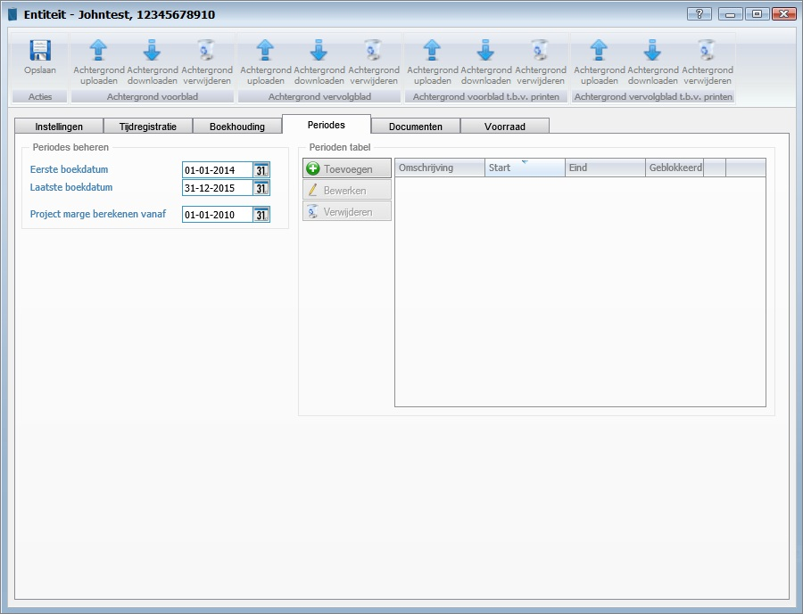
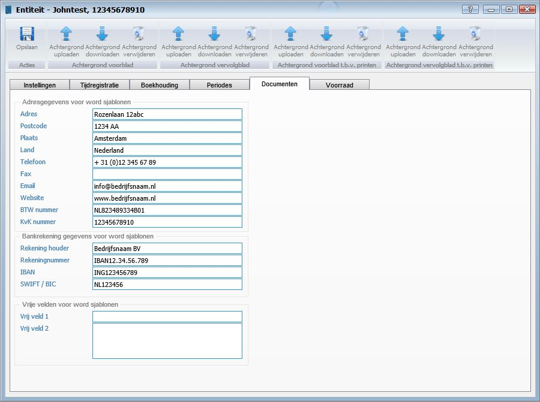
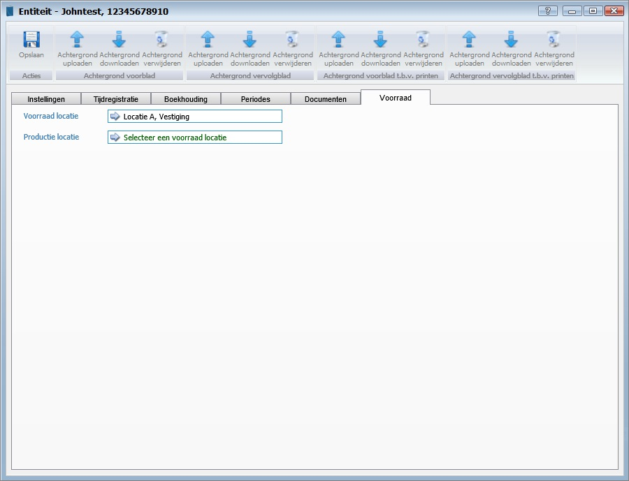

<properties>
	<page>
		<title>entiteit</title>
		<description>entiteit</description>
		<context>entities</context>
	</page>
	<menu>
		<position>Handleiding / Extra</position>
		<title>Entiteit</title>
		<sort>c</sort>
	</menu>
</properties>

#Entiteiten#
----------

#Start#

#Entiteiten#

**Acties**

- Toevoegen
- Bewerken
- Verwijderen
- Vernieuwen

#Entiteit#

**Acties**

- Opslaan

**Achtergrond voorblad**

- Achtergrond uploaden
	- Hier kan je een afbeelding sjabloon aanhangen (deze zal worden weergegeven indien er aan een ander sjabloon geen afbeelding is gekoppeld)
- Achtergrond downloaden
- Achtergrond verwijderen

**Achtergrond vervolgblad**

- Achtergrond uploaden
	- Je kan voor je vervolgblad een andere afbeelding kiezen je kan hem ook het zelfde als je voorblad houden
- Achtergrond downloaden
- Achtergrond verwijderen

**Achtergrond voorblad t.b.v. printen**

- Achtergrond uploaden
	- Hier kan je een afbeelding sjabloon aanhangen (deze zal worden weergegeven indien er aan een ander sjabloon geen afbeelding is gekoppeld) (dit is alleen wanneer het document word geprint)
- Achtergrond downloaden
- Achtergrond verwijderen

**Achtergrond vervolgblad t.b.v. printen**

- Achtergrond uploaden
	- Je kan voor je vervolgblad een andere afbeelding kiezen je kan hem ook het zelfde als je voorblad houden (dit is alleen wanneer het document word geprint)
- Achtergrond downloaden
- Achtergrond verwijderen

#Instellingen#

- Naam
	- Hier kan je de bedrijfsnaam invullen deze zal overal in het programma terug komen.
- Standaard weergave entiteit
- Type

#Tijdregistratie#

**Tijdregistratie instellingen**

- Tijdregistratie werkcode voor werkbon
- Termijn werkcode
- Standaard termijn
- Onderaannemer werkcode
- Reiskosten werkcode
- Toeslagen werkcode

#Boekhouding#

**Verkoop instellingen voor de boekhouding**

- Debiteuren dagboek
- Debiteuren grootboek
- Betalingskorting
- Betalingsreductie
- Afrondingverschillen
- Order betalingen
- Crediteuren dagboek
- Crediteuren grootboek

**Instellingen export naar boekhouding**

- Administratie code
- Project dagboek
- Loonkosten dagboek
- Memoriaal dagboek
- Toevoegingen op grootboek per entiteit

**Nummer reeksen beheren**

- Volgend factuur nummer
- Volgend credit factuur nummer
- Volgend consignatie nummer
- Volgend offerte nummer
- Volgend order nummer
- Volgend project nummer
- Volgend inkoop factuur nummer
- Volgend order nummer is offerte nummer

**Gekoppelde bankrekeningen**

- Afletteren
- Orderbetalingen
- Crediteurbetalingen

**Incasso**

- Incasso naar

#Periodes#

**Periodes beheren**

- Eerste boekdatum
- Laatste boekdatum
- Project marge berekenen vanaf

**Periodes**

- Toevoegen
- Bewerken
- Verwijderen

#Documenten#

**Adresgegevens voor word sjablonen**

- Adres
	- Geef hier het adres in.
- Postcode
	- Geef hier de postcode in.
- Plaats
	- Geef hier de plaats in.
- Land
	- Geef hier het land in.
- Telefoonnummer
	- Geef hier het telefoonnummer in.
- Fax
	- Geef hier het faxnummer in.
- Email
	- Geef hier het e-mailadres in.
- Website
	- Geef hier de website in.
- BTW nummer
	- Geef hier het BTW nummer in.
- KvK nummer
	- Geef hier het KvK nummer in.

**Bankrekening gegevens voor word sjablonen**

- Rekening houder
	- Geef hier het rekeninghouder in.
- Rekeningnummer
	- Geef hier het rekeningnummer in.
- IBAN
	- Geef hier het IBAN nummer in.
- SWIFT/BIC
	- Geef hier het SWIFT/BIC nummer in

**Vrije velden voor word sjablonen**

- Vrije veld 1
- Vrije veld 2

#Voorraad#

- Voorraad locatie
- Productie locatie

---------
[Stappenplan](http://hybridsaas.support/pages/handleiding/extra/omgeving)