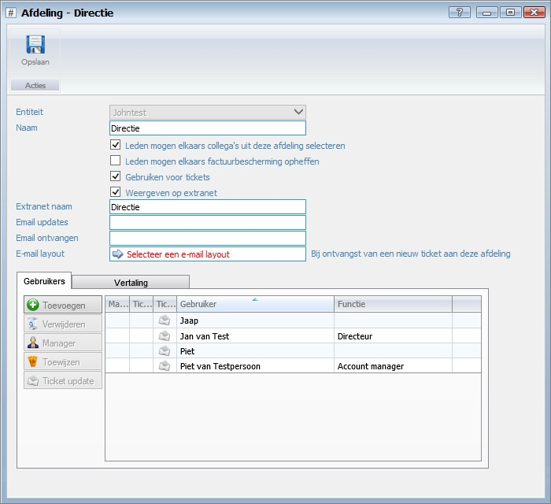

<properties>
	<page>
		<title>afdelingen</title>
		<description>afdelingen</description>
		<context>departments*</context>
	</page>
	<menu>
		<position>Handleiding / Extra</position>
		<title>Afdelingen</title>
		<sort></sort>
	</menu>
</properties>

#Afdelingen#
----------

#Start#

#Afdelingen#

**Acties**

- Toevoegen
- Bewerken 
- Verwijderen
- Vernieuwen

#Afdeling#

- Entiteit
- Naam
- Leden mogen elkaars collega's uit deze afdeling selecteren
- Leden mogen elkaars factuurbescherming opheffen
- Gebruiken voor tickets
- Weergeven op extranet
- Extranet naam
- Email updates
- Email ontvangen
- E-mail layout

**Gebruikers**

- Toevoegen
- Verwijderen
- Manager
- Toewijzen
- Ticket update

**Vertaling**

- Toevoegen
- Downloaden
- Bewerken
- Verwijderen
- Exporteren

---------
[Stappenplan](http://hybridsaas.support/pages/handleiding/extra/omgeving)