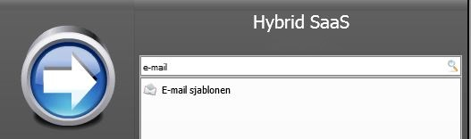
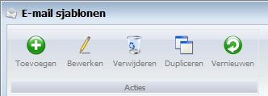
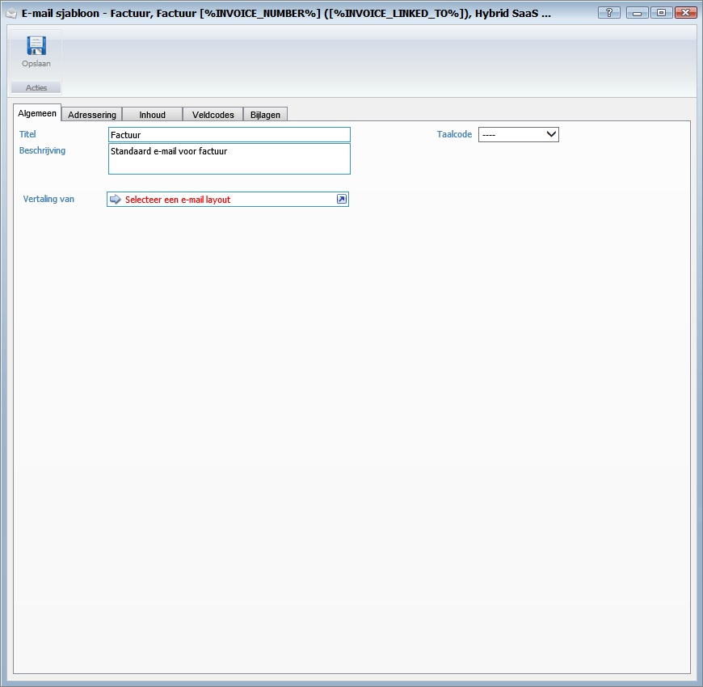
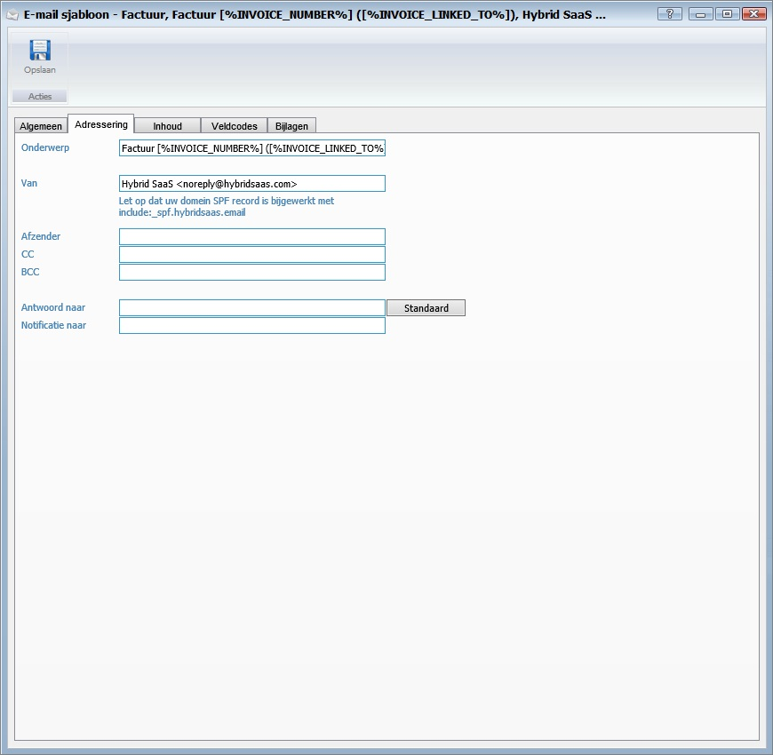
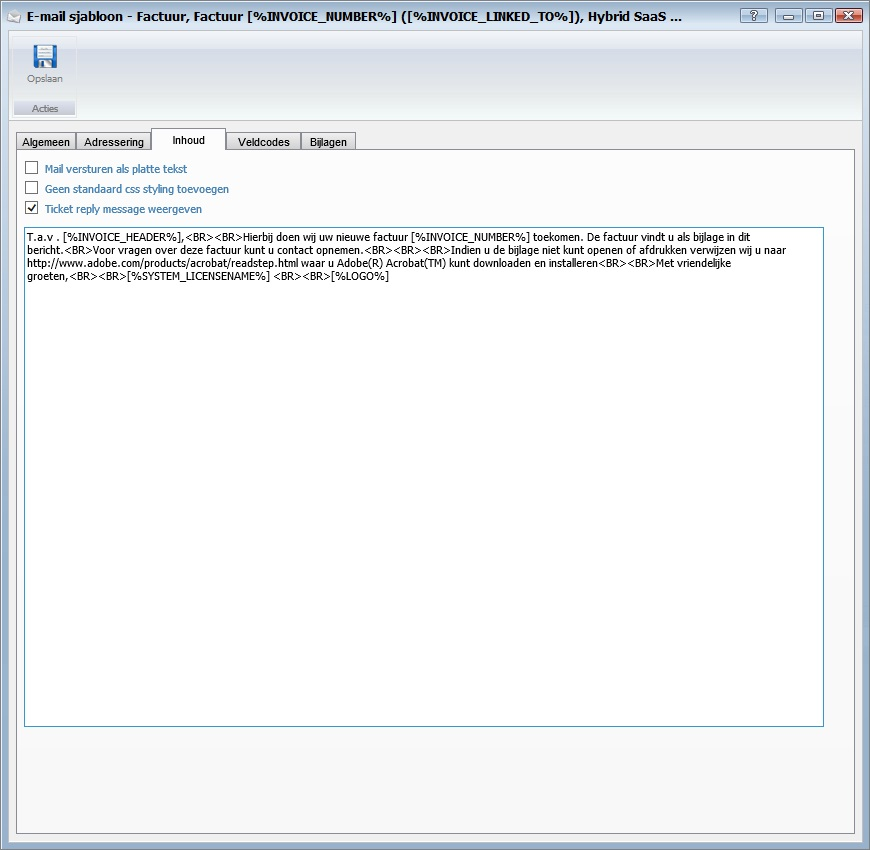
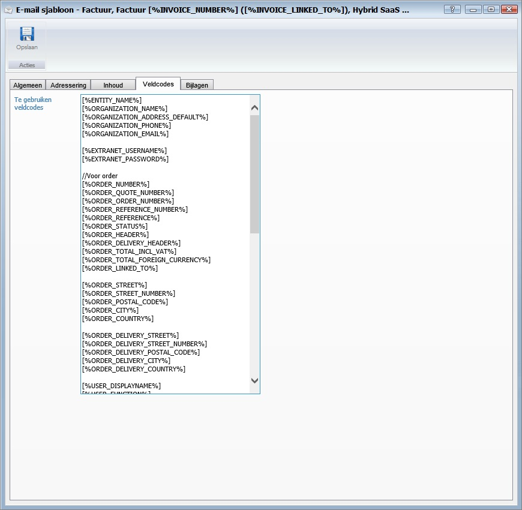

<properties>
	<page>
		<title>e-mail-sjablonen</title>
		<description>e-mail-sjablonen</description>
		<context>email-templates*</context>
	</page>
	<menu>
		<position>Handleiding / Extra</position>
		<title>E-mail Sjablonen</title>
		<sort></sort>
	</menu>
</properties>

#E-mail Sjablonen#
#Start#

#E-mail sjablonen#

#Algemeen#

- Titel
- Beschrijving
- Vertaling van
- Taalcode

#Adressering#

- Onderwerp
- van
- Afzender
- CC
- BCC
- Antwoord naar
- Standaard
- Notificatie naar

#Inhoud#

- Mail versturen als platte tekst
- Geen standaard css styling toevoegen
- Ticket reply message weergeven

#Veldcodes#

#Bijlagen#

**Bijlage naam voor dynamisch gegenereerde documenten**

- Bijlage naam

**Vaste bijlagen die met deze email worden meegestuurd**

- Toevoegen
- Downloaden
- Bewerken
- Verwijderen
- Exporteren

---------
**Ga verder**

----------
**Ga terug**
