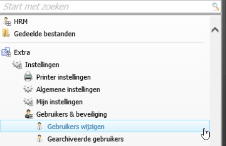
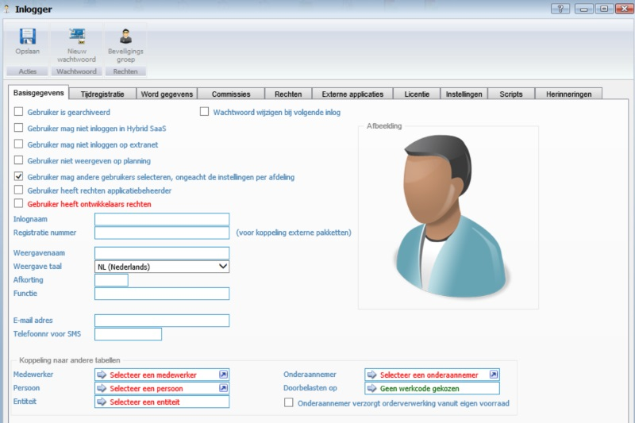

<properties>
	<page>
		<title>Gebruiker aanmaken/wijzigen</title>
		<id>gebruiker</id>
	</page>
	<menu>
		<position>Handleiding / Extra</position> 
		<title>Gebruiker aanmaken/wijzigen</title>
	</menu>
</properties>

#Gebruiker aanmaken/wijzigen#

Voor het aanmaken van een gebruiker ga je via de startknop naar menu "gebruikers wijzigen". 

 

Hierin kan je bestaande gebruikers wijzigen, verwijderen en/of archiveren.
Het aanmaken van een nieuwe gebruiker gaat door middel van de knop toevoegen.

