<properties>
	<page>
		<title>gebruikers</title>
		<description>gebruikers</description>
		<context>dlguser*</context>
	</page>
	<menu>
		<position>Handleiding / Extra</position> 
		<title>Gebruikers</title>
		<sort>d</sort>
	</menu>
</properties>

#Gebruikers#
----------

#Start#
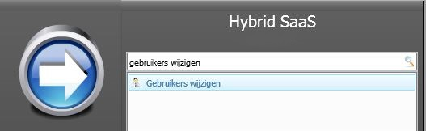
#Gebruikers wijzigen#
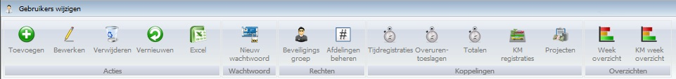

**Acties**

- Toevoegen
- Bewerken
- Verwijderen
- Vernieuwen
- Excel

**Wachtwoord**

- Nieuw wachtwoord

**Rechten**

- beveiligingsgroep
- Afdelingen beheren

**Koppelingen**

- Tijdregistratie
- Overuren toeslagen
- Totalen
- KM Registratie
- Projecten

**Overzichten**

- Week overzicht
- KM week overzicht

#Gebruiker#
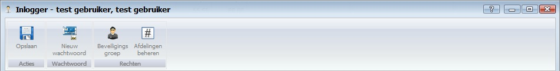

**Acties**

- Opslaan

**Wachtwoord**

- Nieuw wachtwoord

**Rechten**

- Beveiligingsgroep
- Afdeling beheren

#Basisgegevens#
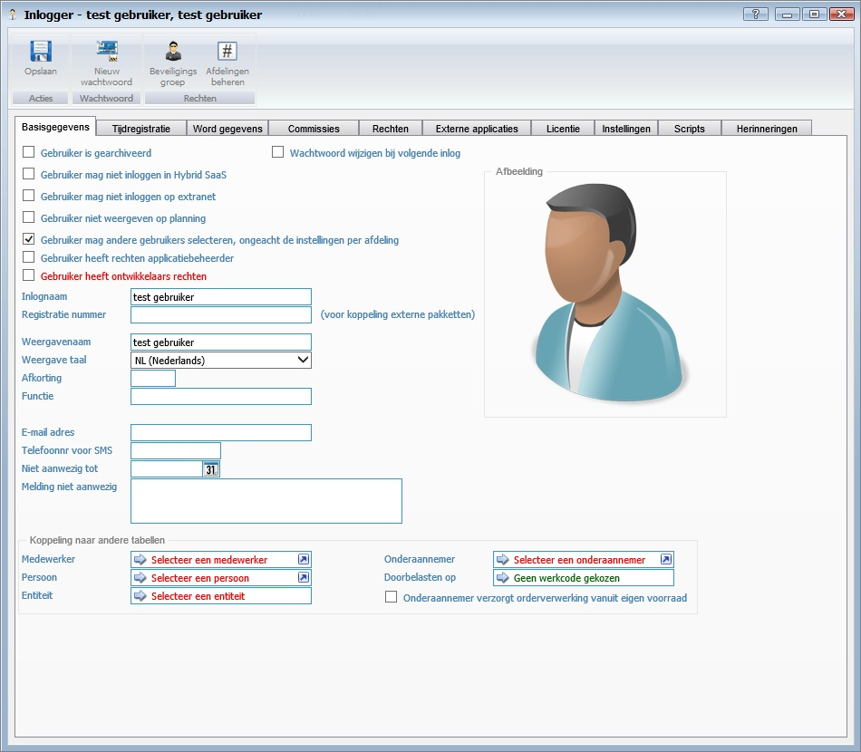

- Wachtwoord wijzigen bij volgende inlog
- Gebruiker is gearchiveerd
- Gebruiker mag niet inloggen in Hybrid SaaS
- Gebruiker mag iet inloggen op extranet
- Gebruiker niet weergeven op planning
- Gebruiker mag andere gebruikers selecteren, ongeacht de instellingen per afdeling
- Gebruiker heeft rechten applicatiebeheer
- Gebruiker heeft ontwikkelaars rechten
- Inlognaam
- Registratienummer
- Weergavenaam
- Weergave taal
- Afkorting
- Functie
- E-mail adres
- Telefoonnr voor SMS
- Niet aanwezig tot
- Melding niet aanwezig

**Afbeelding**

**Koppelingen naar andere tabellen**

- Medewerker
- Persoon
- Entiteit
- Onderaannemer
- Doorbelasten op
- Onderaannemer verzorgt orderverwerking vanuit eigen voorraad

#Tijdregistratie#
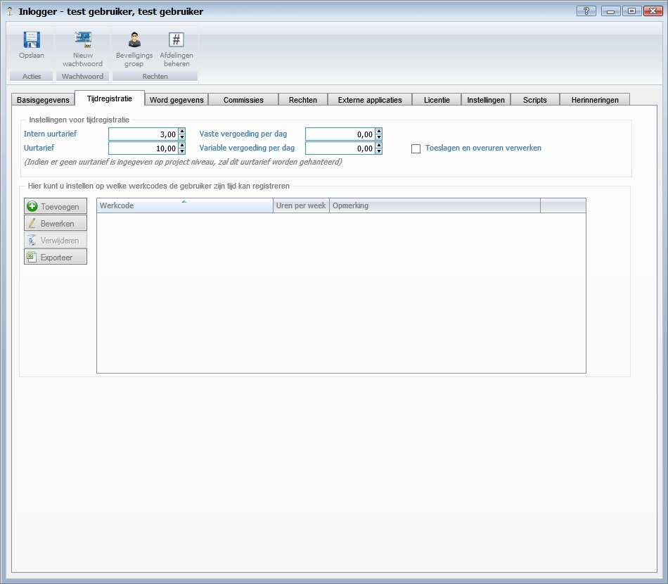

**Instellingen voor tijdregistratie**

- Intern uurtarief
- Uurtarief
- Vaste vergoeding per dag
- Variable vergoeding per dag
- Toeslagen en overuren verwerken

**Hier kunt u instellen op welke werkcodes de gebruiker zijn tijd kan registreren**

- Toevoegen
- Downloaden
- Bewerken
- Verwijderen
- Exporteren

#Word gegevens#
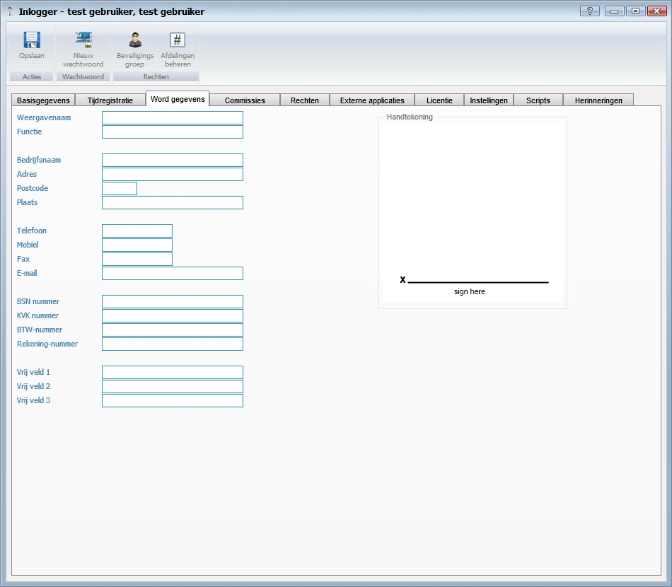

- Weergavenaam
- Functie
- Bedrijfsnaam
- Adres
- Postcode
- Plaats
- Telefoon
- Mobiel
- Fax
- E-mail
- BSN nummer
- KvK nummer
- BTW nummer
- Rekening nummer
- Vrije veld 1
- Vrije veld 2
- Vrije veld 3
- [Handtekening]()

#Commissies#
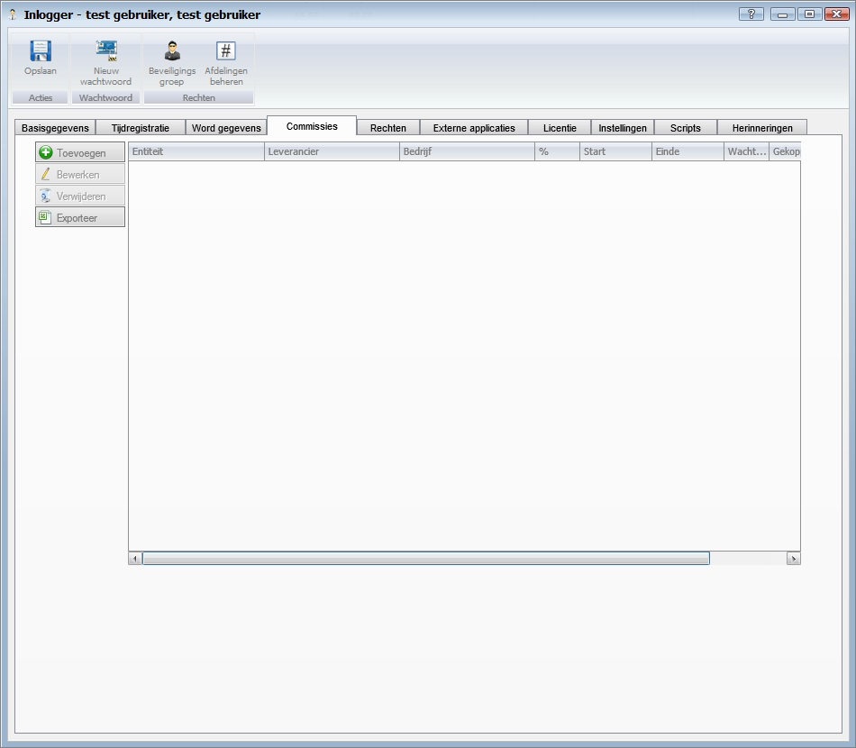

- Toevoegen
- Bewerken
- Verwijderen
- Exporteren

#Rechten#
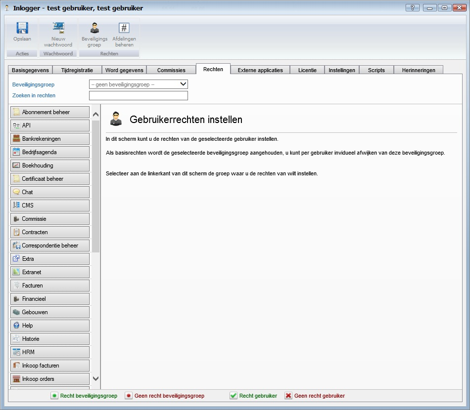

- Beveiligingsgroep
- Zoeken in rechten

#Externe applicaties#
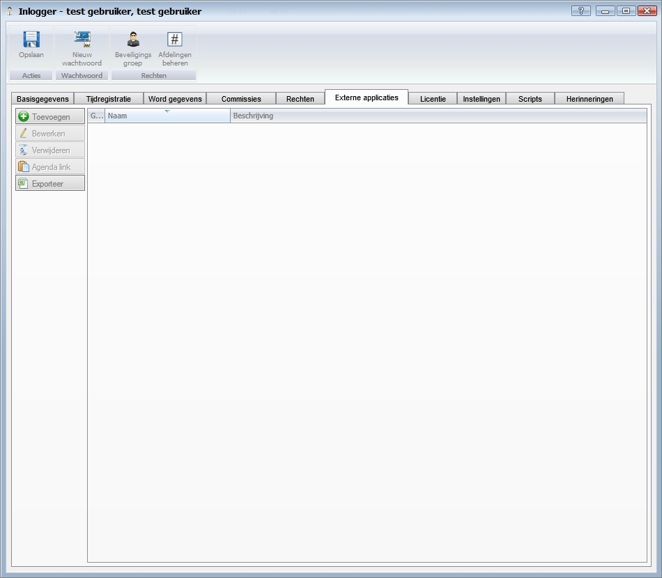

- Toevoegen
- Bewerken
- Verwijderen
- Agenda link
- Exporteren

#Licentie#
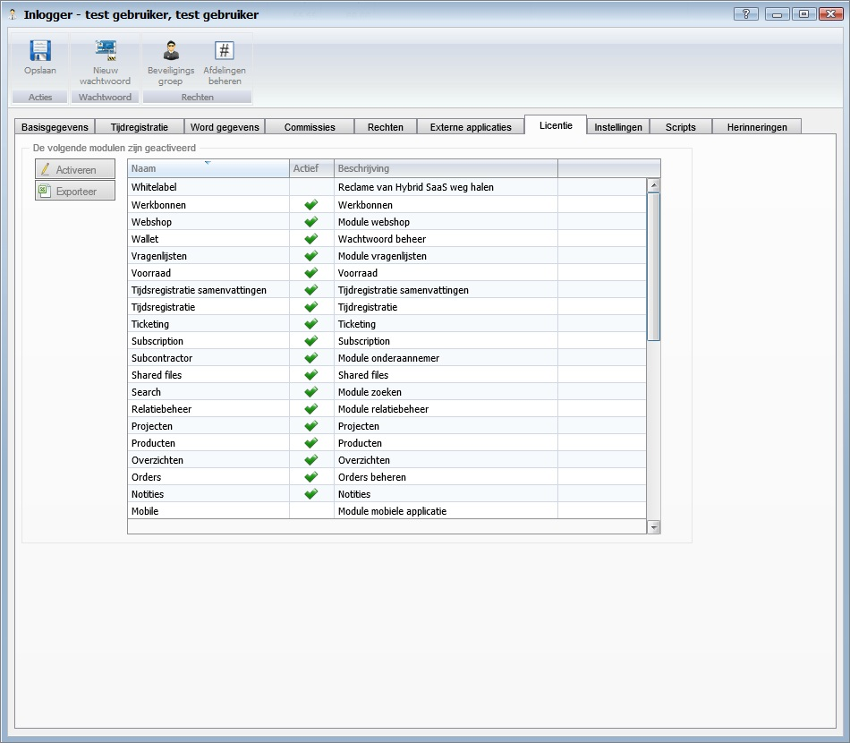

**De volgende modulen zijn geactiveerd**

- Activeren
- Exporteren

#Instellingen#
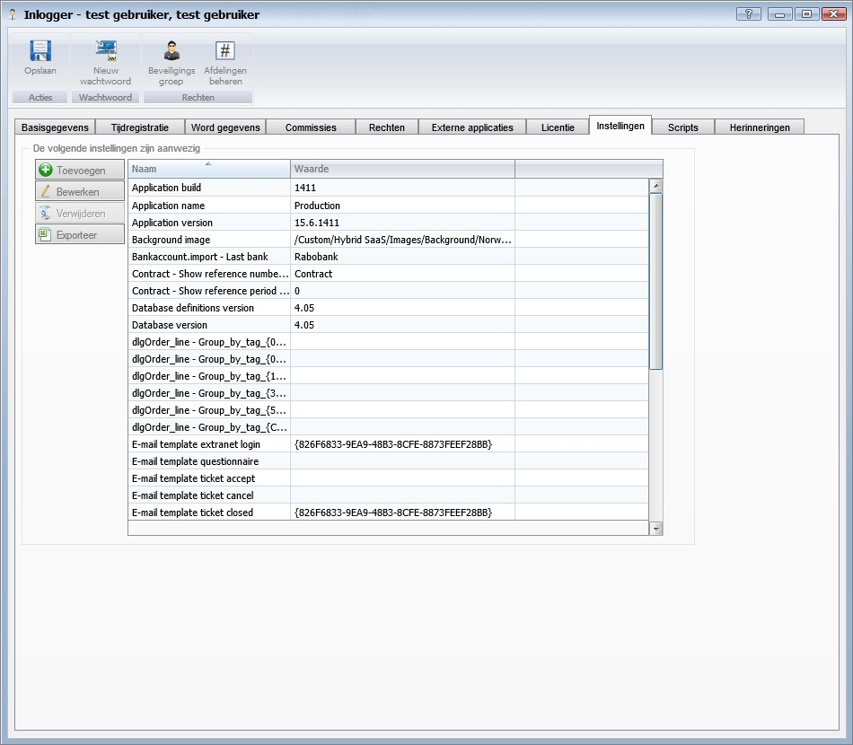

**De volgende instellingen zijn aanwezig**

- Toevoegen
- Bewerken
- Verwijderen
- Exporteren

#Scripts#
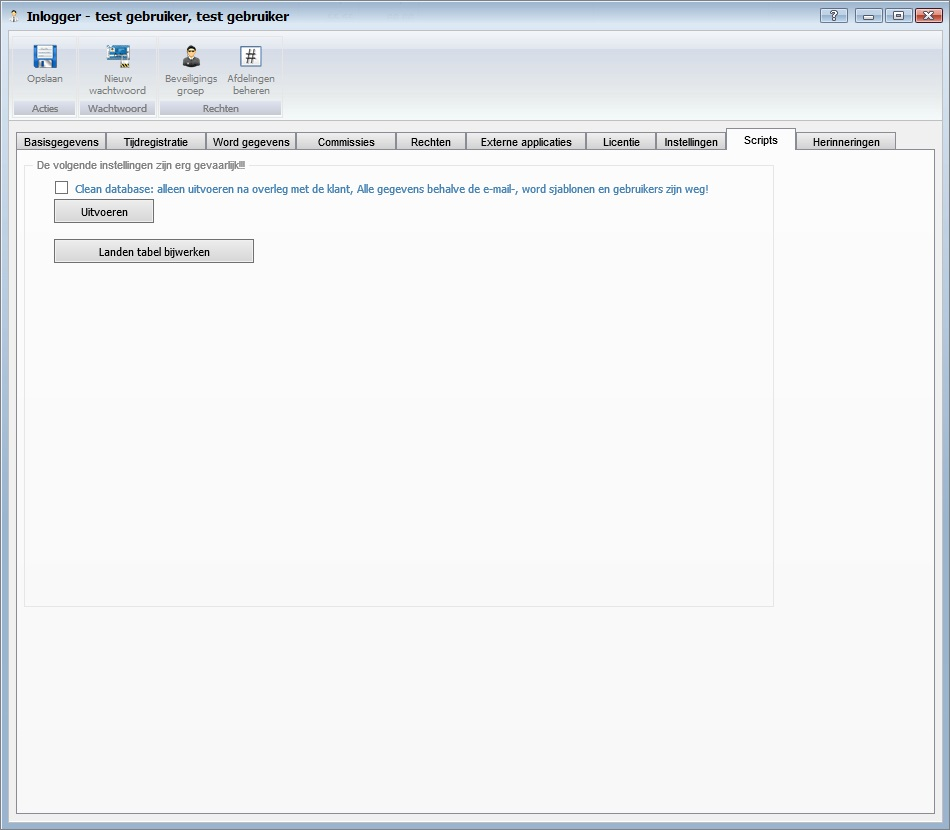

**De volgende instellingen zijn erg gevaarlijk!!!**

- Clean database
- Uitvoeren
- Landentabel verwijderen

#Herinneringen#
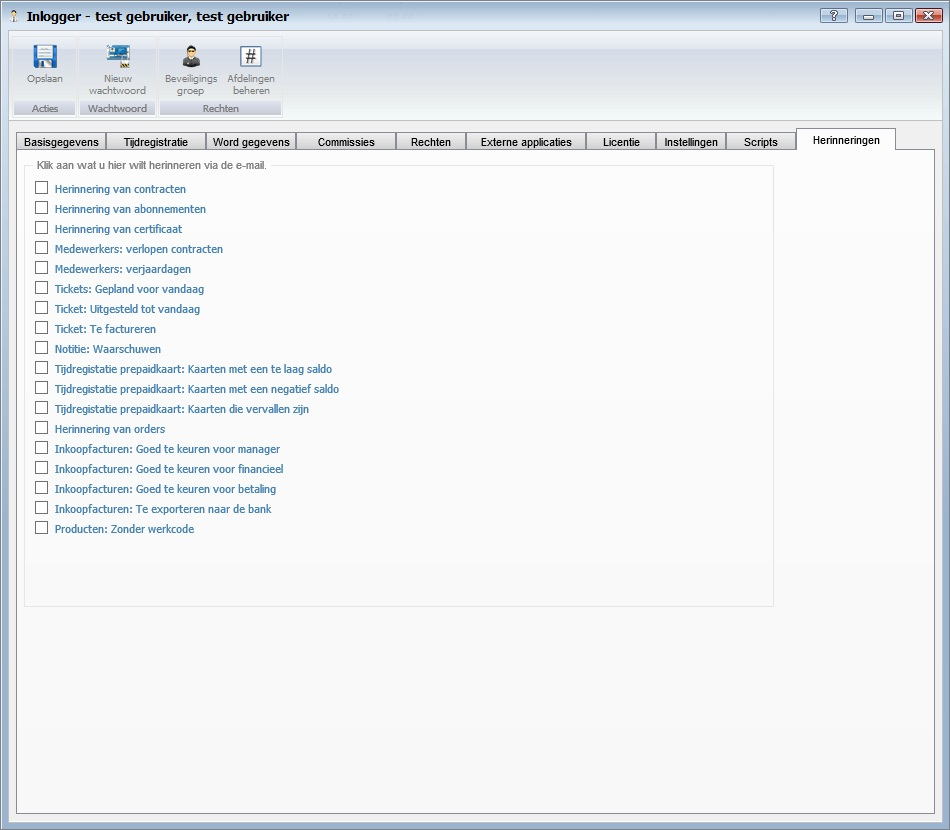

**Klik aan wat u wilt herinneren via de e-mail**

- Herinnering van contracten
- Herinnering van abonnementen
- Herinnering van certificaten
- Medewerkers: verlopen contracten
- Medewerkers: verjaardagen
- Tickets: Gepland voor vandaag
- Ticket: Uitgesteld tot vandaag
- Ticket: Te factureren
- Notitie: Waarschuwen
- Tijdregistratie prepaidkaart: Kaarten met een te laag saldo
- Tijdregistratie prepaidkaart: Kaarten met een negatief saldo
- Tijdregistratie prepaidkaart: Kaarten die vervallen zijn
- Herinnering van orders
- Inkoopfacturen: Goed te keuren voor manager
- Inkoopfacturen: Goed te keuren voor financieel
- Inkoopfacturen: Goed te keuren voor betaling
- Inkoopfacturen: Te exporteren naar de bank
- Producten: Zonder werkcode

---------
[Stappenplan](http://hybridsaas.support/pages/handleiding/extra/omgeving)