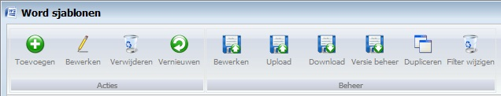
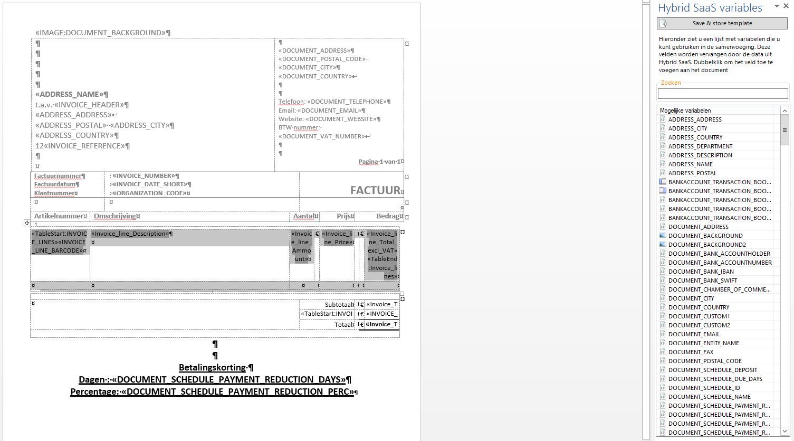
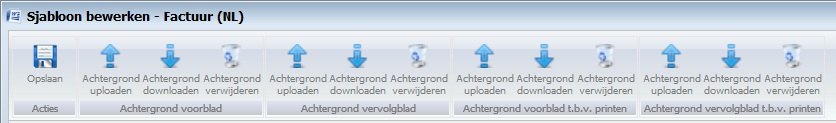
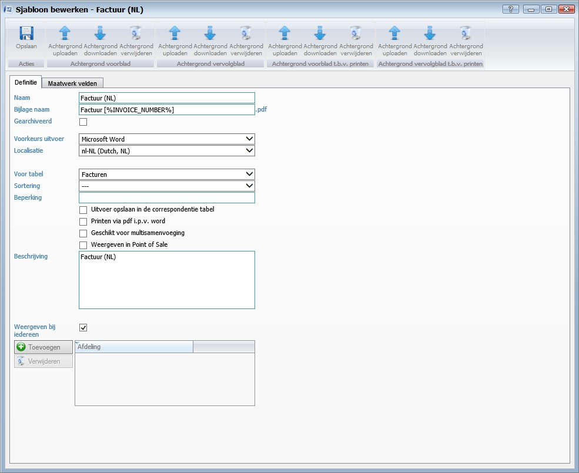
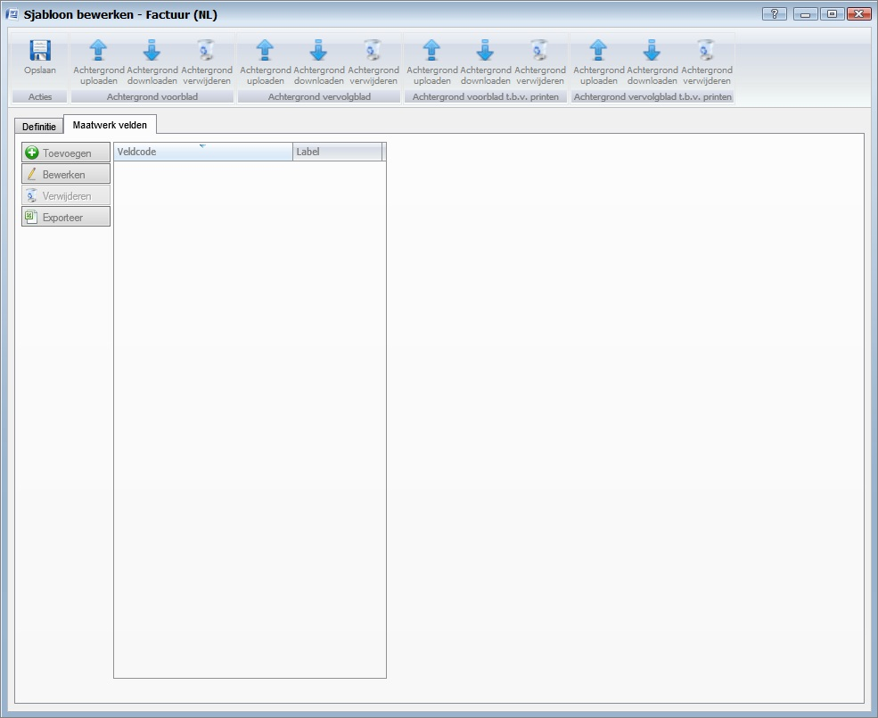

<properties>
	<page>
		<title>word-sjablonen</title>
		<description>word-sjablonen</description>
		<context>document-word*</context>
	</page>
	<menu>
		<position>Handleiding / Extra</position>
		<title>Word Sjablonen</title>
		<sort>g</sort>
	</menu>
</properties>

#Word Sjablonen#
----------

#Start#

#Word sjablonen#

**Acties**

- Toevoegen
- Bewerken
	- Door op de regel te gaan staan en te klikken op bewerken zal er een word document worden geopend, dit is op gebouwd uit variables en hierin kan je het aanpassen.
- Verwijderen
- Vernieuwen

**Beheer**

- Bewerken
- Uploaden
- Downloaden
- Versie beheer
- Dupliceren
- Filter wijzigen

#Variables#

#Sjabloon bewerken#

**Acties**

- Opslaan

**Achtergrond voorblad**

- Achtergrond uploaden
	- Hier kan je een afbeelding sjabloon aanhangen (laat je deze leeg dan wordt die van de Entiteit gebruikt)
- Achtergrond downloaden
- Achtergrond verwijderen

**Achtergrond vervolgblad**

- Achtergrond uploaden
	- Je kan voor je vervolgblad een andere afbeelding kiezen je kan hem ook het zelfde als je voorblad houden (laat je deze leeg dan wordt die van de Entiteit gebruikt)
- Achtergrond downloaden
- Achtergrond verwijderen

**Achtergrond voorblad t.b.v. printen**

- Achtergrond uploaden
	- Hier kan je een afbeelding sjabloon aanhangen (deze zal worden weergegeven indien er aan een ander sjabloon geen afbeelding is gekoppeld) (dit is alleen wanneer het document word geprint) (laat je deze leeg dan wordt die van de Entiteit gebruikt)
- Achtergrond downloaden
- Achtergrond verwijderen

**Achtergrond vervolgblad t.b.v. printen**

- Achtergrond uploaden
	- Je kan voor je vervolgblad een andere afbeelding kiezen je kan hem ook het zelfde als je voorblad houden (dit is alleen wanneer het document word geprint) (laat je deze leeg dan wordt die van de Entiteit gebruikt)
- Achtergrond downloaden
- Achtergrond verwijderen

#Definitie#

- Naam
- Bijlage naam
- Gearchiveerd
- Voorkeurs uitvoer
- Localisatie
- Voor tabel
- Sortering
- Beperking
- Uitvoer opslaan in de correspondentie tabel
- Printen via pdf i.p.v. word
- Geschikt voor multisamenvoeging
- Weergeven in Point of Sale
- Beschrijving
- Weergeven bij iedereen
- Toevoegen
- Verwijderen

#Maatwerk velden#

- Toevoegen
- Bewerken
- Verwijderen
- Exporteren

---------
[Stappenplan](http://hybridsaas.support/pages/handleiding/extra/omgeving)