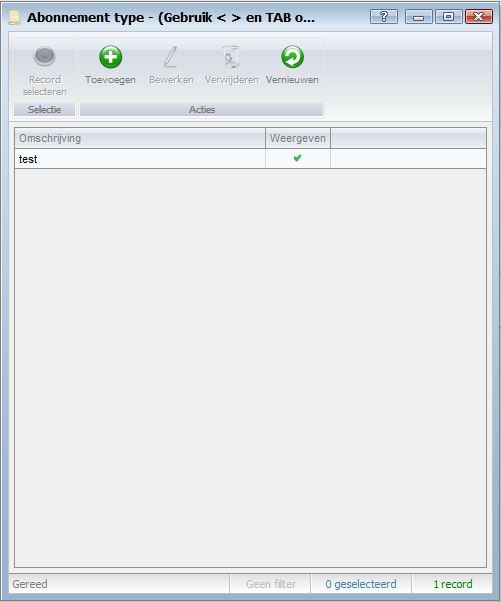
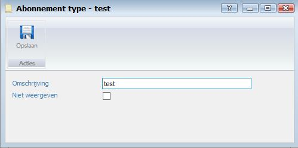
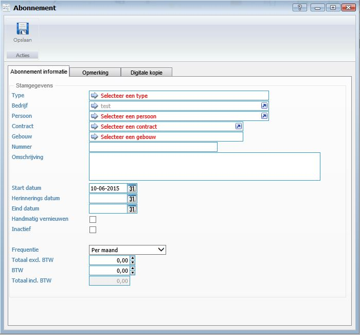
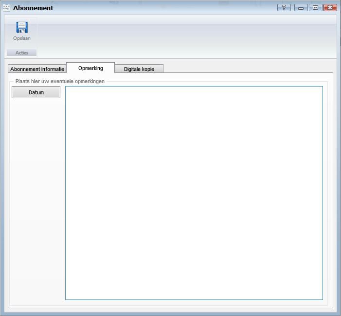
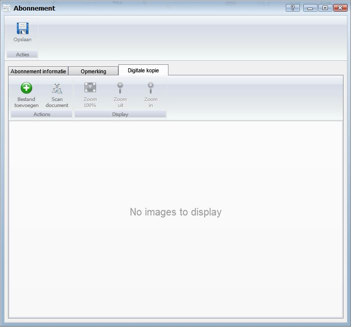

<properties>
	<page>
		<title>Abonnementen</title>
		<description>Abonnementen</description>
		<context>dlgsubscription*</context>
		<context>subscription-type*</context>
	</page>
	<menu>
		<position>Handleiding / Modules / A - E / Abonnementen</position>
		<title>Abonnementen aanmaken</title>
		<sort>B</sort>
	</menu>
</properties>

Terug naar <[Abonnementen](http://hybridsaas.support/pages/handleiding/modules/A-E/abonnementen/introductie)>
<[Relatie aanmaken](http://hybridsaas.support/pages/handleiding/modules/P-Z/relatiebeheer/relatiebeheer)>

----------

#Aanmaken van Abonnementype#
*Introductie*

In dit artikel wordt het proces om een abonnement type aan te maken beschreven. Abonnement types worden aangemaakt om de abonnementen te categoriseren in groepen. Voorbeeld: U maakt een abonnement aan. Het abonnement is een telefoonabonnement. U kunt voor dit abonnement een abonnement type telefonie aanmaken.

**Type**

**Toevoegen**

- Omschrijving
	- Hier kunt u de omschrijving van het abonnement type ingeven.
- Niet weergeven
	- Vink aan wanneer u het abonnement type niet wilt weergeven op de tabellen.

#Aanmaken van Abonnementen#
*Introductie*

In dit artikel wordt het proces om een abonnement aan te maken beschreven. Abonnementen worden vastgelegd bij de relaties en dienen via de relatiekaart aangemaakt te worden. Voordat u een abonnement kunt vastleggen bij een relatie dient u eerst een relatie aan te maken.

**Tabblad Abonnement informatie**

*Stamgegevens* 

- Type
	- Hier kunt u het abonnement type selecteren. Om een abonnement type te selecteren dient u wel eerst abonnement type 's aan te maken.
- Bedrijf
- Persoon
- Contract
- Gebouw
- Nummer
	- Hier kunt u een abonnement nummer ingeven. Het veld abonnement nummer is een vrij veld om in te vullen.
- Omschrijving
	- Hier kunt u de omschrijving van het abonnement ingeven.
- Start datum
	- Hier kunt u de start datum van het abonnement ingeven.
- Herinneringsdatum
	- Hier kunt u de datum van wanneer u een herinnering wilt ontvangen ingeven.
- Eind datum
	- Hier kunt u de eind datum van het abonnement ingeven.
- Handmatig vernieuwen
	- Vink aan wanneer u het abonnement handmatig wilt vernieuwen. Wanneer u dit veld niet aanvinkt loopt het abonnement automatisch door.
- Inactief
	- Vink aan wanneer het abonnement niet meer of niet actief is.
- Frequentie
	- Hier kunt u de frequentie van het abonnement ingeven. Bijvoorbeeld per maand of kwartaal.
- Totaal excl. BTW
	- Hier kunt u de prijs exclusief BTW ingeven.
- BTW
	- Hier kunt u het BTW bedrag ingeven.
- Totaal incl. BTW
	- Hier kunt u het bedrag inclusief BTW van het abonnement ingeven.

**Tabblad Opmerkingen**

	
- In het tabblad opmerking kunt u een opmerking plaatsen over het abonnement. Dit veld is een vrij in te geven veld. Om een datum toe te voegen aan de opmerking klikt u op de button Datum.

**Tabblad Digitale Kopie**

- Bestand toevoegen
	- Om een bestand toe te voegen vanaf uw computer klikt u op de button Toevoegen en opent u de file.
- Scan document
	- Om een document vanuit HybridSaaS te scannen waardoor het gescande document direct word ingelezen klikt u op de button Scan document.
- Zoom 100%
	- Hiermee kan je het document inzoomen naar 100%.
- Zoom uit
	- Hiermee kan je het document uitzoomen.
- Zoom in
	- Hiermee kan je het document inzoomen.

----------

Terug naar <[Abonnementen](http://hybridsaas.support/pages/handleiding/modules/A-E/abonnementen/introductie)>
<[Relatie aanmaken](http://hybridsaas.support/pages/handleiding/modules/P-Z/relatiebeheer/relatiebeheer)>