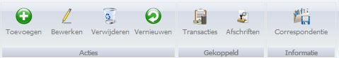

<properties>
	<page>
		<title>Introductie bankrekeningen</title>
		<description>Introductie bankrekeningen</description>
		<context>bankaccounts*</context>
	</page>
	<menu>
		<position>Handleiding / Modules / A - E / Bankrekeningen </position> 
		<title>Introductie</title>
		<sort>A</sort>
	</menu>
</properties>

#Bankrekeningen#
De module Hybrid SaaS Bankrekeningen schept orde in de chaos. U kan eenvoudig banktransacties importeren en afletteren waardoor u altijd inzicht heeft in de openstaande en betaalde facturen.

#Buttonbalk#

*Acties*

- Toevoegen
- Bewerken
- Verwijderen
- Vernieuwen

*Gekoppeld*

- Transacties
- Afschriften

*Informatie*

- Correspondentie

----------

Ga naar <[Bankrekening aanmaken]()>
<[Bankrekening als kas aanmaken]()>
<[Betaalmethode aanmaken]()>

----------

<[Automatische incasso](http://hybridsaas.support/pages/handleiding/modules/A-E/bankrekeningen/automatische-incasso)>
<[Verwijderen van de bankrekeningimport](http://hybridsaas.support/pages/handleiding/modules/A-E/bankrekeningen/bankrekening-import-verwijderen)>

----------

<[Banktransactie importeren]()>
<[Banktransactie importeren MT940]()>

----------
<[Handmatige transactie inboeken]()>