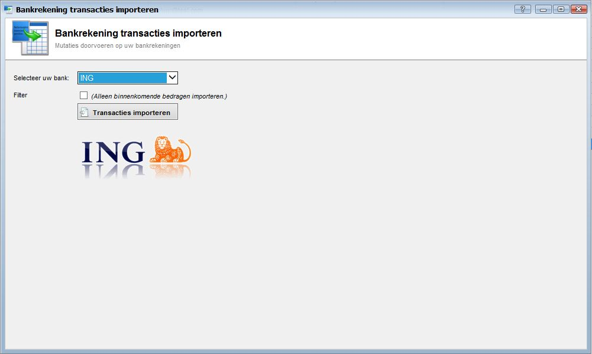

<properties>
	<page>
		<title>Banktransactie importeren</title>
		<description>Banktransactie importeren</description>
	</page>
	<menu>
		<position>Handleiding / Modules / A - E / Bankrekeningen </position> 
		<title>Banktransactie importeren</title>
		<sort>f</sort>
	</menu>
</properties>

Ga terug <[Bankrekeningen](http://hybridsaas.support/pages/handleiding/modules/A-E/bankrekeningen/Introductie)> 

----------

#Banktransactie importeren#
In dit artikel wordt het proces om banktransacties te importeren beschreven. Voordat u banktransacties kunt inlezen dient u eerst een bestand bij uw bank te downloaden.

- Selecteer uw bank
	- Selecteer de bank waarvan u de banktransacties wilt importeren.
- Filter
	- Vink aan wanneer u alleen de binnenkomende bedragen wilt importeren.
- Transacties importeren
	- Om het bestand van de bank te importeren klikt u op de button Transacties importeren.

----------
Ga terug <[Bankrekeningen](http://hybridsaas.support/pages/handleiding/modules/A-E/bankrekeningen/Introductie)> 