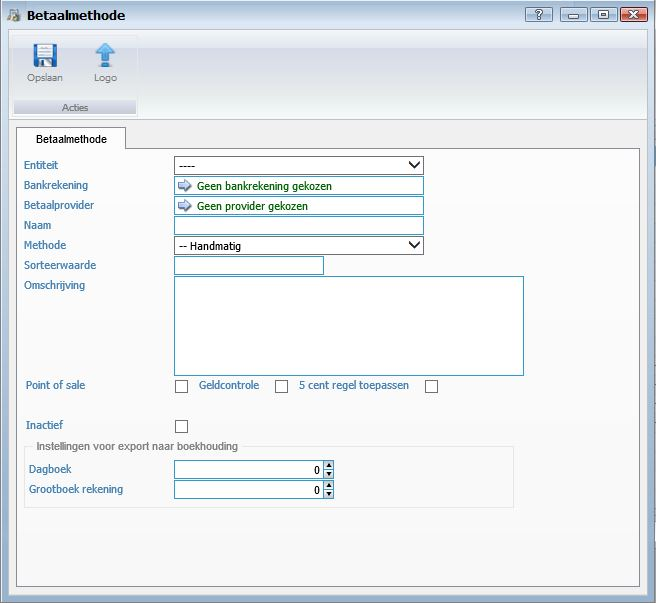

<properties>
	<page>
		<title>Bankrekeningen</title>
		<description>Bankrekeningen</description>
		<context>dlgpayment-method*</context>
	</page>
	<menu>
		<position>Handleiding / Modules / A - E / Bankrekeningen </position> 
		<title>Betaalmethode aanmaken</title>
		<sort></sort>
	</menu>
</properties>

Ga terug <[Bankrekeningen](http://hybridsaas.support/pages/handleiding/modules/A-E/bankrekeningen/Introductie)> 

----------

#Een betaalmethode aanmaken#

**Tabblad Betaalmethode**

- Logo
	- Om een logo van de betaalmethode in te geven klikt u op de button Logo.
- Entiteit
	- Hier kunt u de entiteit van de betaalmethode selecteren.
- Bankrekening
	- Hier kunt u de bankrekening ingeven van de entiteit.
- Betaalprovider
- Naam
	- Hier kunt u de naam van de betaalmethode ingeven.
- Methode
- Sorteerwaarde
- Omschrijving
	- Hier kunt u de omschrijving van de betaalmethode ingeven.
- Point of sale
- Geldcontrole
- 5 cent regel toepassen
- Inactief
	- Vink aan als de betaalmethode op niet actief ingesteld moet worden.

*Instellingen voor export naar boekhouding*

- Dagboek
- Grootboek rekening

----------

Ga terug <[Bankrekeningen](http://hybridsaas.support/pages/handleiding/modules/A-E/bankrekeningen/Introductie)> 