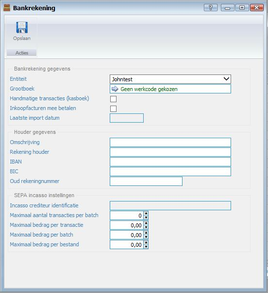

<properties>
	<page>
		<title>Bankrekeningen</title>
		<description>Bankrekeningen</description>
		<context>dlgbankaccount*</context>
	</page>
	<menu>
		<position>Handleiding / Modules / A - E / Bankrekeningen </position> 
		<title>Bankrekening aanmaken</title>
		<sort></sort>
	</menu>
</properties>

Ga terug <[Bankrekeningen](http://hybridsaas.support/pages/handleiding/modules/A-E/bankrekeningen/Introductie)> 

----------

#Een nieuwe bankrekening aanmaken#
*Introductie*

De functies van het invoervenster bankrekeningen word in dit artikel behandeld. Afhankelijk van de gekozen modules zullen de verschillende menu items worden getoond.
Bankrekeningen dienen aangemaakt te worden om financiële handelingen in Hybrid SaaS uit te voeren, deze zijn nodig om banktransacties in te lezen, (inkoop)facturen af te letteren en om de winst en verliesrekening weer te geven.

**Tabblad Bankrekening**

*Bankrekening gegevens*

- Entiteit
	- Entiteit word automatisch ingegeven. Tenzij u meerdere entiteiten heeft aangemaakt. In dat geval kunt u hier de entiteit selecteren.
- Grootboek
	- Selecteer de grootboekrekening welke bij de bank hoort.
- Handmatige transacties (kasboek)
- Inkoopfacturen mee betalen
- Laatste import datum
	- Dit veld wordt automatisch aangepast bij het importeren van bankrekeningtransacties.

*Houder gegevens*

- Omschrijving
	- Geef de naam in van de bankrekening. (bijvoorbeeld kas of Rabobank)
- Rekening houder
	- Geef de naam van de rekeninghouder in.
- IBAN
	- Hier kunt u de IBAN ingeven.
- BIC
- Oud rekeningnummer

*SEPA incasso instellingen*

- Incasso crediteur identificatie
- Maximaal aantal transacties per batch
- Maximaal bedrag per transactie
- Maximaal bedrag per batch
- Maximaal bedrag per bestand

----------

Ga terug <[Bankrekeningen](http://hybridsaas.support/pages/handleiding/modules/A-E/bankrekeningen/Introductie)> 