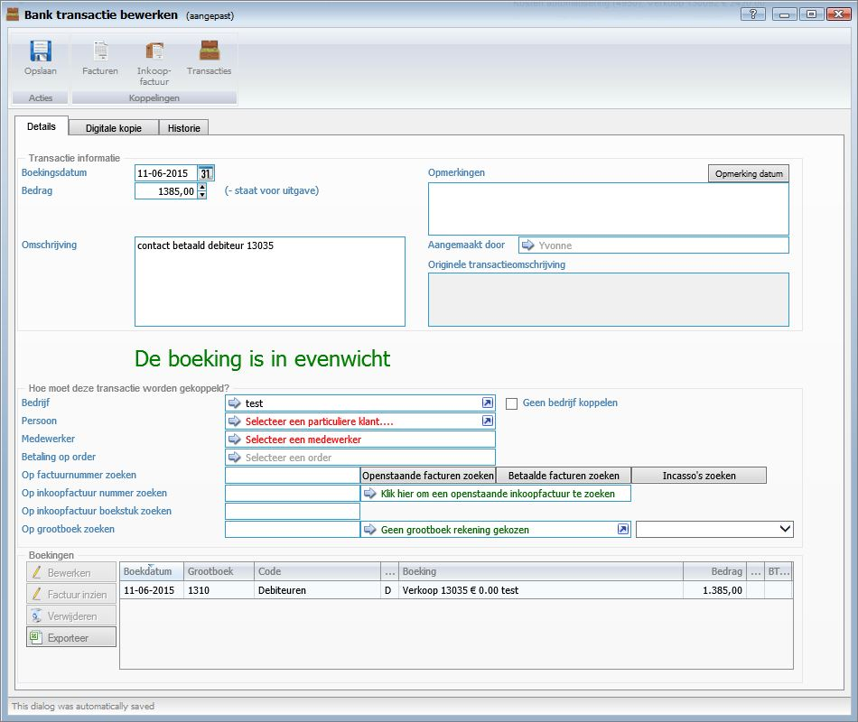
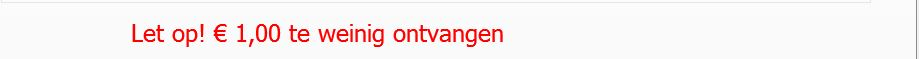
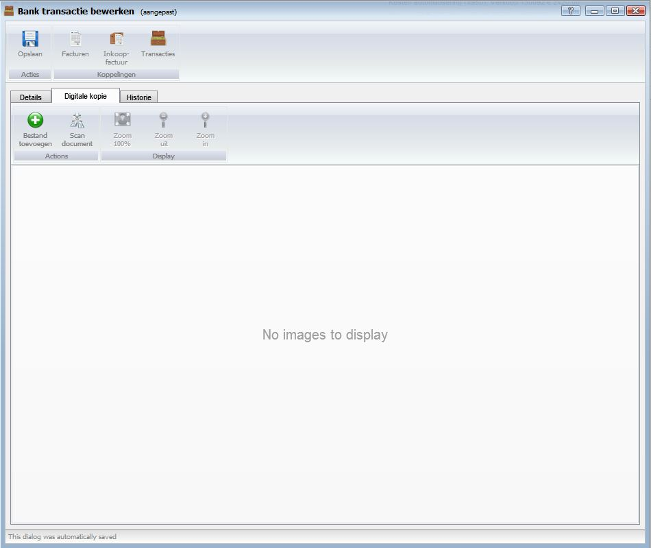
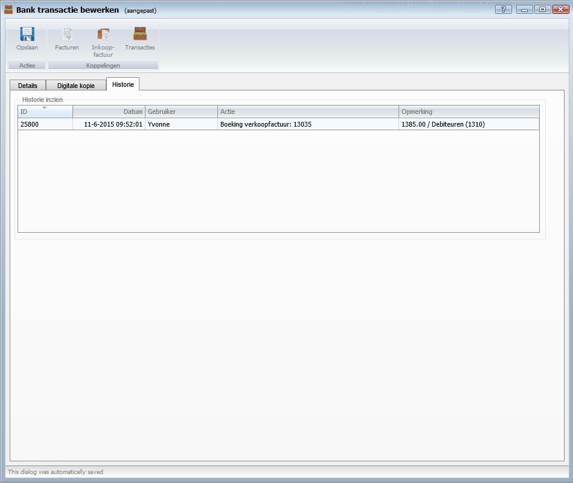

<properties>
	<page>
		<title>Handmatige transactie inboeken</title>
		<description>Handmatige transactie inboeken</description>
	</page>
	<menu>
		<position>Handleiding / Modules / A - E / Bankrekeningen </position> 
		<title>Handmatige transactie inboeken</title>
		<sort>i</sort>
	</menu>
</properties>

Ga terug <[Bankrekeningen](http://hybridsaas.support/pages/handleiding/modules/A-E/bankrekeningen/Introductie)> 

----------
#Handmatige transacties inboeken#
In dit artikel wordt het proces om een handmatige transactie in te boeken beschreven

**Tabblad Details**

*Transacties informatie*

- Boekingsdatum
	- Geef hier de boekingsdatum van de transactie in.
- Bedrag
	- Geef hier het bedrag van de transactie in.
- Omschrijving
	- Geef hier de omschrijving van de transactie in.
- Opmerkingen
- Opmerking datum
- Aangemaakt door
- Originele transactieomschrijving

*Hoe moet deze transactie worden gekoppeld*

- Bedrijf
	- Hier kunt u een Bedrijf selecteren. (U bent verplicht om een bedrijf of persoon of een medewerker te selecteren.)
- Geen bedrijf koppelen
	- Hier kunt u aangeven dat u dit rekening nummer niet automatische wilt koppelen aan dit bedrijf
- Persoon
	- Hier kunt u een Persoon selecteren. (U bent verplicht om een bedrijf of persoon of een medewerker te selecteren.)
- Medewerker
	- Hier kunt u een Medewerker selecteren. (U bent verplicht om een bedrijf of persoon of een medewerker te selecteren.)
- Betaling op order
- Op factuurnummer zoeken
	- Hier kunt u een factuur koppelen aan deze transactie d.m.v. het zoeken op:
		- Openstaande facturen zoeken
		- Betaalde facturen zoeken
		- Incasso's zoeken
- Op inkoopfactuur nummer zoeken
	- Hier kunt u een inkoopfactuur koppelen aan deze transactie d.m.v. zoeken op:
		- Inkoopfactuurnummer 
		- Openstaande inkoop factuur zoeken.
- Op inkoopfactuur boekstuk zoeken
	- Hier kunt u een inkoopfactuur koppelen aan deze transactie d.m.v. zoeken op:
		- Het boekstuk nummer.
- Op grootboek zoeken
	- Hier kunt u een grootboekrekening koppelen aan deze transactie d.m.v. zoeken op:
		- Het grootboeknummer 
		- Grootboekrekening te selecteren.

**Boeking is in evenwicht**

 Wanneer u de transactie gekoppeld heeft aan de juiste factuur, inkoopfactuur of grootboekrekening wordt er aangegeven dat De boeking in evenwicht is. Op het moment dat u de verkeerde koppeling heeft gemaakt kunt u dat herstellende in de boekingen. Selecteer de boeking en klik op bewerken, factuur inzien of verwijderen.

**Tabblad Digitale Kopie**

**Tabblad Historie**

----------
Ga terug <[Bankrekeningen](http://hybridsaas.support/pages/handleiding/modules/A-E/bankrekeningen/Introductie)> 
