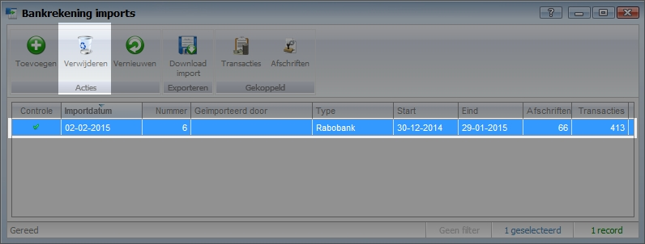

<properties>
	<page>
		<title>Bankrekeningimport verwijderen</title>
	</page>
	<menu>
		<position>Handleiding / Modules / A - E / Bankrekeningen </position> 
		<title>Bankimport verwijderen</title>
	</menu>
</properties>

# Verwijderen van de bankrekeningimport #

Het is mogelijk om een bankrekening import te verwijderen wanneer deze is ingelezen. Ge hiervoor naar bankrekeningen > transacties > bankrekening imports. Selecteer de import welke verwijderd dient te worden en klik op verwijderen.

Wanneer de import wordt verwijderd zullen alle geboekte transacties komen te vervallen. Dit kan betekenen dat reeds geboekte in- en verkoopfacturen weer open komen te staan.

