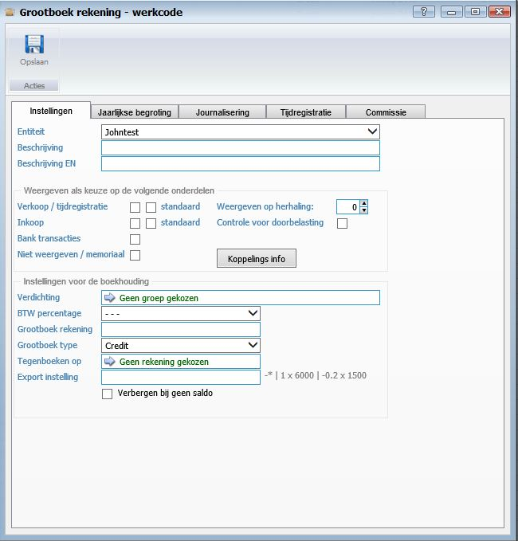
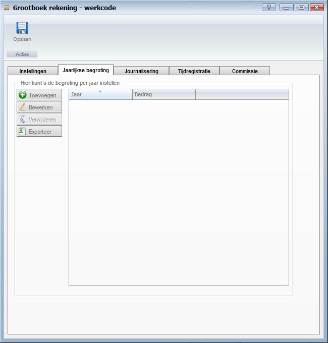
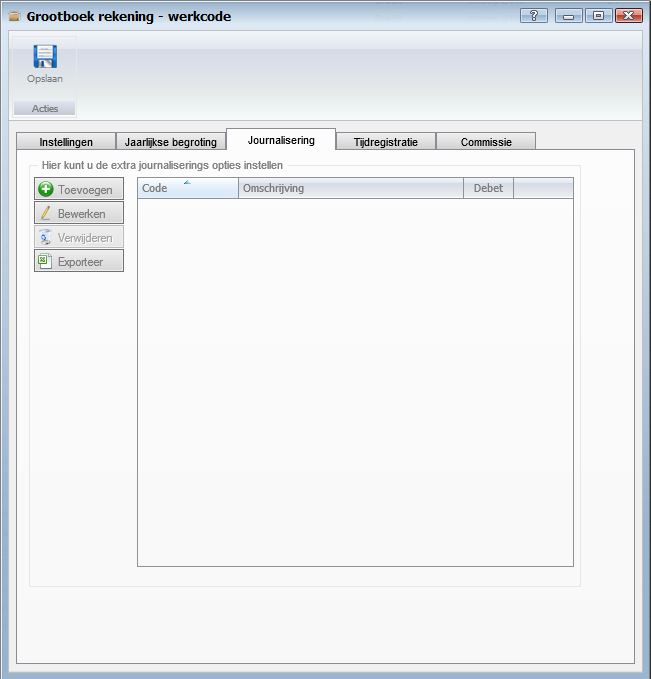
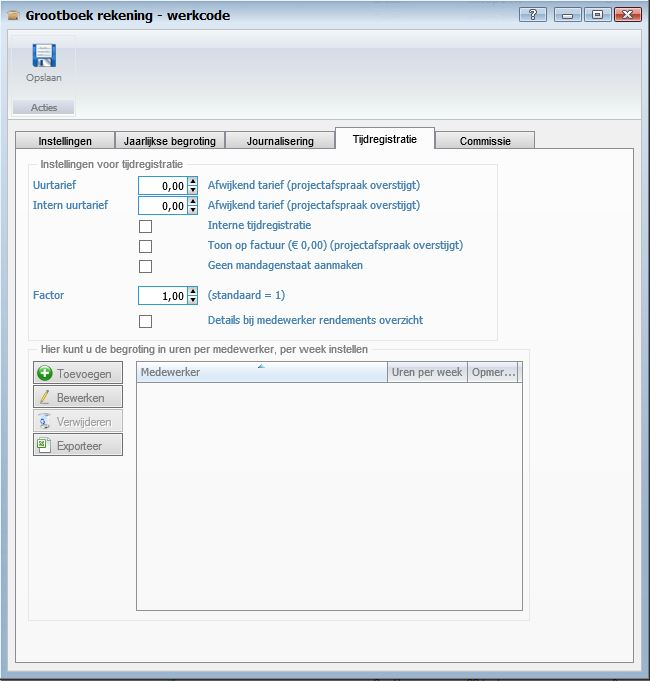
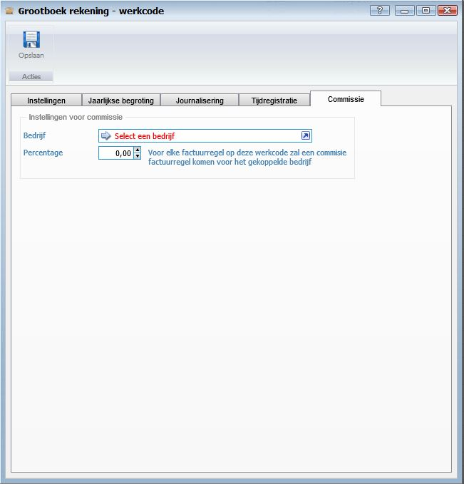

<properties>
	<page>
		<title>Grootboekrekening-aanmaken</title>
		<description>Grootboekrekening-aanmaken</description>
		<context>dlgwork-code*</context>
	</page>
	<menu>
		<position>Handleiding / Modules / A - E / Boekhouding</position>
		<title>Grootboekrekening aanmaken</title>
		<sort>B</sort>
	</menu>
</properties>

Terug naar {[Tijdregistratie](http://hybridsaas.support/pages/handleiding/modules/P-Z/tijdregistratie/tijdregistratie)} {[Boekhouding](http://hybridsaas.support/pages/handleiding/modules/A-E/boekhouding/boekhouding)}
# Grootboek rekening/werkcode aanmaken #

**Aanmaken van een grootboek rekening/werkcode**

**Tabblad Instellingen**

 

- Entiteit
- Beschrijving
- Beschrijving EN

*Weergeven als keuze op de volgende onderdelen*

- Verkoop/tijdregistratie
- Standaard
- Inkoop
- Standaard
- Bank transacties
- Niet weergeven/memoriaal
- Weergeven op herhaling
- Controle voor doorbelasting
- Koppelings info

*Instellingen voor de boekhouding*

- Verdichting
- BTW percentage
- Grootboek rekening
- Grootboek type
- Tegenboeken op
- Export instelling
- Verbergen bij geen saldo 

**Tabblad Jaarlijkse begroting**

 

*Hier kunt u de begroting per jaar instellen*

**Tabblad Journalisering**

 

*Hier kunt u de extra journaliserings opties instellen*

**Tabblad Tijdregistratie**

 

*Instellingen voor tijdregistratie*

- Uurtarief
- Intern uurtarief
- Interne tijdregistratie
- Toon op factuur
- Geen mandagenstaat aanmaken
- Factor
- Details bij medewerker rendements overzicht

*Hier kunt u de begroting in uren per medewerker, per week instellen*

**Tabblad Commissie**

*Instellingen voor commissie*

- Bedrijf
- Percentage

Terug naar {[Tijdregistratie](http://hybridsaas.support/pages/handleiding/modules/P-Z/tijdregistratie/tijdregistratie)} {[Boekhouding](http://hybridsaas.support/pages/handleiding/modules/A-E/boekhouding/boekhouding)}