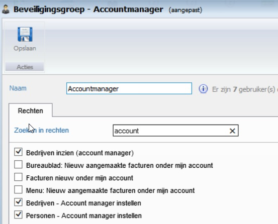
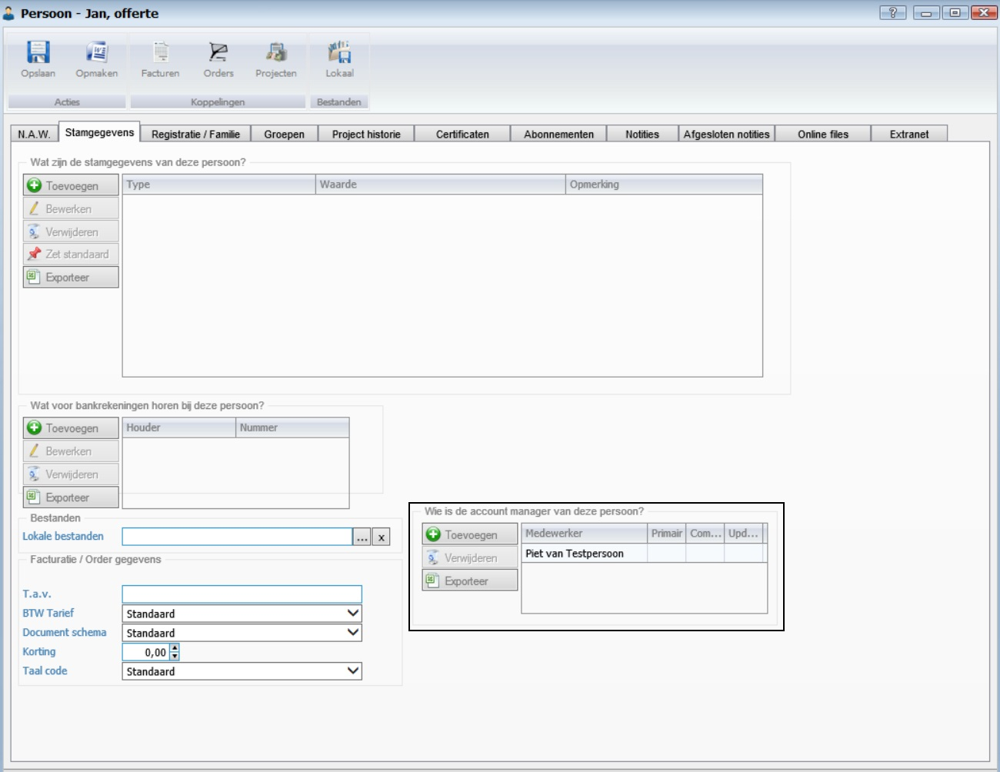
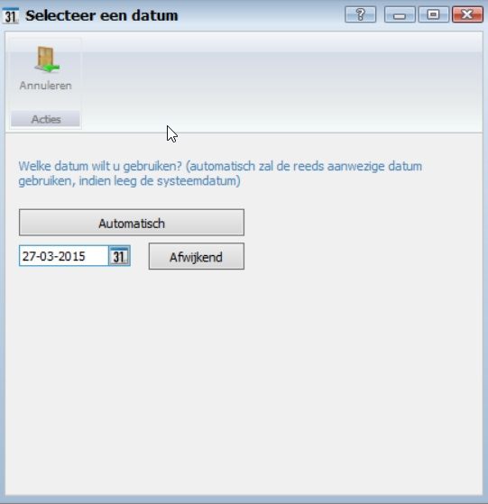
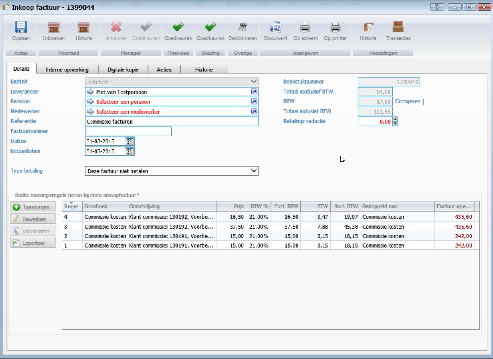

<properties>
	<page>
		<title>Commissie toepassen</title>
		<description>Commissie toepassen</description>
	</page>
	<menu>
		<position>Handleiding / Modules / A - E / Commissiebeheer</position>
		<title>Commissie toepassen</title>
	</menu>
</properties>

Ga terug [Commissie](http://hybridsaas.support/pages/handleiding/modules/A-E/commissiebeheer/Introductie)

#Commsissie toepassen#
Hier wordt beschreven welke stappen je moet doorlopen om commissie in te richten.

**Rechten aanpassen**

Als je accountmanagers wilt gebruiken dan moeten er rechten worden aangepast. Dit kan bij "Beveiligingsgroepen" of bij "Gebruikers wijzigen". De rechten die dan aangezet moeten worden staan in onderstaand plaatje. 
 

**Koppeling maken met een accountmanager**

Iedere gebruiker die aangemaakt is in het systeem kan je als accountmanager selecteren. Dit kan op 2 plaatsen namelijk bij klanten en bij personen (particulieren)

Klanten:

Personen:
 

**Commissie toevoegen**

Op het moment dat je een accountmanager commissie wilt geven op een bepaalde klant en op en mogelijk op een specifiek gedeelte van het productassortiment dan kan je dit doen via de klantkaart of via de menuoptie "commissie beheren". 

Klantkaart

Ga via het menu naar "Klanten", selecteer de klant en ga naar het tabblad "Commissies". Kies dan voor "Toevoegen", onderstaand scherm verschijnt:

 

In dit scherm zijn "Leverancier" en "Grootboekrekening" verplichte velden. "Commissie %" is niet verplicht, maar dit is wordt wel altijd gevuld. De overige velden zijn ervoor om op specifiek niveau de commissie te laten berekenen.

- Accountmanager
	- aan welke accountmanager wordt de commissie berekend (een leverancier kan meerdere accountmanagers hebben lopen)
- Start- en einddatum
	- is deze commissie alleen voor een bepaalde periode van toepassing
- Korting verdelen
	- Op het moment dat er korting op een order wordt gegeven, is het dan de bedoeling dat deze ook in de commissie wordt verrekend of komt deze korting volledig ten laste van de organisatie 
- Wachten op betaling
	- Wordt de commissie bekerend zodra de order is geplaatst of pas als de order is betaald 
- Contract
- Contractregel
- Project
- Werkcode
- Order bron
- Productgroep
- Product subgroep
- Product

Commissie beheer

Ga via het menu naar "Commissies", naar "commissies beheren". Kies dan voor "Toevoegen", onderstaand scherm verschijnt:
  
 

**Functionaliteit**

- Klant: Klant A
- Leverancier: Leverancier A
- Accountmanager : Piet van Testpersoon
- Commissie: Alle producten; 10 %
- Producten zijn op voorraad

Er wordt een order ingevoerd voor Klant A, met 2 producten van 100 euro per product. Totaalprijs 200 euro. De stappen die doorlopen moeten worden zijn: 

- Order goedkeuren
- Order afhandelen 
- Order factureren (commissie wordt hier toegewezen)

Orderinvoer scherm 
 

Als er een factuur is gemaakt verschijnt deze in het bakje " alle nieuwe facturen". Je kan dan in deze factuur bij het tabblad "Commissies" terugvinden aan wie welke commissie is toebedeeld.(in waarde en in percentage). Zodra de factuur is goedgekeurd en is verstuurd start het proces om de commissie te gaan verrekenen.

Na het versturen van de factuur komt er in het bakje "Nieuwe commissie afdracht" een regel te staan per leverancier met daarbij het totaal bedrag en het commissie bedrag. Als er meerdere facturen met commissie voor dezelfde leverancier, dan wordt deze gecumuleerd. Er komt niet voor iedere factuur één regel. Je kan de facturen inzien door de leverancier te selecteren en dan de knop Facturen te gebruiken. 

Afromen 
Om van de commissie een inkoopfactuur te maken gebruik je de knop "Afromen".
Selecteer alle leveranciers waarvoor je dit wilt doen.
Je krijgt dan nog de mogelijkheid om aan te geven tot en met welke datum de commissie moet worden berekend. Standaard is dit de systeem datum. Als je een afwijkende datum wilt hebben, kies dan de datum en gebruik de toets afwijkend.
er wordt nu één of meerdere inkoopfacturen gemaakt en deze komen in het bakje "Te verzenden naar onderaannemer".
 

Selecteer hier de inkoopfacturen die je wilt gaan versturen aan de leveranciers (onderaannemers). Dit doe je door de knop "per e-mail" te gebruiken. de verschillende inkoopfacturen worden verstuurd naar de emailadressen die bij de leveranciers (onderaannemers) is ingesteld.

In het bakje "Verzonden naar onderaannemer wachtend op factuur" staan nu de verzonden inkoopfacturen. Zodra de leverancier (onderaannemer) zijn factuur heeft gestuurd en je deze hebt ontvangen dan kan je de inkoopfactuur verder verwerken en tot betaling overgaan. 

Open vanuit het bakje "Verzonden naar onderaannemer wachtend op factuur" de inkoopfactuur. Vul het factuurnummer van de leverancier (onderaannemer) in, dit is een verplicht veld. en kies de type betaling. 
Verder moet  

In dit voorbeeld heb ik gekozen voor betaling via SEPA. De goedgekeurde inkoopfactuur komt hierdoor terecht in het bakje "Exporteren naar SEPA bestand

---
- emailsjabbloon aanmaken
- wordsjabloon aanmaken
- documentschema's aanpassen (onderaannemersbon)
- accountmanager aanmaken als leverancier
- commissie beheer (inrichten per klant) 
- Rechten voor gebruikers toevoegen
- desktop aanpassen (procesflow)

- order
- factuur
- nieuwe commissie factuur (afromen)
- te verzenden 
- wachtend op factuur
- inkoopfactuur (goedkeuren)

Ga terug [Commissie](http://hybridsaas.support/pages/handleiding/modules/A-E/commissiebeheer/Introductie)