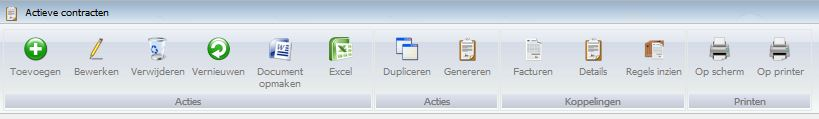

<properties>
	<page>
		<title>Introductie contracten</title>
		<description>Introductie contracten</description>
		<context>contract-active*</context>
	</page>
	<menu>
		<position>Handleiding / Modules / A - E / Contracten</position>
		<title>Introductie</title>
		<sort>A</sort>
	</menu>
</properties>

#Contracten#
Met de module Hybrid SaaS Contractbeheer hoeft u zich nooit meer zorgen te maken over regelmatig terugkerende facturen, orders en contracten. Doordat u eenmalig de spelregels van het contract instelt gaat u direct veel tijd besparen.

*Acties*

- Toevoegen
- Bewerken
- Verwijderen
- Vernieuwen
- Document opmaken
- Excel

*Acties*

- Dupliceren
- Genereren

*Koppelingen*

- Facturen
- Details
- Regels inzien

*Printen*

- Op scherm
- Op printer

> **Koppelingen die betrekking hebben op 'Contracten':**

----------
<[Contract aanmaken](http://hybridsaas.support/pages/handleiding/modules/A-E/contracten/contracten-contract-aanmaken)>
<[Contract regel aanmaken](http://hybridsaas.support/pages/handleiding/modules/A-E/contracten/contracten-regel-aanmaken)>

----------

<[Facturen & orders genereren](http://hybridsaas.support/pages/handleiding/modules/A-E/contracten/contracten-factuur-order-genereren)>

----------

