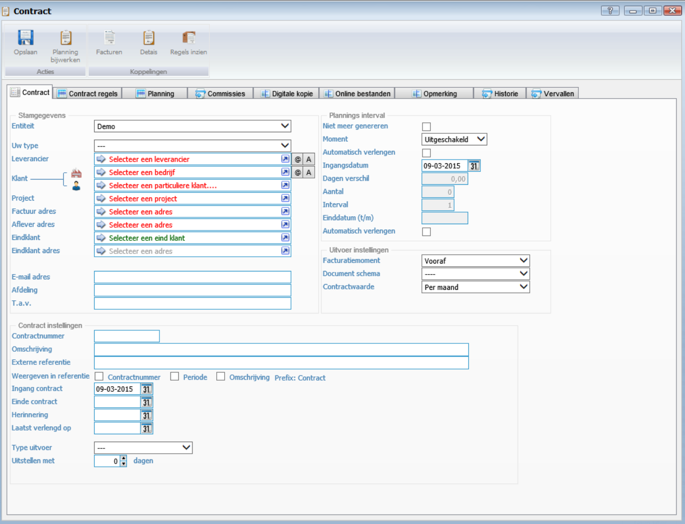
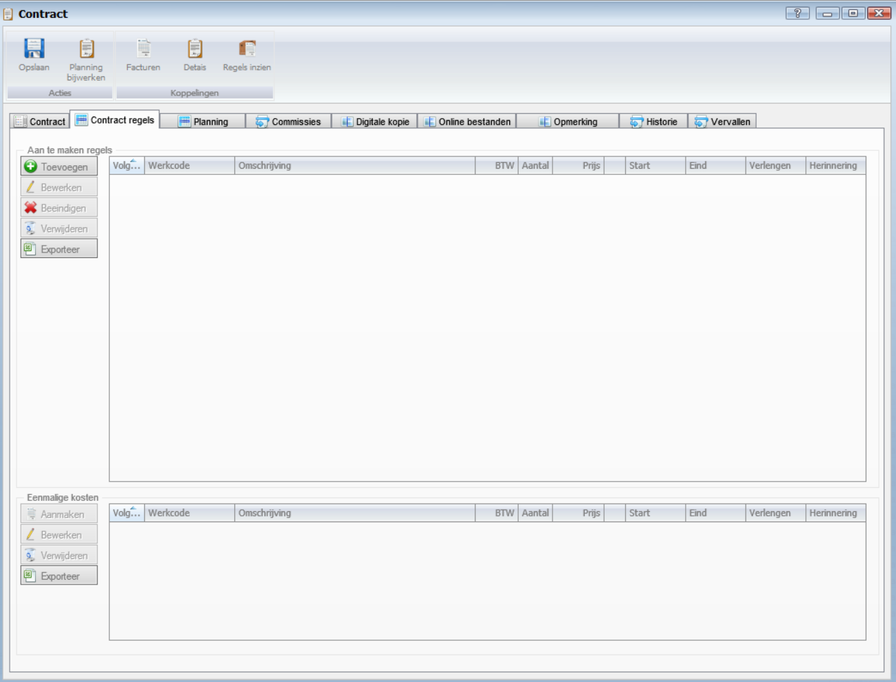
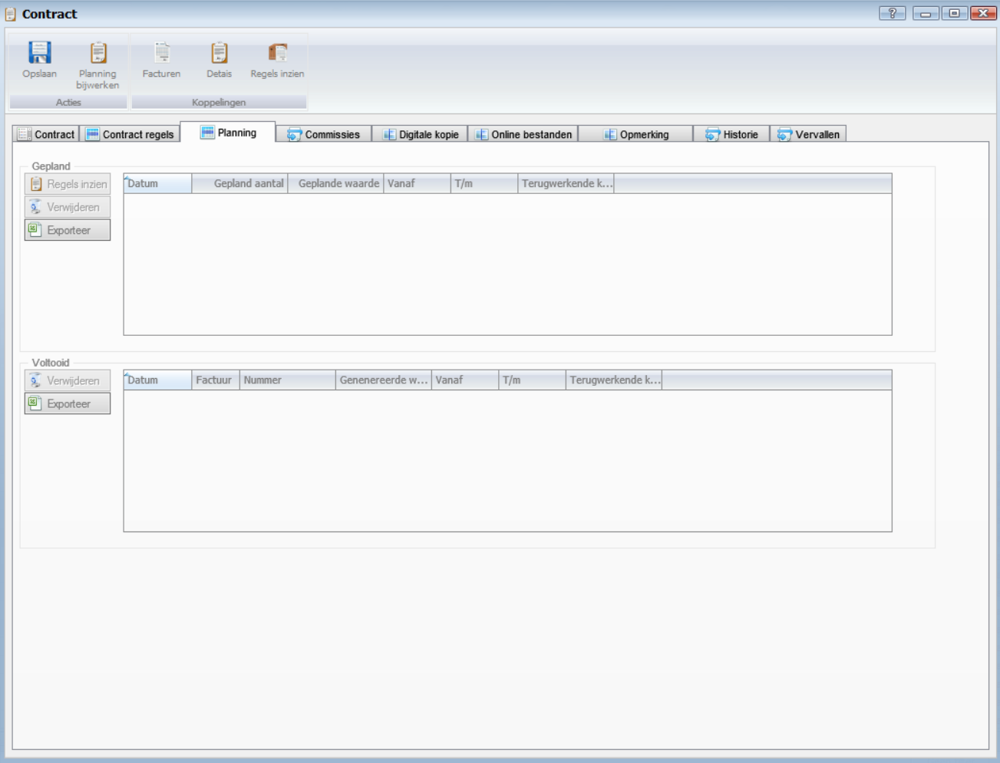
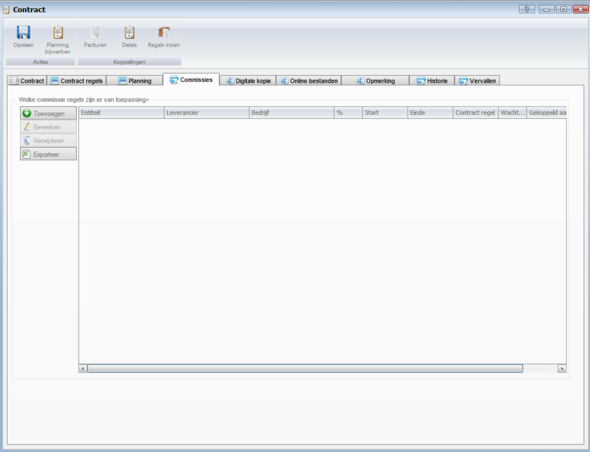
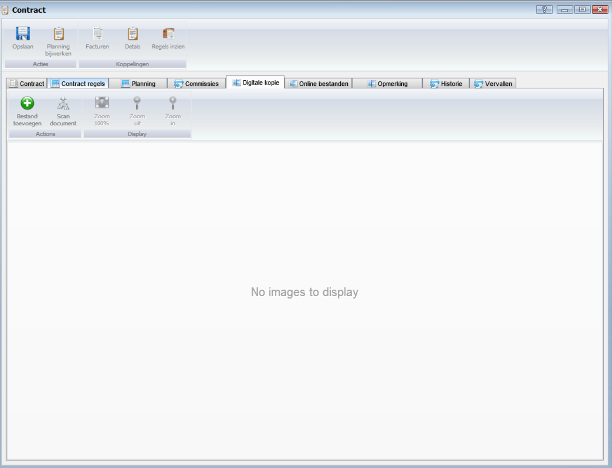
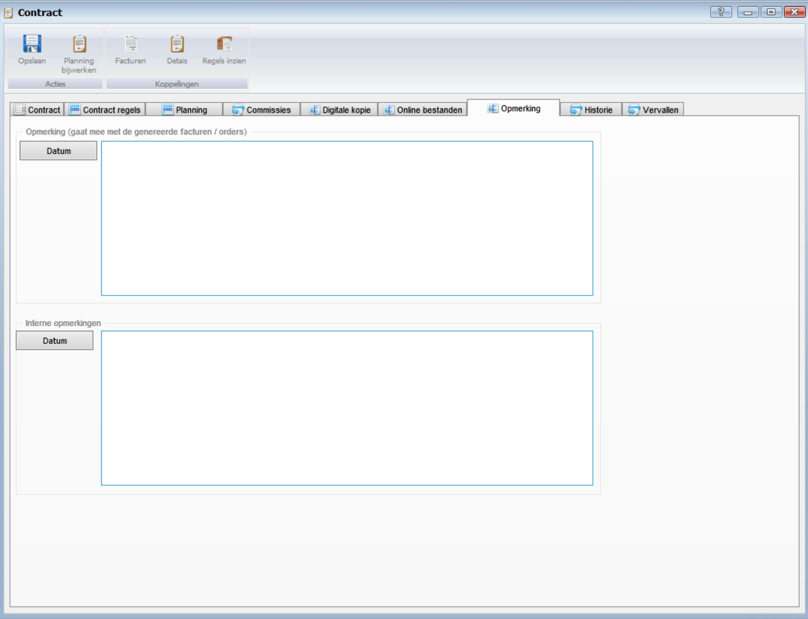
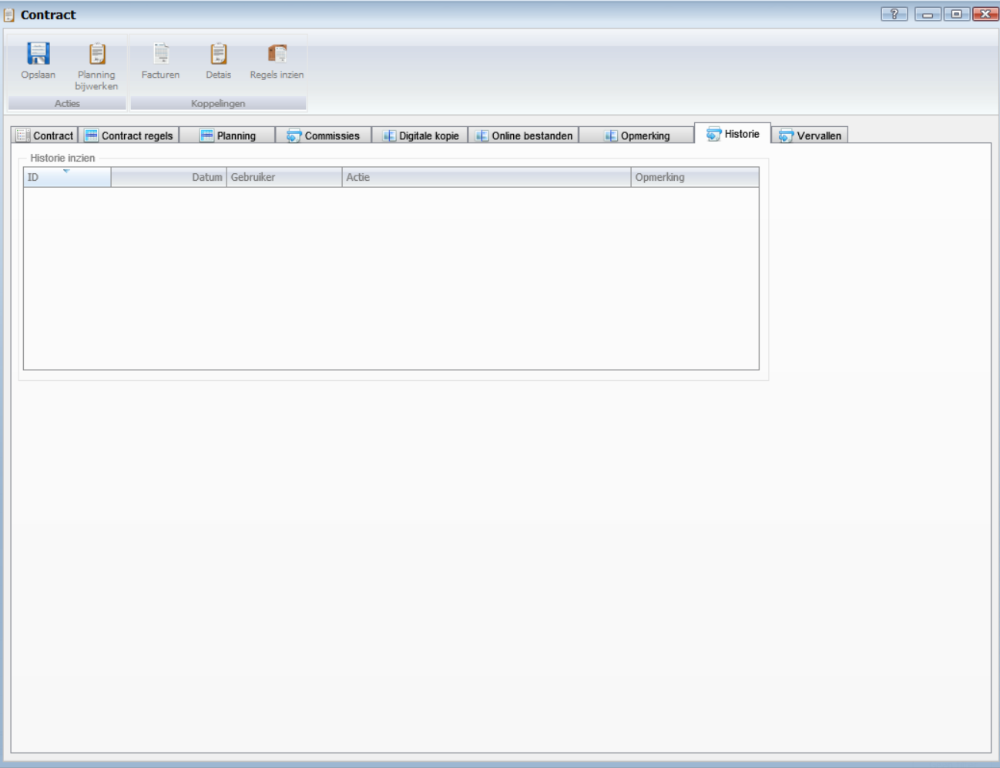
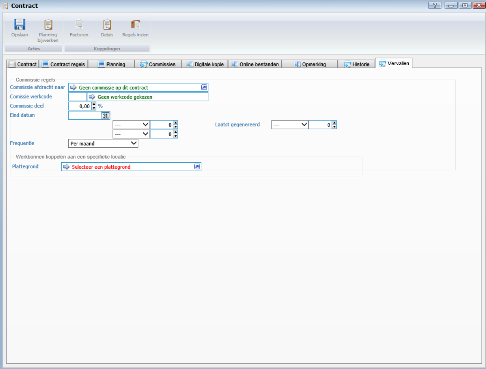

<properties>
	<page>
		<title>Contracten-aanmaken</title>
		<description> Contracten-aanmaken</description>	
		<context>dlgcontract*</context>	
	</page>
	<menu>
		<position>Handleiding / Modules / A - E / Contracten</position> 
		<title>Contracten aanmaken</title>
		<sort>B</sort>
	</menu>
</properties>

Ga terug <[Contracten](http://hybridsaas.support/pages/handleiding/modules/A-E/contracten/Introductie)>

----------

# Contract aanmaken #

Tijdens het aanmaken van een contract zijn er 2 belangrijke zaken (tabbladen) de contract gegevens en de contractregels. Het resultaat van deze 2 kan je terugvinden in de planning. De overige tabbladen zijn informatief en ondersteunend.

**Tabblad Contract** 
 

*Stamgegevens*

- Entiteit
	- Dit is de administratie waar dit contract onder valt (over het algemeen wordt er met 1 entiteit gewerkt)
- Uw type
	- Je kan hier het contract type aanmerken. Dit veld is niet verplicht
- Leverancier
- Klant
	- Hier kies je de klant waarvoor het contract geldig is. Je hier een bedrijf of een particuliere klant kiezen. (één van de twee, niet beide)
- Project
- Factuuradres
	- Als het om een factuur gaat is het noodzakelijk om aan te geven waar de factuur naar toe moet. Dit is een **verplicht veld**
- Afleveradres
- Eindklant
- Eindklant adres
- E-mail adres
	- Dit emailadres wordt overgenomen uit de relatiekaart. Dit kan je per contract wijzigen.
- Afdeling
	- Hier kan je zelf een afdeling invoeren, bijvoorbeeld Financiële administratie. 
- T.a.v.
	- Hier kan je zelf een persoon of functie toevoegen, bijvoorbeeld Hoof administratie of Dhr. J. Janssen.

*Contract instellingen*

- Contractnummer
	- Dit is een vrij in te voeren veld. Je kan deze ook via een volgnummer laten oplopen, dit gebeurt dan bij het opslaan.
- Omschrijving
	- Geef hier in duidelijk bewoording weer waarvoor het contract bedoeld is. Dit is een **verplicht veld**
- Externe referentie
- Weergeven in referentie
	- je kan hier kiezen welke tekst er in de contractreferentie wordt geplaatst. 
		- Vinkje contract aan 
			- Referentie  | Contract {contractnummer}
		- Vinkje periode aan  
			- Referentrie | {01-01-2015 t/m 31-01-2015}
		- Vinkje omschrijving 
			- Referentie  | Contract : {omschrijving}
		- Alle vinkjes aan    
			- Referentie  |Contract {contractnummer}: 15-8-2015  t/m  14-10-2015: contract {omschrijving
- Ingangsdatum
- Herinnering
- Laatst verlengd op
- Type uitvoer
	- Hiermee geef je aan wat de output van dit contract wordt. Dit is vaak een nieuwe factuur, maar kan ook een nieuwe order, extern contract of nieuwe factuur(regels) zijn. Dit is een **verplicht veld**
- Uitstellen met

*Plannings interval*

- Niet meer genereren
	- Als je een contract wilt beëindigen, dan kan je dit vinkje aanzetten dan wordt het contract niet meer in de planning geplaatst en ook niet meer gegenereerd.
- Moment
	- Hier kies je het moment waarop de factuur/order wordt gegenereerd.
- Automatisch verlengen
	- Vinkje aan betekend dat het contract automatisch wordt verlengd, na dat de einddatum is bereikt.
- Ingangsdatum	
	- Datum waarop het contract ingaat.
- Dagen verschil
	- Dagen verschil tussen ingangsdatum contract en ingangsdatum eerste keer genereren. Dit is nodig voor de berekening van een gebroken maand (naar rato)
- Aantal
	- Dit is het aantal keer dat je dit factuur/order wilt laten genereren. Als je de waarde op 0 laat staan wordt de factuur 24 keer klaar gezet in de planning. Bij ieder ander getal zal hij deze waarde overnemen.
- Interval
	- Hiermee kan je aangeven hoeveel je per keer wilt factureren. Als je bijvoorbeeld per kwartaal wilt genereren en het "Moment" staat op 1 maand dan geef je hier 3 in. 
	- de planning zal dan 01-01-2015 t/m 31-03-2015 en 01-04-2015 t/m 30-06-2015, etc,  aanmaken
- Einddatum 
- Automatisch verlengen

*Uitvoer instellingen*

- Factuurmoment
	- Je kan een factuur/order vooraf of achteraf laten genereren. Dit kan je hier ingeven.
- Document schema
	- Hier kies je een document schema, dat nodig is om de output op de juiste manier te kunnen verwerken. Hier wordt aangegeven welk wordsjabloon en emailsjabloon worden gebruikt. (zie documenten schema). Dit is een **verplicht veld**
- Contractwaarde
	- De waarde die wordt ingegeven bij de contractregels wordt weergegeven in deze waarde. dit kan zijn jaar, maand, week of dag. 

**Tabblad Contract regels**
 
 

*Aan te maken regels*

- Toevoegen zie [contract regel aanmaken]()
 
*Eenmalige kosten*

- Entiteit

**Tabblad Planning**
 

*Gepland*

- Regels inzien
	- Klik hier om de regels in te zien
- Verwijderen
	- Om te verwijderen selecteert u een regel en klikt op de button Verwijderen.
- Exporteren

*Voltooid*

- Verwijderen
	- Om te verwijderen selecteert u een regel en klikt op de button Verwijderen.
- Exporteren

**Tabblad Commissies**
 

- Toevoegen
	- Om toe te voegen klikt u op de button Toevoegen.
- Bewerken
	- Om te bewerken selecteert u een regel en klikt op de button Bewerken.
- Verwijderen
	- Om te verwijderen selecteert u een regel en klikt op de button Verwijderen.
- Exporteren

**Tabblad Digitale kopie**
 

- Bestand toevoegen
	- Om een bestand toe te voegen klikt u op de button Toevoegen.
- Scan document
	- Om een document te scannen vanuit Hybrid SaaS dient een scanner gekoppeld te zijn aan de computer waarop u werkt. Klik op de button Scan document om een document te scannen en direct toe te voegen.
- Zoom 100%
	- Om het document 100% uit te zoemen klikt u op de button Zoom 100%.
- Zoom uit
	- Om het document uit te zoemen klikt u op de button Zoom uit.
- Zoom in
	- Om het document in te zoemen klikt u op de button Zoom in.

**Tabblad Online bestanden**
 

**Tabblad Opmerking**
 

*Opmerking*

- Om een datum aan de opmerking toe te voegen klikt u op de button Datum.

*Interne Opmerking*

- Om een datum aan de interne opmerking toe te voegen klikt u op de button Datum.

**Tabblad Historie**
 

**Tabblad Vervallen**
 

*Commissie regels*

- Commissie afdracht naar
- Commissie werkcode
- Commissie deel
- Eind datum
- Laatst gegenereerd
- Frequentie

*Werkbonnen koppelen aan een specifieke locatie*

- Plattegrond

----------

Ga terug <[Contracten](http://hybridsaas.support/pages/handleiding/modules/A-E/contracten/Introductie)>