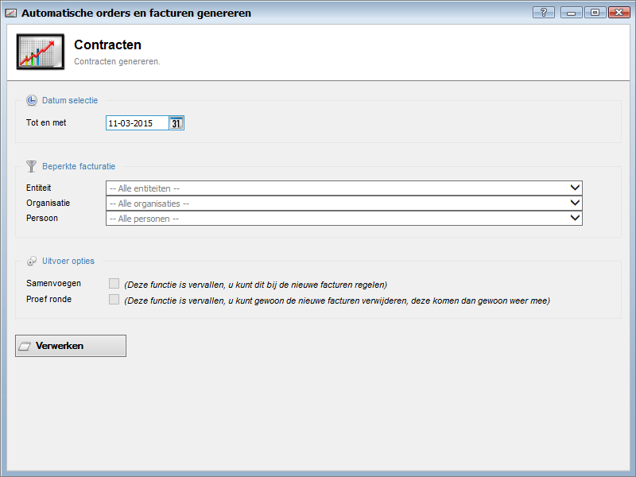

<properties>
	<page>
		<title>Contracten</title>
		<description>Uitleg hoe je contracten kan omzetten in facturen</description>
	</page>
	<menu>
		<position>Handleiding / Modules / A - E / Contracten</position>
		<title>Contracten genereren</title>
		<sort>C</sort>
	</menu>
</properties>

Ga terug <[Contracten](http://hybridsaas.support/pages/handleiding/modules/A-E/contracten/Introductie)>
----------

# Facturen & orders genereren #
In dit artikel wordt het proces voor genereren van automatische orders en facturen beschreven. U dient eerst een automatische factuur aan te maken

 

*Datum selectie*

- Tot en met

*Beperkte facturatie*

- Entiteit
- Organisatie
- Persoon

*Uitvoer opties*

- Samenvoegen
- Proef ronde

*Verwerken*

- Om de orders en facturen te verwerken klikt u op de button Verwerken.

De contracten worden verwerkt nadat u op de knop Verwerken geklikt heeft. Van de contracten zijn nadat u ze verwerkt heeft nieuwe facturen gemaakt. Deze kan u vinden in de bak Nieuwe facturen. Nadat u de facturen gecontroleerd heeft kan u ze goedkeuren en verzenden.

----------

Ga terug <[Contracten](http://hybridsaas.support/pages/handleiding/modules/A-E/contracten/Introductie)>

