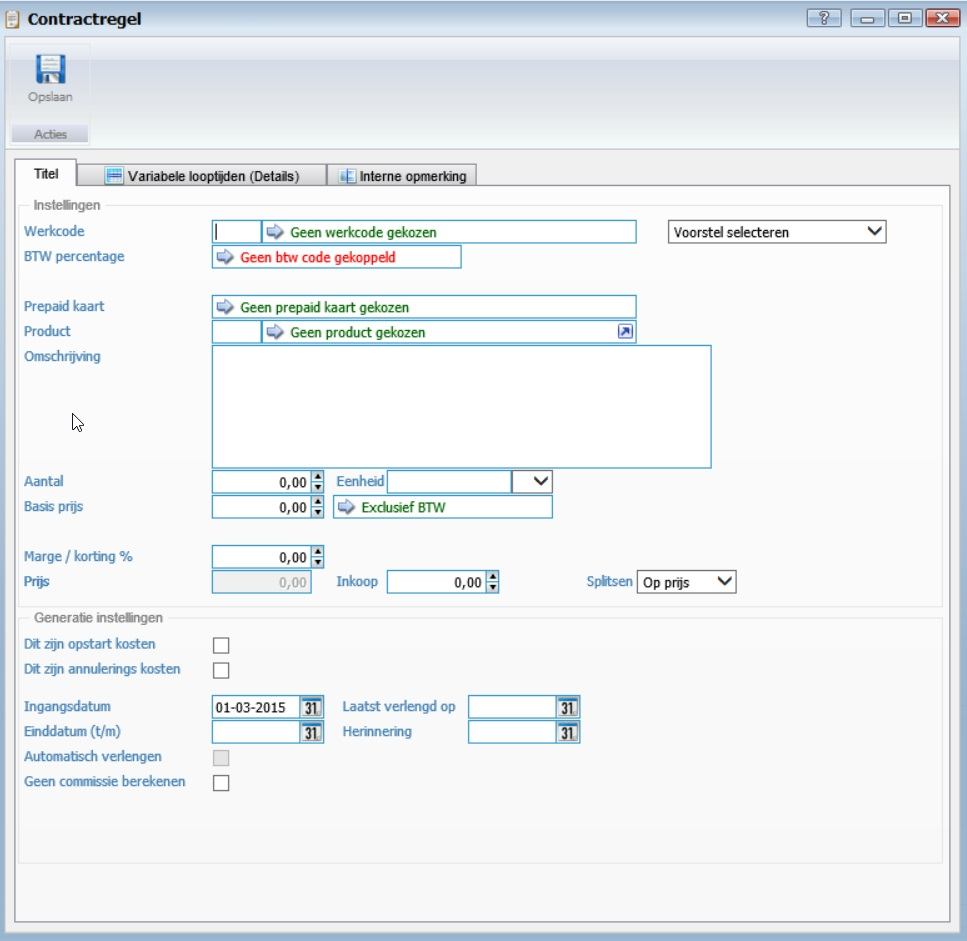
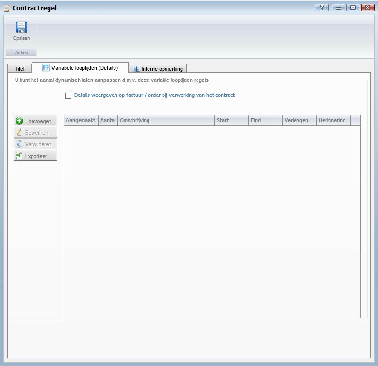

<properties>
	<page>
		<title>Contracten-aanmaken</title>
		<description> Contracten-aanmaken</description>	
		<context>dlgcontract*</context>	
	</page>
	<menu>
		<position>Handleiding / Modules / A - E / Contracten</position> 
		<title>Contracten aanmaken</title>
		<sort>c</sort>
	</menu>
</properties>

Ga terug <[Contract aanmaken](http://hybridsaas.support/pages/handleiding/modules/A-E/contracten/contracten-contract-aanmaken)>
<[Contracten](http://hybridsaas.support/pages/handleiding/modules/A-E/contracten/Introductie)>

----------

# Contract regel aanmaken #

**Tabblad Titel**

	- De 3 manieren om een contractregel toe te voegen zijn op werkcode, prepaid kaart of op productcode.

*Instellingen*

-  Werkcode
	-  Je kan een werkcode invoeren (als je deze weet)
	-  Je kan een gedeelte van de tekst invoeren, het systeem haalt dan de eerste code op die hieraan voldoet.
	-  Je kan zoeken op werkcode door op het veld "Geen werkcode gekozen" te klikken, er verschijnt dan een lijst met mogelijke werkcodes waarvan je er één kan kiezen
-  Prepaid kaart
	-  Je kan zoeken op prepaidkaart door op het veld "Geen prepaid kaart gekozen" te klikken, als er aan deze relatie één of meerdere prepaid kaarten zijn gekoppeld dan kan je die kiezen.
-  Productcode
	-  Je kan de productcode invoeren 
	-  Je kan een gedeelte van de productcode invoeren, het systeem haalt dan de eerste code op die aan hieraan voldoet
- BTW-percentage
	- wordt gevuld aan de hand van de gemaakte keuze. (werkcode, prepaidkaart of productcode)
- Omschrijving
	- Dit is vaak de omschrijving die wordt overgenomen uit de werkcode, prepaidkaart of de productcode. Deze kan altijd worden aangepast.
- Aantal
- Eenheid
- Basis bedrag
- Marge /Korting %
- Prijs
- Inkoop
- Splitsen

*Generatie instellingen*

- Opstart kosten
- Annulerings- kosten
- Ingangsdatum
- Einddatum
- Automatisch verlengen
- Geen commissie berekenen
- laatst verlengd op
- Herinnering

**Tabblad Variabele looptijden (Details)**

- Details weergeven op factuur/ order bij verwerking van het contract

- Toevoegen
	- Om toe te voegen klikt u op de button Toevoegen.
- Downloaden
- Bewerken
	- Om te bewerken selecteert u een regel en klikt op de button Bewerken.
- Verwijderen
	- Om te verwijderen selecteert u een regel en klikt op de button Verwijderen.
- Exporteren

**Tabblad Interne opmerking**

*Opmerking*

- Om een datum aan de opmerking toe te voegen klikt u op de button Datum.

----------

Ga terug <[Contract aanmaken](http://hybridsaas.support/pages/handleiding/modules/A-E/contracten/contracten-contract-aanmaken)>
<[Contracten](http://hybridsaas.support/pages/handleiding/modules/A-E/contracten/Introductie)>