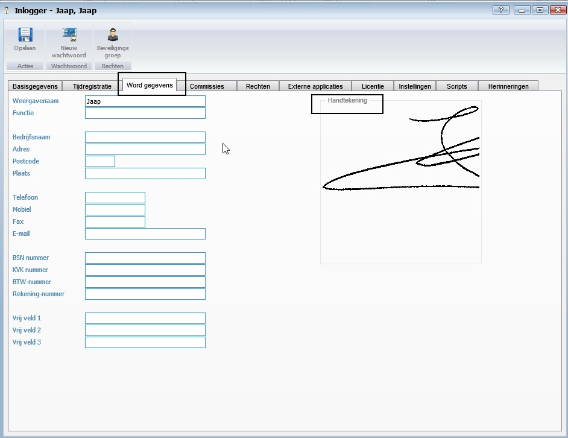
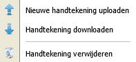
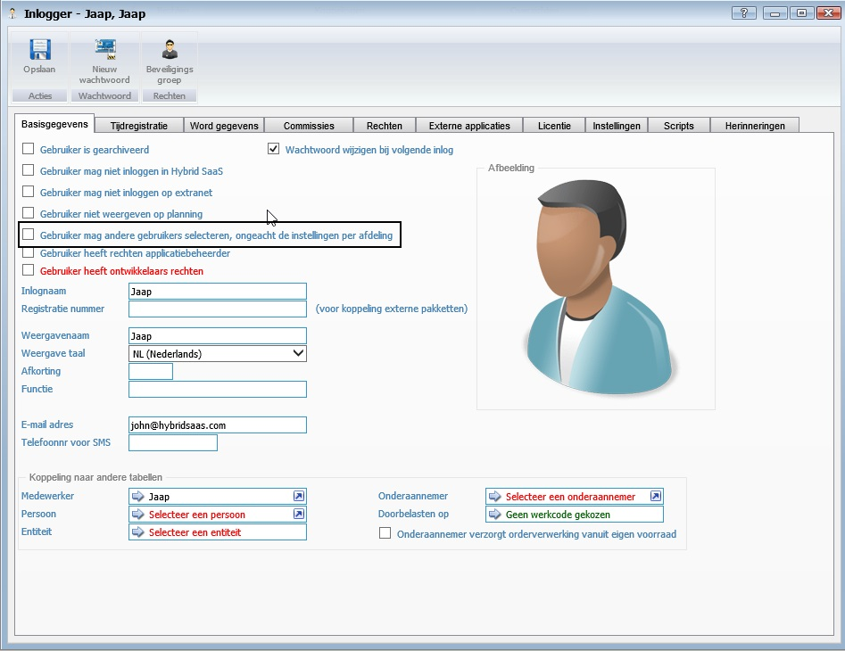
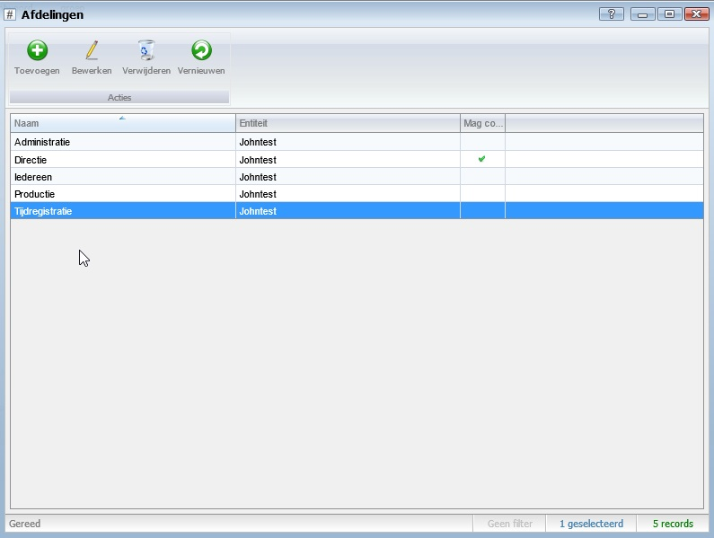
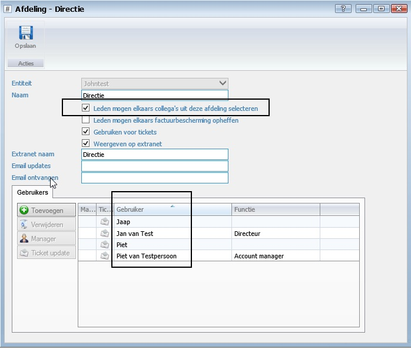

<properties>
	<menu>
		<position>Handleiding / Modules / F - O / Gebruikers / Handtekening</position> 
		<title>Handtekening</title>
	</menu>
	<page>
		<title>Handtekening</title>
		<description> Hier</description>
				
	</page>

</properties>

# Handtekening #

**Plaatsen van een handtekening**

Je kan in het systeem een digitale handtekening plaatsen en deze op verschillende plaatsen onder documenten laten terugkomen.
Hier wordt uitgelegd hoe je dat kan doen.

**Uploaden van een handtekening** 

Zorg dat je de handtekening als .png bestand op je systeem hebt staan. Dit kan je doen door je handtekening in te scannen en op te slaan als .png bestand.
Ga dan in Hybrid SaaS naar dem gebruikerskaart van de eigenaar van de handtekening. (Gebruikers wijzigen).

 
Door in het vakje waar de handtekening staat je rechtermuisknop te gebruiken verschijnen onderstaande opties:

Kies voor "Nieuwe handtekening uploaden", zoek het .png bestand op en selecteer deze dan. De handtekening verschijnt dan in het venster.
Sla de gebruikerskaart op. de handtekeing is nu opgeslagen en kan nu worden gebruikt op documenten. Het databaseveld is "USER_AUTOGRAPH".

Het is nu zo dat je alleen je eigen handtekening onder documenten kan plaatsen. 

**Handtekening van een ander persoon plaatsen**

Het is mogelijk dat je in overleg een handtekening van een collega wilt plaatsen. Dit kan je regel op gebruikersniveau of op afdelingsniveau.  

Als je besluit dat een gebruiker rechten moet hebben om voor iedere gebruiker een handtekening te plaatsen dan doe je dit op de gebruikerskaart. 
Je zet dan het recht "Gebruiker mag andere gebruikers selecteren, ongeacht de instelling per afdeling".

Als je besluit dat gebruikers per afdeling onderling een handtekening van elkaar moeten kunnen plaatsen dan doe je dit op afdelingsniveau.
Zorg dat de afdelingen op orde zijn en dat de juiste gebruikers ion de juiste afdelingen staan.
Selecteer de afdeling en zet het recht "Leden mogen elkaars collega's uit deze afdeling selecteren.
 

