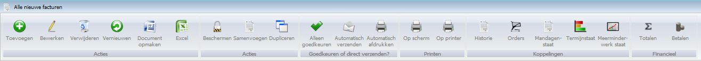

<properties>
	<page>
		<title>Introductie facturatie</title>
		<description>Introductie facturatie</description>
		<context>invoice-new*</context>
	</page>
	<menu>
		<position>Handleiding / Modules / F - O / Facturatie</position>
		<title>Introductie</title>
		<sort>A</sort>
	</menu>
</properties>

#Facturatie#

Een goede cashflow begint bij het op tijd versturen van je facturen. Met Hybrid SaaS Facturatie kun je eenvoudig en snel een factuur opmaken en (digitaal) versturen. Je maakt gebruik van vooraf ingestelde gegevens. Op deze manier win je veel tijd en wordt de kans op fouten aanzienlijk verkleind. Facturen worden overzichtelijk opgeslagen en zijn hierdoor eenvoudig terug te vinden. Het verzenden van kopie- en creditfacturen was nog nooit zo gemakkelijk.

Daarnaast geeft de module altijd het actuele facturatie proces weer en kun je in één oogopslag zien welke facturen zijn afgehandeld en welke er nog openstaan. Wanneer een betalingstermijn van een factuur is verstreken kunnen er gemakkelijk en snel betalingsherinneringen worden verstuurd.

*Acties*

- Toevoegen
- Bewerken
- Verwijderen
- Vernieuwen
- Document opmaken
- Excel

*Acties*

- Beschermen
- Samenvoegen 
- Dupliceren

*Goedkeuren of direct verzenden?*

- Alleen goedkeuren
- Automatisch verzenden
- Automatisch afdrukken

*Printen*

- Op scherm
- Op printer

*Koppelingen* 

- Historie
- Orders
- Mandagenstaat
- Termijnstaat
- Meerminderwerk staat

*Financieel*

- Totalen
- Betalen

> **Koppelingen die betrekking hebben op 'Facturatie':**
> 

----------

Video<[Verkoopfactuur aanmaken](https://www.youtube.com/watch?v=aSJ160Q7TEE)>

----------

<[Een factuur aanmaken](http://hybridsaas.support/pages/handleiding/modules/F-O/facturatie/een-factuur-aanmaken)>

----------
