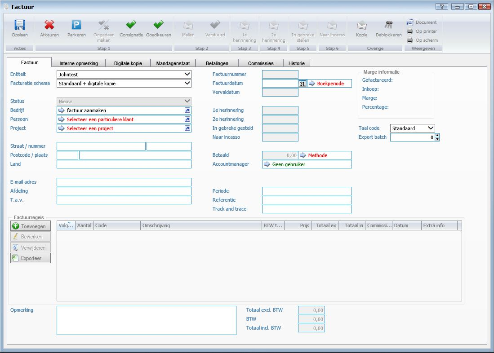
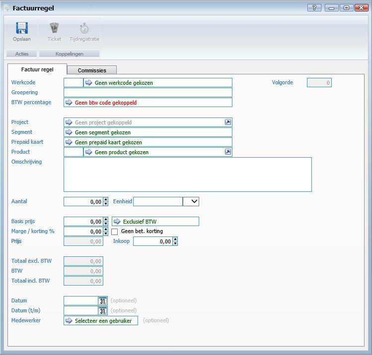
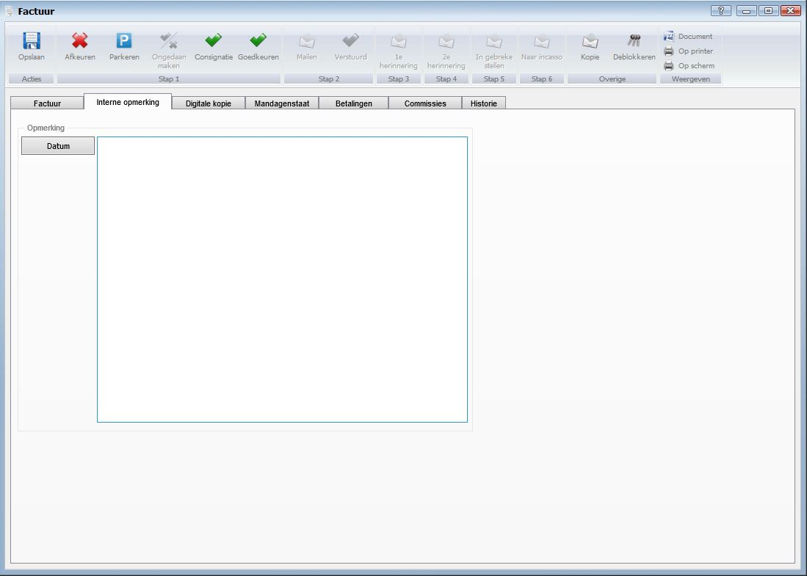
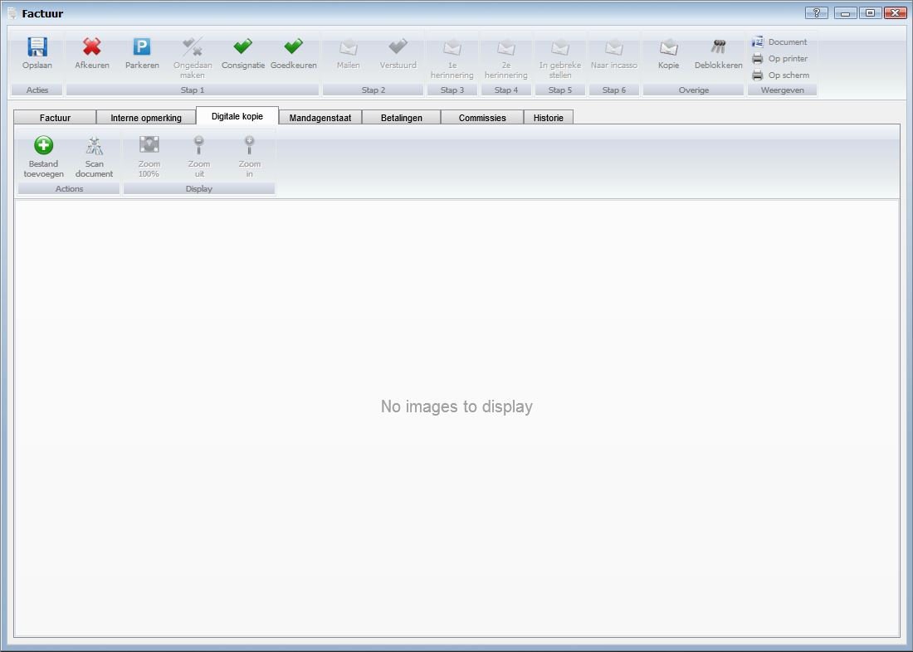
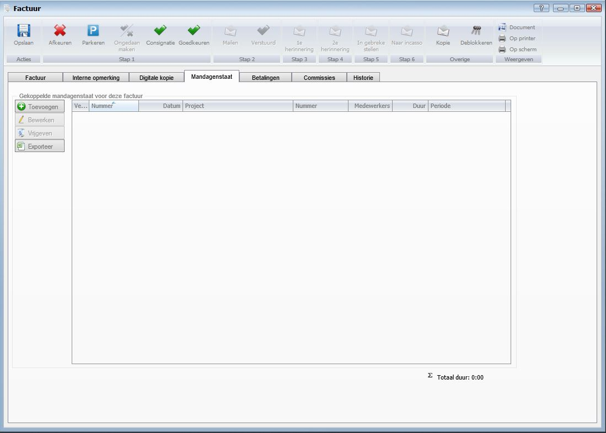
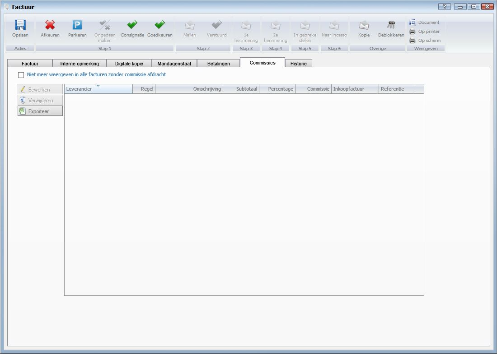
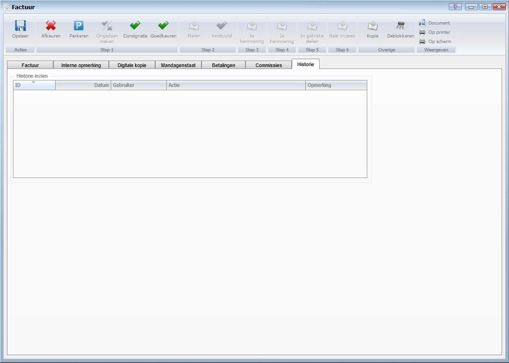

<properties>
	<page>
		<title>Factuur aanmaken</title>
        <description>Factuur aanmaken</description>
        <context>dlginvoice*</context>
	</page>
	<menu>
		<position>Handleiding / Modules / F - O / Facturatie</position>
		<title>Factuur aanmaken</title>
		<sort>B</sort>
	</menu>
</properties>

Ga terug <[Facturatie](http://hybridsaas.support/pages/handleiding/modules/F-O/facturatie/facturatie)>

----------

#Een factuur aanmaken#

**Tabblad Factuur**

- Entiteit
	- Hier kunt u de entiteit selecteren. Wanneer er één entiteit ingegeven is wordt dit veld automatisch ingevuld.
- Facturatie schema
	- Hier kunt u het facturatie schema selecteren. Om een facturatie schema aan te maken en te koppelen aan een document schema gaat u naar: [Word sjabloon](http://hybridsaas.support/pages/handleiding/extra/Sjabloon-word) en [Document schema]().
- Status
	- De status van de factuur is in dit veld zichtbaar. Dit veld wordt automatisch ingegeven en is niet handmatig aan te passen.
- Bedrijf
	- Hier kunt u een Bedrijf selecteren. U bent verplicht om een bedrijf of persoon of een project te selecteren.
- Persoon
	- Hier kunt u een Persoon selecteren. U bent verplicht om een bedrijf of persoon of een project te selecteren.
- Project
	- Hier kunt u een Project selecteren. U bent verplicht om een bedrijf of persoon of een project te selecteren.
- Straat/Nummer
	- De straatnaam/nummer wordt automatisch ingevuld als de gegevens in het systeem bekent zijn. Zijn de gegevens niet in het systeem bekent dan kan u dit handmatig ingeven.
- Postcode/Plaats
	- De postcode/plaats wordt automatisch ingevuld als de gegevens in het systeem bekent zijn. Zijn de gegevens niet in het systeem bekent dan kan u dit handmatig ingeven.
- Land
	- Het land wordt automatisch ingevuld als de gegevens in het systeem bekent zijn. Zijn de gegevens niet in het systeem bekent dan kan u dit handmatig ingeven.
- Email adres
	- Het email adres wordt automatisch ingevuld als de gegevens in het systeem bekent zijn. Zijn de gegevens niet in het systeem bekent dan kan u dit handmatig ingeven.
- Afdeling
- T.a.v.
	- De t.a.v. wordt automatisch ingevuld als de gegevens in het systeem bekent zijn. Zijn de gegevens niet in het systeem bekent dan kan u dit handmatig ingeven.
- Factuurnummer
- Factuurdatum
- Boekingsdatum
- Vervaldatum
- 1e Herinnering
- 2e Herinnering
- In gebreke gesteld
- Naar incasso
- Betaald
- Accountmanager
- Periode
	- Hier kunt u de periode van de factuur ingeven.
- Referentie
	- Hier kunt u de referentie van de factuur ingeven.
- Track and Trace
	- Hier kan je een track and trace nummer invullen.
		- Je kan het nummer ook toevoegen aan het mail bestand zie [Email sjabloon](http://hybridsaas.support/pages/handleiding/extra/Sjabloon-email)
- Taal code
- Export batch
- Opmerking
- Totaal excl. BTW
- BTW
- Totaal incl. BTW

*Factuurregels*

- Werkcode
	- Hier kunt u de werkcode selecteren van het product.
- Volgorde
	- Wanneer er meerdere factuurregels in de factuur zijn aangemaakt kunt u hier de volgorde van factuurregels ingeven. Automatisch wordt dit oplopend ingegeven door het systeem.
- Groepering
	- Hier kunt u de groepering van het product ingeven. Dit is geen verplicht veld.
- BTW percentage
	- Hier kunt u het BTW percentage selecteren.
- Project
- Segment
- Prepaid kaart
- Product
	- Hier kunt u het product selecteren. Wanneer u een product selecteert wordt automatisch de werkcode, BTW percentage en omschrijving ingevuld.
- Omschrijving
- Aantal
	- Hier kunt u het aantal van het product ingeven.
- Eenheid
	- Hier kunt u de eenheid selecteren van het product.
- Basisprijs
	- Hier kunt u de basis prijs van het product ingeven.
- BTW
- Marge/korting %
	- Hier kunt u de marge of de korting over het product ingeven.
- Geen bet. korting
	- Vink aan wanneer u op deze factuurregel geen betalingskorting wilt toekennen.
- Prijs
- Inkoop
	- Hier kunt u de inkoopprijs van het product ingeven (optioneel).
- Totaal excl. BTW
	- Hier kunt u aangeven of de basis prijs in- of exclusief BTW is.
- BTW
- Totaal incl. BTW
- Datum
	- Hier kunt u de datum ingeven (optioneel).
- Datum (t/m)
- Medewerker
	- Hier kunt u de medewerker selecteren die betrekking heeft op de factuurregel (optioneel).

*Marge informatie*

- Gefactureerd
- Inkoop
- Marge
- Percentage

**Tabblad Interne opmerking**

*Opmerking*

- Om een datum aan de interne opmerking toe te voegen klikt u op de button Datum.

**Tabblad Digitale kopie**

- Bestand toevoegen
	- Om een bestand toe te voegen klikt u op de button Toevoegen.
- Scan document
	- Om een document te scannen vanuit Hybrid SaaS dient een scanner gekoppeld te zijn aan de computer waarop u werkt. Klik op de button Scan document om een document te scannen en direct toe te voegen.
- Zoom 100%
	- Om het document 100% uit te zoemen klikt u op de button Zoom 100%.
- Zoom uit
	- Om het document uit te zoemen klikt u op de button Zoom uit.
- Zoom in
	- Om het document in te zoemen klikt u op de button Zoom in.

**Tabblad Mandagenstaat**

*Gekoppelde mandagenstaat voor deze factuur*

- Totaal duur:

**Tabblad Betalingen**

*Betalings- informatie*

**Tabblad Commissies**

- Niet meer weergeven in alle facturen zonder commissie afdracht
- Bewerken
	- Om te bewerken selecteert u een regel en klikt op de button Bewerken.
- Verwijderen
	- Om te verwijderen selecteert u een regel en klikt op de button Verwijderen.
- Exporteren

**Tabblad Historie**

*Historie inzien*

----------

Ga terug <[Facturatie](http://hybridsaas.support/pages/handleiding/modules/F-O/facturatie/facturatie)>