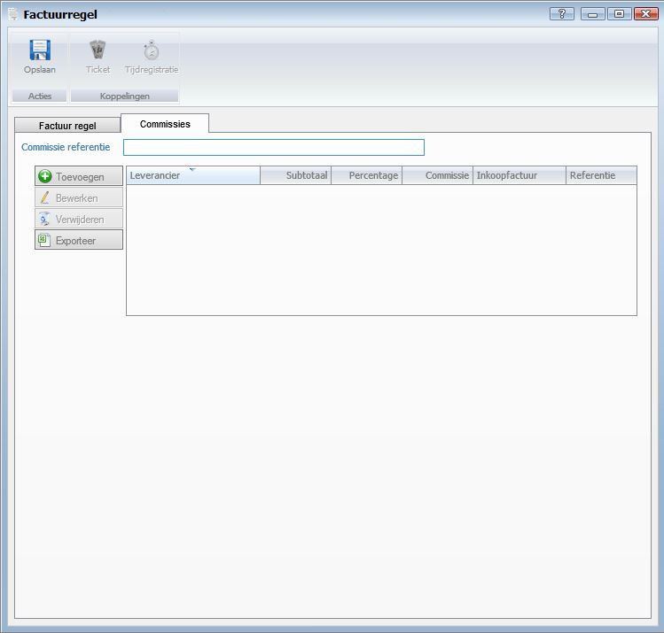

<properties>
	<page>
		<title>Factuurregel aanmaken</title>
        <description>Factuurregel aanmaken</description>
        <context>dlginvoice*</context>
	</page>
	<menu>
		<position>Handleiding / Modules / F - O / Facturatie</position>
		<title>Factuurregel aanmaken</title>
		<sort>c</sort>
	</menu>
</properties>

Ga terug <[Facturatie](http://hybridsaas.support/pages/handleiding/modules/F-O/facturatie/facturatie)>

----------

#Een factuurregel aanmaken#

**Tabblad Factuur regel**

- Werkcode
	- Hier kunt u de werkcode selecteren van het product.
- Volgorde
	- Wanneer er meerdere factuurregels in de factuur zijn aangemaakt kunt u hier de volgorde van factuurregels ingeven. Automatisch wordt dit oplopend ingegeven door het systeem.
- Groepering
	- Hier kunt u de groepering van het product ingeven. Dit is geen verplicht veld.
- BTW percentage
	- Hier kunt u het BTW percentage selecteren.
- Project
- Segment
- Prepaid kaart
- Product
	- Hier kunt u het product selecteren. Wanneer u een product selecteert wordt automatisch de werkcode, BTW percentage en omschrijving ingevuld.
- Omschrijving
- Aantal
	- Hier kunt u het aantal van het product ingeven.
- Eenheid
	- Hier kunt u de eenheid selecteren van het product.
- Basisprijs
	- Hier kunt u de basis prijs van het product ingeven.
- BTW
- Marge/korting %
	- Hier kunt u de marge of de korting over het product ingeven.
- Geen bet. korting
	- Vink aan wanneer u op deze factuurregel geen betalingskorting wilt toekennen.
- Prijs
- Inkoop
	- Hier kunt u de inkoopprijs van het product ingeven (optioneel).
- Totaal excl. BTW
	- Hier kunt u aangeven of de basis prijs in- of exclusief BTW is.
- BTW
- Totaal incl. BTW
- Datum
	- Hier kunt u de datum ingeven (optioneel).
- Datum (t/m)
- Medewerker
	- Hier kunt u de medewerker selecteren die betrekking heeft op de factuurregel (optioneel).

**Tabblad commissie**

- Commissie referentie

- Toevoegen
	- Om toe te voegen klikt u op de button Toevoegen.
- Bewerken
	- Om te bewerken selecteert u een regel en klikt op de button Bewerken.
- Verwijderen
	- Om te verwijderen selecteert u een regel en klikt op de button Verwijderen.
- Exporteren

----------

Ga terug <[Facturatie](http://hybridsaas.support/pages/handleiding/modules/F-O/facturatie/facturatie)>