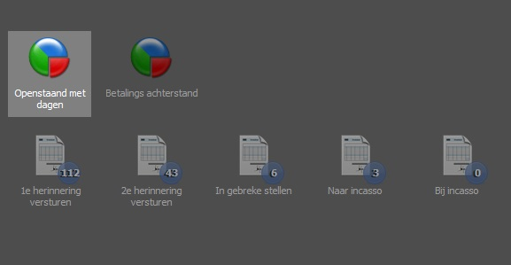
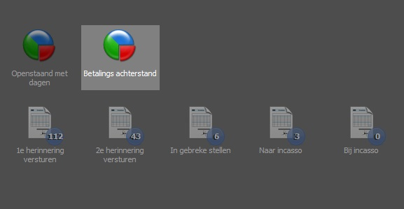
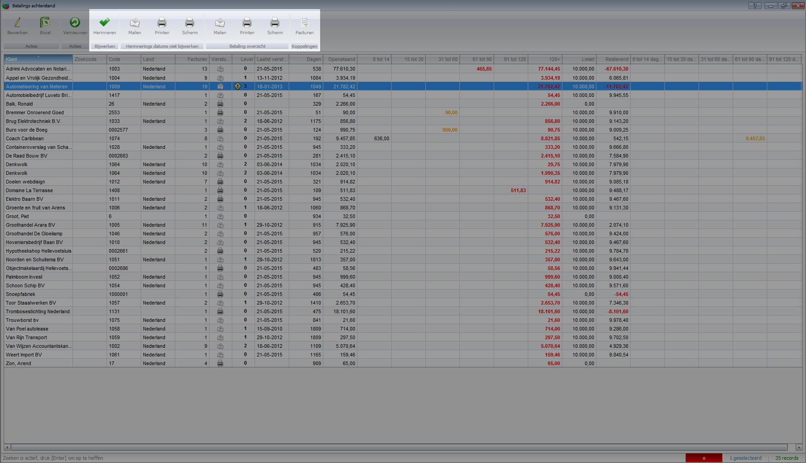

<properties>
	<page>
		<title>Betalingsherinneringen versturen per klant</title>
	</page>
	<menu>
		<position>Handleiding / Modules / F - O / Facturatie / Debiteurenbeheer </position> 
		<title>Herinnering per klant</title>
	</menu>
</properties>

# Betalingsherinnering per factuur versturen #

Er zijn verschillende manieren om een betalingsherinnering te versturen.
- Een herinnering per factuur versturen
- Een herinneringsoverzicht versturen van openstaande facturen van één klant

We bespreken in deze handleiding de herinnering per klant.

Op basis van het documentschema en de vervaldatum van de factuur bepaalt het systeem of een factuur in aanmerking komt voor een herinnering. 

Voor optimaal debiteurenbeheer raden wij aan gebruik te maken van de bankrekening module, waarmee eenvoudig banktransacties van de bank worden ingelezen en worden geboekt op facturen. Indien hier geen gebruik van wordt gemaakt is het mogelijk om zelf handmatig een factuur als "betaald" aan te merken.

Er kan een verschil zitten in de tussen de transacties die je ziet bij de bank ten opzichte van de ingelezen banktransacties. De meeste banken werken met dagafschriften. Hierdoor kan het voorkomen dat sommige transacties (meestal één dag) nog niet in de importbatch staan.

## Overzicht van de openstaande facturen met dagen ##

Er zijn twee verschillende overzichten welke facturen gegroepeerd per klant weergegeven. 
- Openstaand met dagen
- Betalingsachterstand

### Openstaand met dagen ###

In dit overzicht wordt een overzicht getoond van alle openstaande facturen gegroepeerd per klant. Hierin wordt geen onderscheid gemaakt in vervaldagen, kredietlimieten of betalingsregelingen.

### Betalingsachterstand ###

In dit overzicht wordt een overzicht getoond van alle openstaande facturen gegroepeerd per klant. Hierin wordt  onderscheid gemaakt in vervaldagen, kredietlimieten of betalingsregelingen.

## Versturen ##

Indien je een overzicht wilt sturen selecteer je de betreffende klant en klik je op "Herinneren". Met deze knop wordt de herinnering per mail verzonden en worden de herinneringsdata in de factuur opgeslagen. Wil je enkel een overzicht sturen waarbij de data niet worden opgeslagen kies dan één van andere twee opties.

Er kan worden gekozen om de herinnering per e-mail of post te versturen. Je kiest hier respectievelijk de koppeling met de enveloppe of met de printer. Bij de envelop zal de herinnering met begeleidende email worden verzonden. Kies je voor de printer dan zal de herinnering op de standaard printer worden afgedrukt.

Voor instellingen van sjablonen en e-mails kan je "documentschema's" raadplegen.

"Het is mogelijk om verschillende facturen tegelijkertijd te selecteren zodat meerdere herinneringen te gelijkertijd kunnen worden verstuurd. Gebruik hiervoor de SHIFT en/of CTRL toets voor de selectie.

