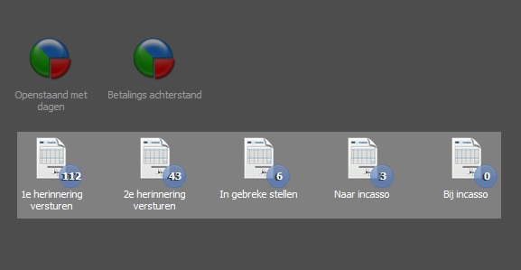
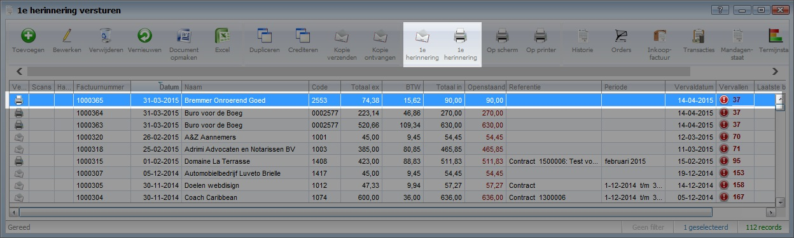

<properties>
	<page>
		<title>Betalingsherinneringen versturen per status</title>
	</page>
	<menu>
		<position>Handleiding / Modules / F - O / Facturatie / Debiteurenbeheer </position> 
		<title>Herinnering per status</title>
	</menu>
</properties>

# Betalingsherinnering per factuur versturen #

Er zijn verschillende manieren om een betalingsherinnering te versturen.
- Een herinnering per factuur versturen
- Een herinneringsoverzicht versturen van openstaande facturen van één klant

Op basis van het documentschema en de vervaldatum van de factuur bepaalt het systeem of een factuur in aanmerking komt voor een herinnering. 

Voor optimaal debiteurenbeheer raden wij aan gebruik te maken van de bankrekening module, waarmee eenvoudig banktransacties van de bank worden ingelezen en worden geboekt op facturen. Indien hier geen gebruik van wordt gemaakt is het mogelijk om zelf handmatig een factuur als "betaald" aan te merken.

Er kan een verschil zitten in de tussen de transacties die je ziet bij de bank ten opzichte van de ingelezen banktransacties. De meeste banken werken met dagafschriften. Hierdoor kan het voorkomen dat sommige transacties (meestal één dag) nog niet in de importbatch staan.

## Overzicht van de facturen per status ##

Op je bureaublad, of in het menu staan verschillende inconen. Afhankelijk van de van de ouderdom van de factuur en eventueel eerder verzonden herinneringen, worden de facturen in de verschillende statussen weergegeven. Op deze manier je overzicht van het aantal openstaande facturen in een chronologische workflow.

## Herinnering versturen per factuur ##

Klik op één van snelkoppelingen zodat de facturen in deze status worden weergegeven. Voor het voorbeeld gaan gebruiken wij de 1e herinnering.

Selecteer één of meerdere facturen en klik op "1e herinnering"

Er kan worden gekozen om de herinnering per e-mail of post te versturen. Je kiest hier respectievelijk de koppeling met de enveloppe of met de printer. Bij de envelop zal de herinnering met begeleidende email worden verzonden. Kies je voor de printer dan zal de herinnering op de standaard printer worden afgedrukt.

Voor instellingen van sjablonen en e-mails kan je "documentschema's" raadplegen.

"Het is mogelijk om verschillende facturen tegelijkertijd te selecteren zodat meerdere herinneringen te gelijkertijd kunnen worden verstuurd. Gebruik hiervoor de SHIFT en/of CTRL toets voor de selectie.

