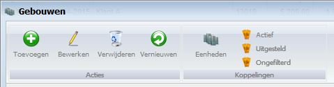

<properties>
	<page>
		<title>Introductie gebouwen</title>
		<description>Introductie gebouwen</description>
		<context>building-all*</context>
	</page>
	<menu>
		<position>Handleiding / Modules / F - O / Gebouwen</position>
		<title>Introductie</title>
		<sort>A</sort>
	</menu>
</properties>

#Gebouwen#

*Acties*

- Toevoegen
	- Om een nieuw contract op te maken klikt u op de button Toevoegen
- Bewerken
	- Om de geselecteerde regel te bewerken selecteert u een product en klikt u op de button Bewerken
- Verwijderen
	- Om een bestaande record te verwijderen selecteert u een regel en klikt u op de button Verwijderen
- Vernieuwen
	- Om de gegevens te vernieuwen klikt u op de button Vernieuwen

*Koppelingen*

- Eenheden
	- Om de eenheden (ruimtes) van een gebouw te beheren selecteert u een regel en klikt u op de button Eenheden
- Actief
	- Om de actieve tickets in te zien 
- Uitgesteld
	- Om alle uitgestelde tickets in te zien
- Ongefilterd
	- Om alle ongefilterde tickets in te zien

> **Koppelingen die betrekking hebben op 'Gebouwen':**

----------

<[Gebouwen beheren](http://hybridsaas.support/pages/handleiding/modules/F-O/facturatie/een-factuur-aanmaken)>

----------