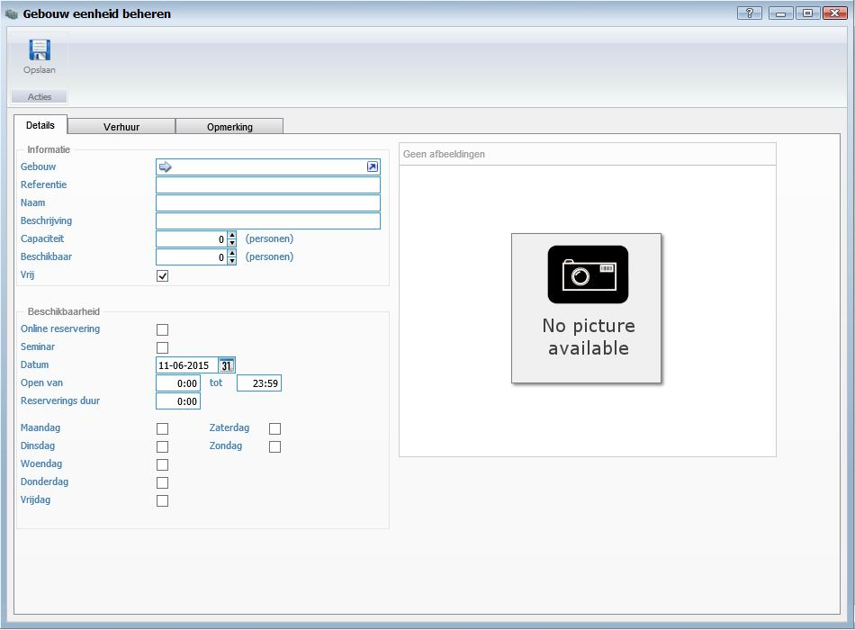
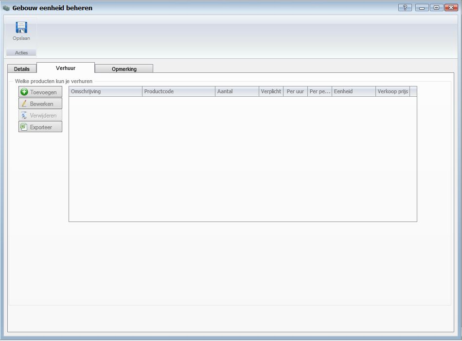
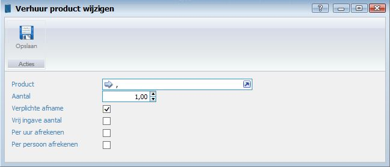

<properties>
	<page>
		<title>Gebouwen eenheden</title>
		<description>Gebouwen eenheden</description>
		<context>building-units*</context>
	</page>
	<menu>
		<position>Handleiding / Modules / F - O / Gebouwen</position>
		<title>Gebouwen eenheden</title>
		<sort>c</sort>
	</menu>
</properties>

Ga terug <[Gebouwen](http://hybridsaas.support/pages/handleiding/modules/F-O/gebouwen/gebouwen)>

----------

#Gebouw eenheden#

**Tabblad Details**

*Informatie*

- Gebouwen
- Referentie
	- Hier kan u een referentie ingeven van de eenheid.
- Naam
	- Hier kan u de naam van de eenheid ingeven.
- Beschrijving
	- Hier kan u de beschrijving van de eenheid ingeven.
- Capaciteit
	- Hier kan u de capaciteit van de eenheid ingeven (het aantal personen die maximaal in de ruimte kunnen verblijven).
- Beschikbaar
- Vrij
- Afbeelding
	- Door met de rechter muistoets te klikken op de afbeelding kan u een afbeelding uploaden. De afbeelding is wanneer u het vinkje Online reservering aangezet heeft ook te zien op het Extranet.

*Beschikbaarheid*

- Online reservering
	- Wanneer u het vinkje Online reservering aanzet kan de ruimte via het Extranet gereserveerd worden.
- Seminar
- Datum
- Open van ... tot ...
	- Hier kan u de openingstijden van de eenheid ingeven.
- Reservering duur
	- Hier kan u de MINIMALE reserverings- duur ingeven.
- Dagen
	- Hier kan u de dagen aanvinken wanneer de eenheid gereserveerd kan worden.
		- Maandag
		- Dinsdag
		- Woensdag
		- Donderdag
		- Vrijdag
		- Zaterdag
		- Zondag

- Producten toevoegen
	- Klik op toevoegen om producten die online gereserveerd kunnen worden toe te voegen aan de eenheid.
- Verhuur producten wijzigen
	- Dubbelklik op een product om het product te wijzigen

- Product
- Aantal
	- Hier kan u het aantal dat verhuurt kan worden bij de eenheid instellen.
- Verplichte afname
	- Vink aan wanneer dit een verplicht product is.
- Vrij ingave aantal
- Per uur afrekenen
	- Vink aan wanneer er per uur afgerekend moet worden.
- Per persoon afrekenen
	- Vink aan wanneer er per persoon afgerekend moet worden. (Bijvoorbeeld bij de lunch)

Alle producten dienen in Hybrid SaaS gezet te worden en aan een locatie / ruimte gelinkt te worden. Het kan zijn dat in bepaalde ruimtes er standaard faciliteiten bij horen zoals een beamer, microfoon etc. en daar niet extra kosten voor worden gerekend. Dan zet u het vinkje aan bij Verplichte afname en de prijs van het product in Hybrid SaaS op 0 euro. De klant ziet dan bij het reserveren van de ruimte wel de faciliteiten van de eenheid.

- In het tabblad opmerking kan u een opmerking over de eenheid ingeven. Klik op de knop datum om de actuele datum en tijd toe te voegen.

----------
Ga terug <[Gebouwen](http://hybridsaas.support/pages/handleiding/modules/F-O/gebouwen/gebouwen)>