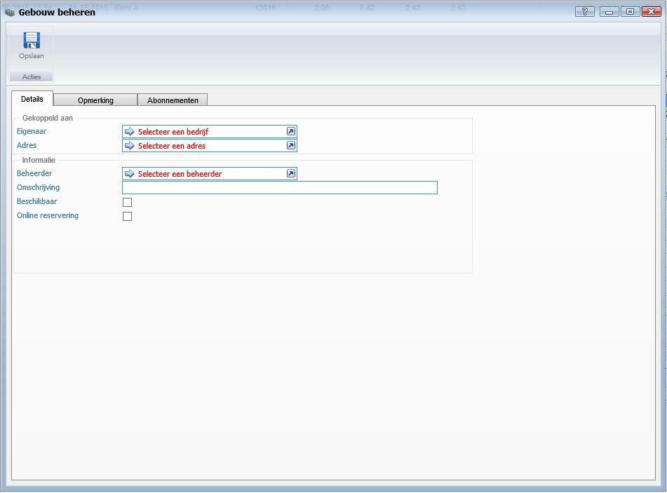
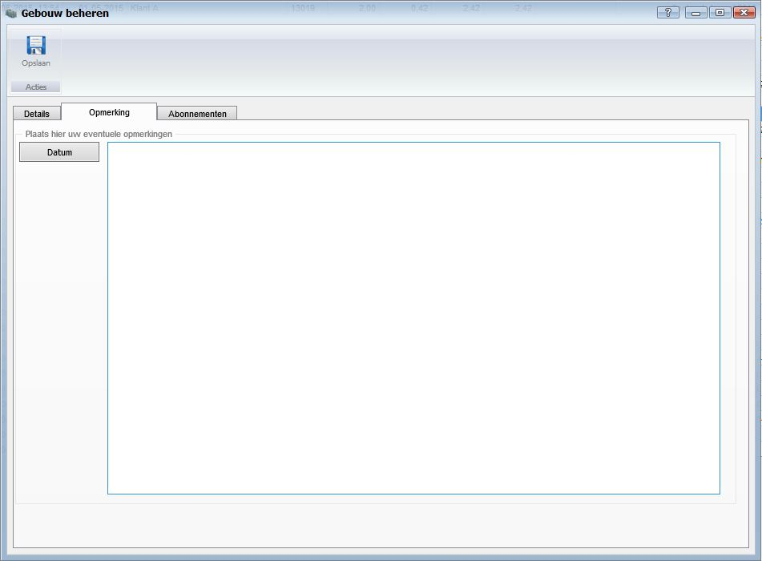
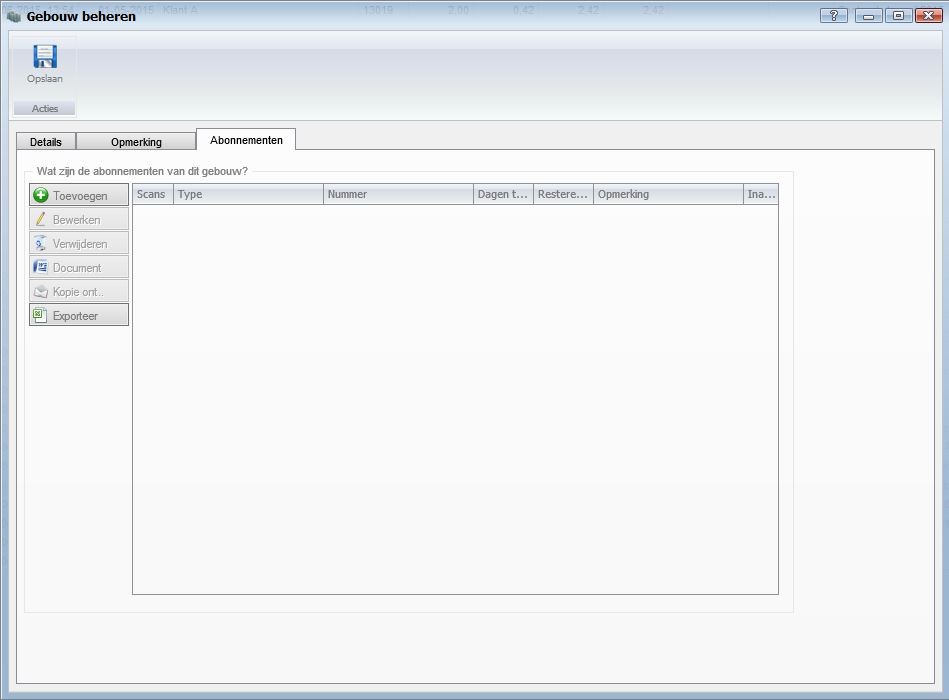

<properties>
	<page>
		<title>Gebouwen beheren</title>
		<description>Gebouwen beheren</description>
		<context>dlgbuilding*</context>
	</page>
	<menu>
		<position>Handleiding / Modules / F - O / Gebouwen</position>
		<title>Gebouwen beheren</title>
		<sort>b</sort>
	</menu>
</properties>

Ga terug <[Gebouwen](http://hybridsaas.support/pages/handleiding/modules/F-O/gebouwen/gebouwen)>

----------
#Gebouwen beheren#
De functies van het invoervenster gebouwen wordt in dit artikel behandeld. Afhankelijk van de gekozen modules zullen de verschillende menu items worden getoond.

**Tabblad Deatails**

*Gekoppeld aan*

- Eigenaar
	- Hier kan u de eigenaar van het gebouw selecteren.
- Adres
	- Hier kan u het adres van het gebouw selecteren.

*Informatie*

- Beheerder
	- Hier kan u de beheerder van het gebouw selecteren.
- Omschrijving
	- Hier kan u een omschrijving van het gebouw ingeven.
- Beschikbaar
	- Vink aan wanneer het gebouw beschikbaar is.
- Online reservering
	- Vink aan wanneer het gebouw via het Extranet gereserveerd kan worden.

**Tabblad Opmerking**

- In het tabblad opmerking kan u een opmerking over het gebouw ingeven. Klik op de knop datum om de actuele datum en tijd toe te voegen

**Tabblad Abonnementen**

----------
Ga terug <[Gebouwen](http://hybridsaas.support/pages/handleiding/modules/F-O/gebouwen/gebouwen)>