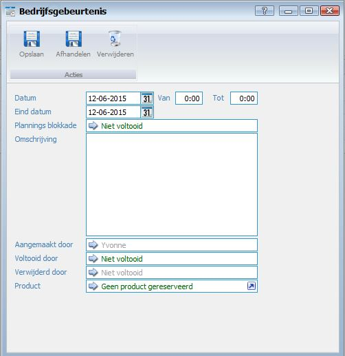
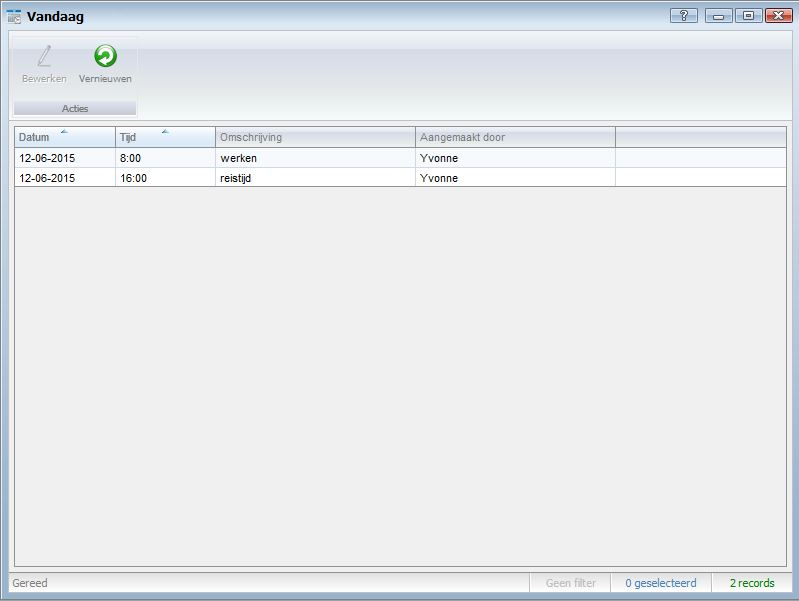

<properties>
	<page>
		<title>Bedrijfsagenda aanmaken</title>
		<description>Bedrijfsagenda aanmaken</description>
		<context>dlgcompany-event*</context>
	</page>
	<menu>
		<position>Handleiding / Modules / F - O / HR Management</position>
		<title>Bedrijfsagenda aanmaken</title>
		<sort>h</sort>
	</menu>
</properties>

Ga terug <[HR Management](http://hybridsaas.support/pages/handleiding/modules/F-O/hr-management/introductie)>

----------

#Bedrijfsagenda aanmaken#

- Datum
	- Geef hier de datum in van de gebeurtenis
- Van...Tot
	- Geef hier (indien van toepassing) een begin en eind tijd weer
- Eind datum
	- Geef hier de einddatum in van de gebeurtenis
- Plannings blokkade
	- Geef hier (indien van toepassing) de medewerker in welke geblokkeerd moet worden zodat er geen afspraken op deze dag gepland kunnen worden.
- Omschrijving
- Aangemaakt door
- Voltooid door
- Verwijderd door
- Product

#Inzien welke bedrijfsgebeurtenis vandaag staan gepland#

----------

Ga terug <[HR Management](http://hybridsaas.support/pages/handleiding/modules/F-O/hr-management/introductie)>

