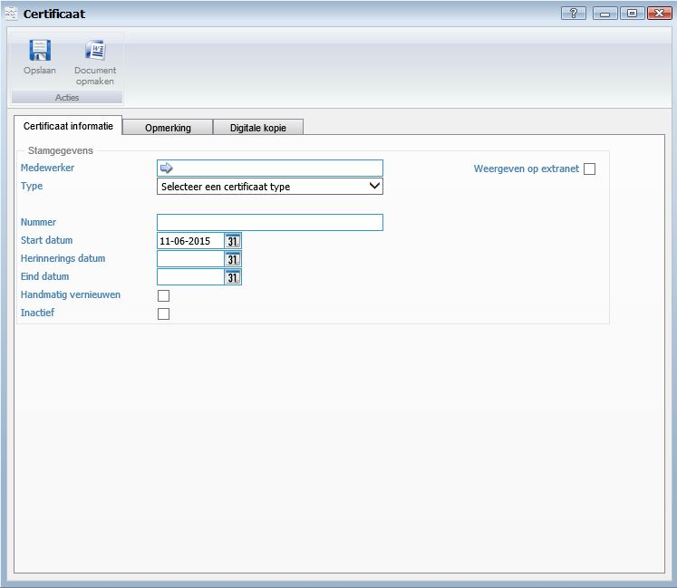
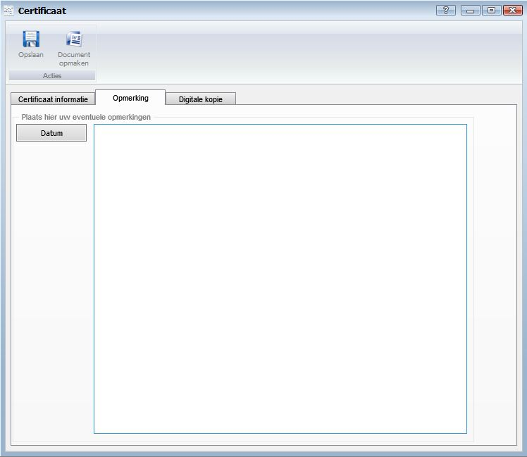
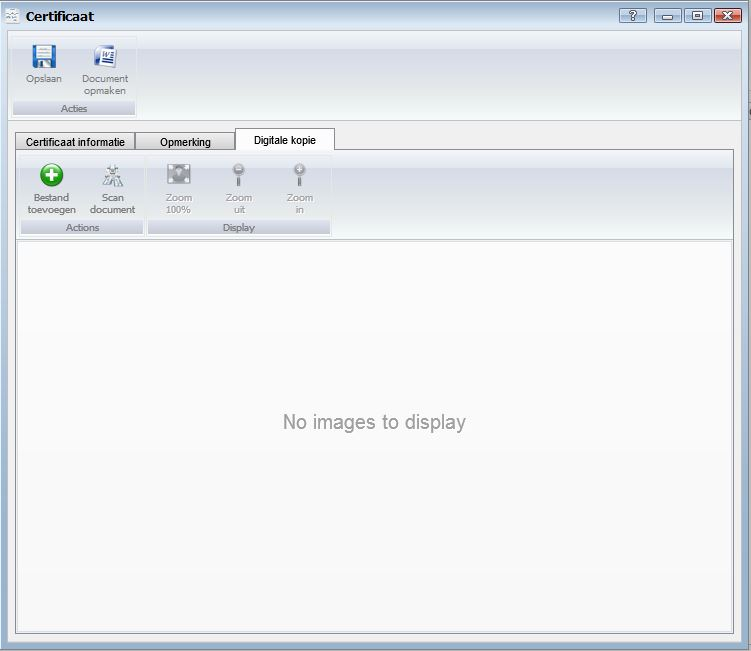

<properties>
	<page>
		<title>Certificaat aanmaken</title>
		<description>Certificaat aanmaken</description>
		<context>dlgcertificate*</context>
	</page>
	<menu>
		<position>Handleiding / Modules / F - O / HR Management</position>
		<title>Certificaat aanmaken</title>
		<sort>c</sort>
	</menu>
</properties>

Ga terug <[Medewerker aanmaken](http://hybridsaas.support/pages/handleiding/modules/F-O/hr-management/een-medewerker-aanmaken)>
<[HR Management](http://hybridsaas.support/pages/handleiding/modules/F-O/hr-management/introductie)>

----------
#Een Certificaat aanmaken#

**Tabblad Certificaat informatie**

*Stamgegevens*

- Medewerker
	- Dit veld wordt automatisch ingevuld.
- Type
	- Hier kunt u het certificaat type selecteren zie [Certificaat type]().
- Weergeven op extranet
	- Vink aan wanneer u het certificaat wilt weergeven op Extranet.
- Nummer
	- Hier kunt u een nummer van het certificaat type ingeven.
- Start datum
	- Hier kunt u de start datum van het certificaat ingeven.
- Herinnerings- datum
	- Hier kunt u de datum selecteren van wanneer u een herinnering wilt ontvangen.
- Eind datum
	- Hier kunt u de eind datum van het certificaat selecteren.
- Handmatige vernieuwing
	- Vink aan wanneer u het certificaat handmatig wilt vernieuwen.
- Inactief
	- Vink aan wanneer het certificaat niet meer actief is.

**Tabblad Opmerking**

- U kunt een opmerking plaatsen. Dit veld is een vrij in te geven veld. Om een datum toe te voegen aan de opmerking klikt u op de button Datum.

**Tabblad Digitale kopie**

- Bestand toevoegen
	- Om een bestand toe te voegen klikt u op de button Toevoegen.
- Scan document
	- Om een document te scannen vanuit Hybrid SaaS dient een scanner gekoppeld te zijn aan de computer waarop u werkt. Klik op de button Scan document om een document te scannen en direct toe te voegen.
- Zoom 100%
	- Om het document 100% uit te zoemen klikt u op de button Zoom 100%.
- Zoom uit
	- Om het document uit te zoemen klikt u op de button Zoom uit.
- Zoom in
	- Om het document in te zoemen klikt u op de button Zoom in.

----------

Ga terug <[Medewerker aanmaken](http://hybridsaas.support/pages/handleiding/modules/F-O/hr-management/een-medewerker-aanmaken)>
<[HR Management](http://hybridsaas.support/pages/handleiding/modules/F-O/hr-management/introductie)>
