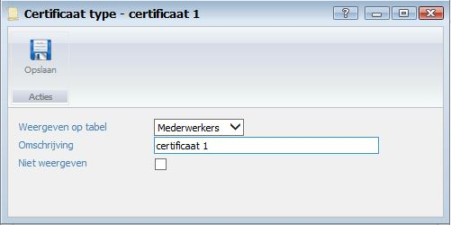

<properties>
	<page>
		<title>Certificaat type aanmaken</title>
		<description>Certificaat type aanmaken</description>
		<context>certificate-type*</context>
	</page>
	<menu>
		<position>Handleiding / Modules / F - O / HR Management</position>
		<title>Certificaat type aanmaken</title>
		<sort>d</sort>
	</menu>
</properties>

Ga terug <[Medewerker aanmaken]()>
<[HR Management](http://hybridsaas.support/pages/handleiding/modules/F-O/hr-management/hr-management)>

----------
#Een Certificaat type aanmaken#

- Weergeven op tabel
	- Selecteer hier op welke tabel u het certificaat type wilt weergeven.
- Omschrijving
	- Geef hier een omschrijving van het door u aan te maken certificaat type in.
- Niet weergeven
	- Vink aan wanneer u het certificaat type niet wilt weergeven op de tabellen.

----------

Ga terug <[Medewerker aanmaken]()>
<[HR Management](http://hybridsaas.support/pages/handleiding/modules/F-O/hr-management/hr-management)>