<properties>
	<page>
		<title>Medewerker aanmaken</title>
		<description>Medewerker aanmaken</description>
		<context>dlgemployee*</context>
	</page>
	<menu>
		<position>Handleiding / Modules / F - O / HR Management</position>
		<title>Medewerker aanmaken</title>
		<sort>b</sort>
	</menu>
</properties>

Ga terug <[HR Management](http://hybridsaas.support/pages/handleiding/modules/F-O/hr-management/hr-management)>

----------

#Een medewerker aanmaken#

**Tabblad Basisgegevens**

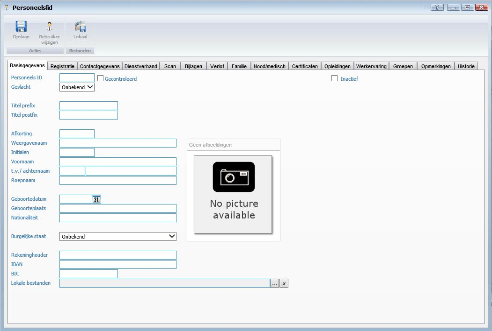

- Personeels ID
- Gecontroleerd
- Inactief
- Geslacht
- Titel prefix
- Titel postfix
- Afkorting
- Weergavenaam
- Initialen
- Voornaam
- T.v./achternaam
- Roepnaam
- Afbeelding
- Geboortedatum
- Geboorteplaats
- Nationaliteit
- Burgelijke staat
- Rekeninghouder
- IBAN
- BIC
- Lokale bestanden

**Tabblad Registratie**

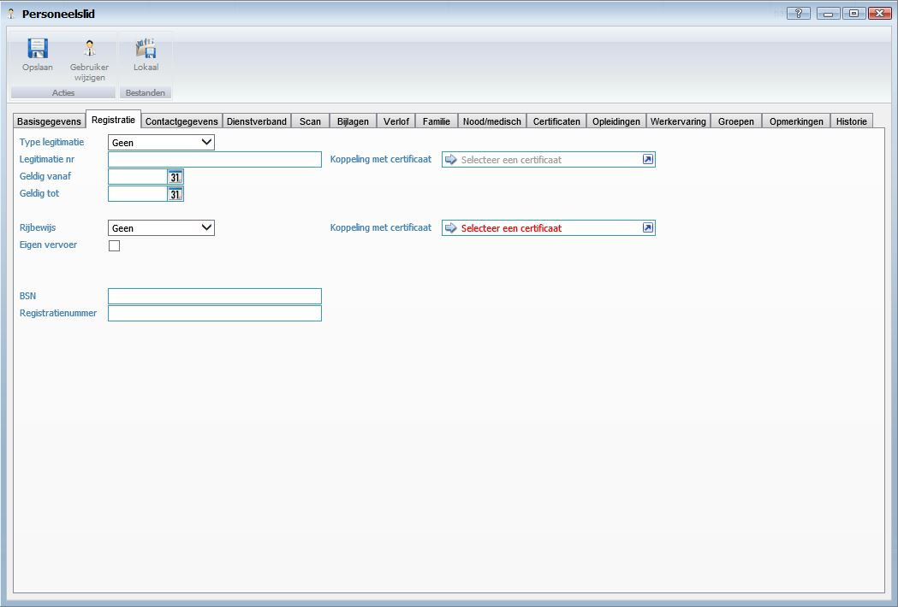

- Type legitimatie
	- Hier kunt u het type legitimatie selecteren.
- Legitimatie nr
	- Hier kunt u het nummer van de legitimatie ingeven.
- Geldig vanaf
	- Hier kunt u de datum van wanneer de legitimatie geldig is selecteren.
- Geldig tot
	- Hier kunt u de datum van wanneer de legitimatie niet meer geldig is selecteren.
- Koppeling met certificaat
	- Hier kunt u een certificaat selecteren om een koppeling te maken.
- Rijbewijs
- Eigen vervoer
- Koppeling met certificaat
	- Hier kunt u een certificaat selecteren om een koppeling te maken.
- BSN
	- Hier kunt u de BSN van de medewerker ingeven.
- Registratienummer
	- Hier kunt u het registratie nummer van de legitimatie ingeven.

**Tabblad Contactgegevens**

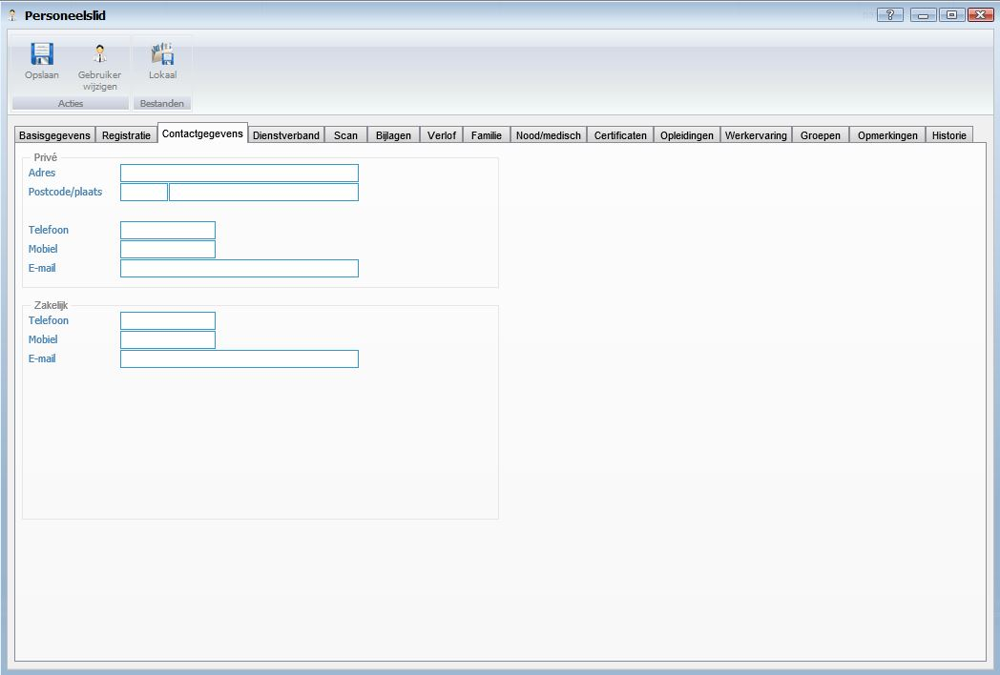

*Prive*

- Adres
- Postcode/plaats
- Telefoon
- Mobiel
- E-mail

*Zakelijk*

- Telefoon
- Mobiel
- E-mail

**Tabblad Dienstverband**

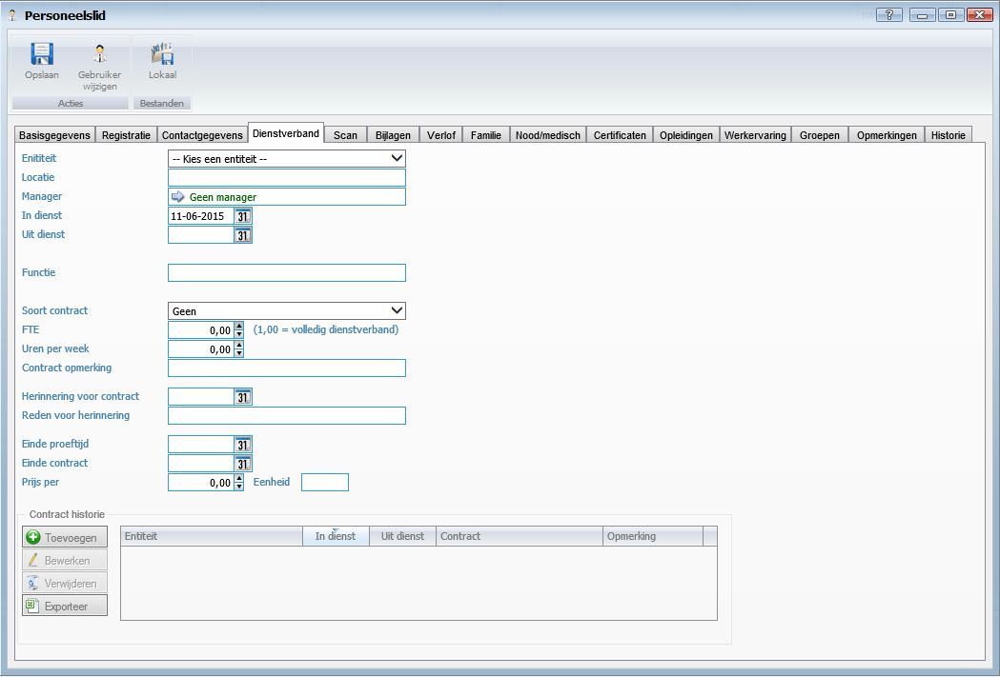

- Entiteit
	- Hier kunt u de entiteit selecteren.
- Locatie
	- Hier kunt u de locatie van de entiteit ingeven.
- Manager
- In dienst
	- Hier kunt u de datum van in dienst ingeven.
- Uit dienst
	- Hier kunt u de datum van uit dienst ingeven.
- Functie
	- Hier kunt u de functie van de medewerker ingeven.
- Soort Contract
	- Hier kunt u het soort contract selecteren
- FTE
- Uren per week
- Contract opmerking
	- Hier kunt u een opmerking over het contract ingeven.
- Herinnering voor contract
	- Hier kunt u een herinnering instellen.
- Reden van herinnering
	- Hier kunt u een reden voor herinnering ingeven. Bijvoorbeeld het verlengen van een contract.
- Einde proeftijd
- Einde contract
	- Hier kunt u het einde van het contract instellen.
- Prijs per .. eenheid
	- Hier kunt u de prijs per eenheid ingeven. Bijvoorbeeld 1000 euro per maand.

*Contract historie*

- Hier kunt u een verlopen contract toevoegen zodat u altijd de historie van de medewerker kan inzien.

**Tabblad Scan**

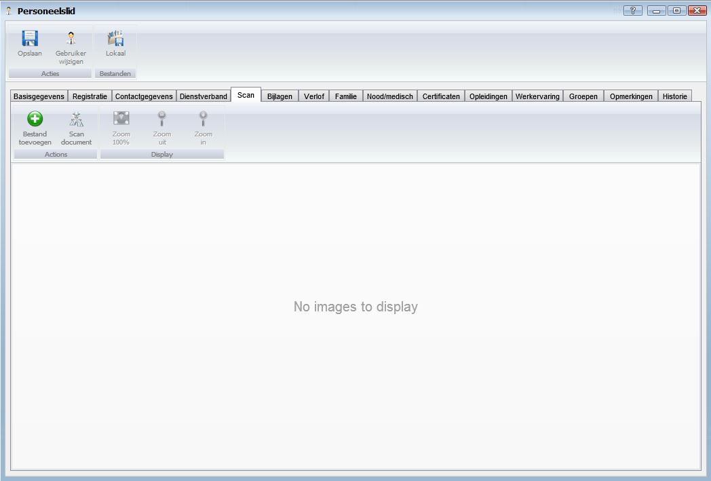

- Bestand toevoegen
	- Om een bestand toe te voegen klikt u op de button Toevoegen.
- Scan document
	- Om een document te scannen vanuit Hybrid SaaS dient een scanner gekoppeld te zijn aan de computer waarop u werkt. Klik op de button Scan document om een document te scannen en direct toe te voegen.
- Zoom 100%
	- Om het document 100% uit te zoemen klikt u op de button Zoom 100%.
- Zoom uit
	- Om het document uit te zoemen klikt u op de button Zoom uit.
- Zoom in
	- Om het document in te zoemen klikt u op de button Zoom in.

**Tabblad Bijlage**

- Toevoegen
	- Om toe te voegen klikt u op de button Toevoegen.
- Downloaden 
- Bewerken
	- Om te bewerken selecteert u een regel en klikt op de button Bewerken.
- Verwijderen
	- Om te verwijderen selecteert u een regel en klikt op de button Verwijderen.
- Exporteren

**Tabblad Verlof**

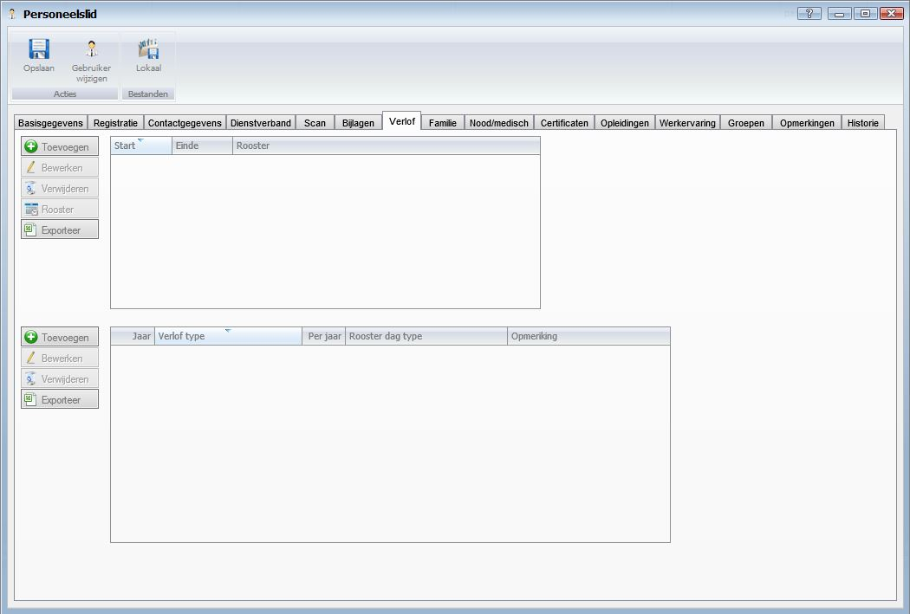

*Actief rooster*

- Toevoegen
	- Om een rooster toe te voegen klikt u op de button Toevoegen.
- Bewerken
	- Om een rooster te bewerken selecteert u een regel en klikt op de button Bewerken.
- Verwijderen
	- Om een rooster te verwijderen selecteert u een regel en klikt op de button Verwijderen.
- Rooster
- Exporteren

*Verlof toewijzing*

- Toevoegen
	- Om een verlof toewijzing toe te voegen klikt u op de button Toevoegen.
- Bewerken
	- Om een verlof toewijzing te bewerken selecteert u een regel en klikt op de button Bewerken.
- Verwijderen
	- Om een verlof toewijzing te verwijderen selecteert u een regel en klikt op de button Verwijderen.
- Exporteren

**Tabblad Familie**

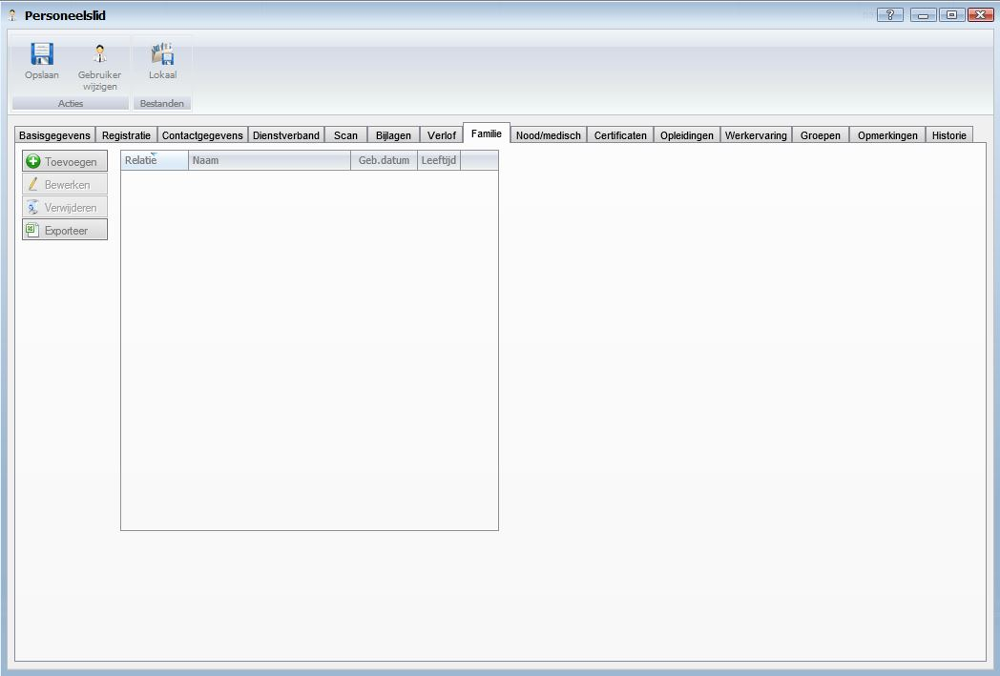

- Toevoegen
	- Om toe te voegen klikt u op de button Toevoegen. 
- Bewerken
	- Om te bewerken selecteert u een regel en klikt op de button Bewerken.
- Verwijderen
	- Om te verwijderen selecteert u een regel en klikt op de button Verwijderen.
- Exporteren

**Tabblad Nood/Medisch**

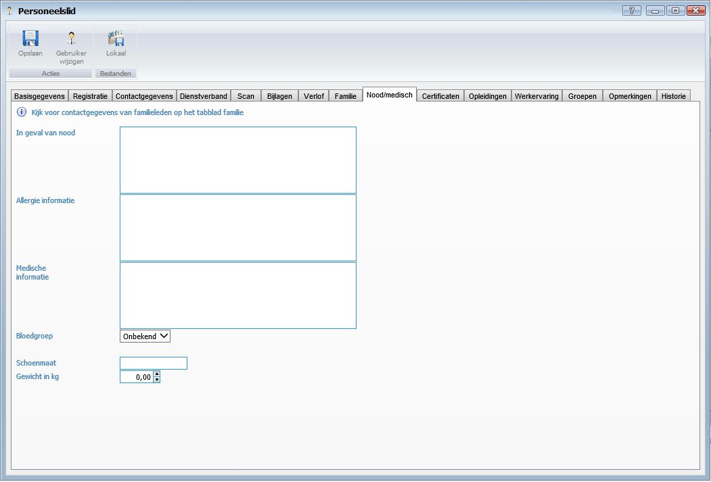

- In geval van nood
- Allergie informatie
- Medische informatie
- Bloedgroep
- Schoenmaat
- Gewicht in KG 

**Tabblad Certificaten**

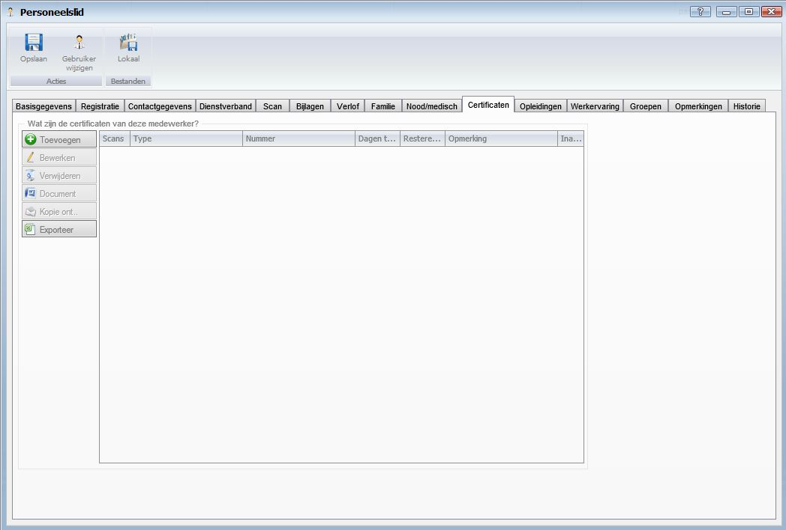

- Toevoegen
	- Om toe te voegen klikt u op de button Toevoegen. zie ook [Certificaat toevoegen]()
- Bewerken
	- Om te bewerken selecteert u een regel en klikt op de button Bewerken.
- Verwijderen
	- Om te verwijderen selecteert u een regel en klikt op de button Verwijderen.
- Document
- Kopie ont..
- Exporteren

**Tabblad Opleidingen**

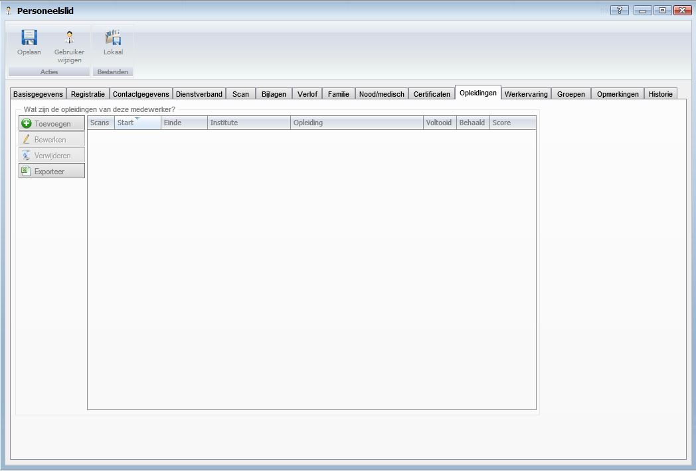

- Toevoegen
	- Om toe te voegen klikt u op de button Toevoegen. zie ook [Opleiding type toevoegen]()
- Bewerken
	- Om te bewerken selecteert u een regel en klikt op de button Bewerken.
- Verwijderen
	- Om te verwijderen selecteert u een regel en klikt op de button Verwijderen.
- Document
- Kopie ont..
- Exporteren

**Tabblad Werkervaring**

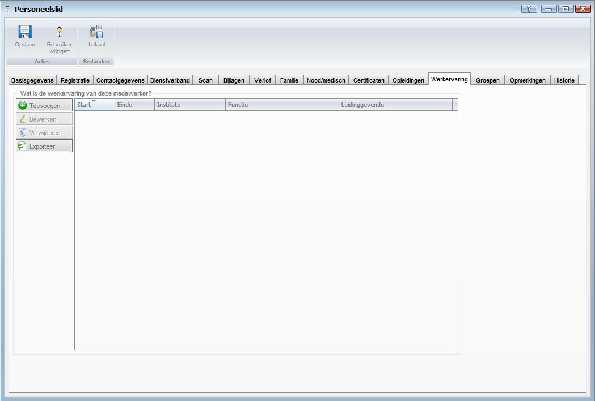

- Toevoegen
	- Om toe te voegen klikt u op de button Toevoegen. 
- Bewerken
	- Om te bewerken selecteert u een regel en klikt op de button Bewerken.
- Verwijderen
	- Om te verwijderen selecteert u een regel en klikt op de button Verwijderen.
- Exporteren

**Tabblad Groepen**

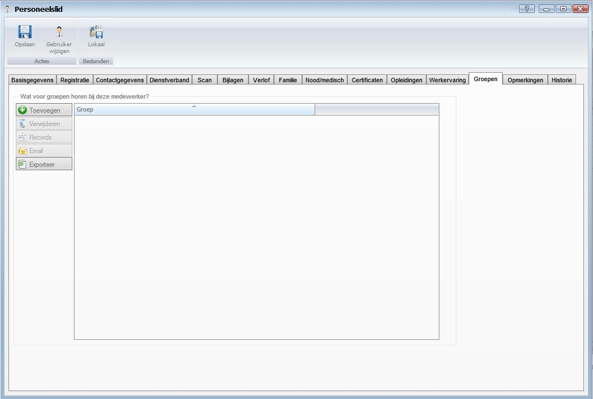

- Toevoegen
	- Om toe te voegen klikt u op de button Toevoegen. 
- Verwijderen
	- Om te verwijderen selecteert u een regel en klikt op de button Verwijderen.
- Records
- Email
	- Om een email te versturen aan alle deelnemers aan de groep selecteert u een regel en klikt op de button Email.
- Exporteren

U dient eerst groepen aan te maken om het medewerkers te koppelen aan een bepaalde groep. Ga naar [Medewerkers indelen in groepen](). Groepen worden aangemaakt om medewerkers te sorteren in bepaalde groepen. Dit kan zijn alle medewerkers die werkzaam zijn bij de receptie,  administratie, sales en implementatie, systeembeheer etc.

**Tabblad Opmerkingen**

- U kunt een opmerking plaatsen. Dit veld is een vrij in te geven veld. Om een datum toe te voegen aan de opmerking klikt u op de button Datum.

**Tabblad Historie**

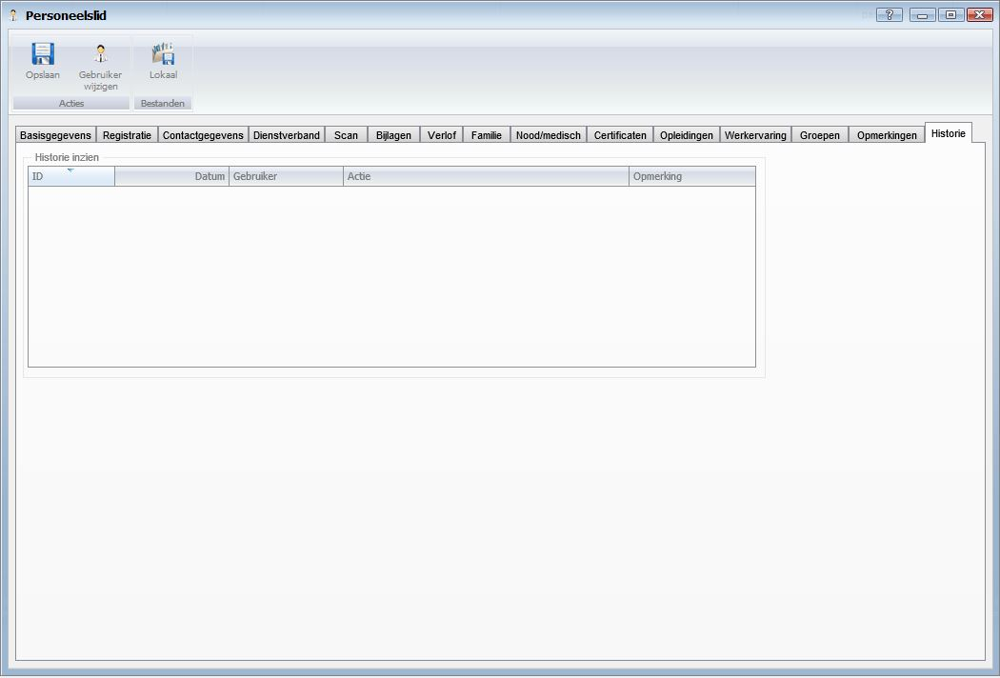

- In het tabblad Historie kunt u alle historie van de medewerker inzien.

----------
Ga terug <[HR Management](http://hybridsaas.support/pages/handleiding/modules/F-O/hr-management/hr-management)>