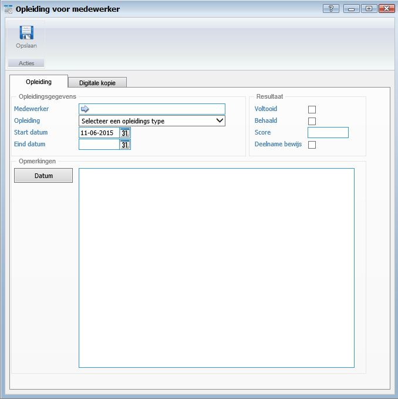
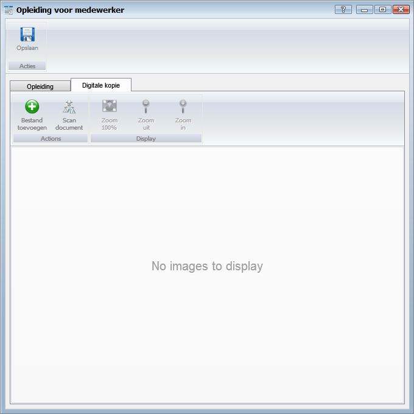

<properties>
	<page>
		<title>Opleiding type aanmaken</title>
		<description>Opleiding type aanmaken</description>
		<context>dlgtraining-type*</context>
	</page>
	<menu>
		<position>Handleiding / Modules / F - O / HR Management</position>
		<title>Opleiding type aanmaken</title>
		<sort>e</sort>
	</menu>
</properties>

Ga terug <[Medewerker aanmaken](http://hybridsaas.support/pages/handleiding/modules/F-O/hr-management/een-medewerker-aanmaken)>
<[HR Management](http://hybridsaas.support/pages/handleiding/modules/F-O/hr-management/introductie)>

----------
#Opleiding type aanmaken#

*Opleidingsgegevens*

- Medewerker
	- Dit veld wordt automatisch ingevuld.
- Opleiding
	- Hier kunt u het opleidings- type selecteren zie ook [opleidings- type]()
- Start datum
	- Hier kunt u de start datum van de opleiding selecteren.
- Eind datum
	- Hier kunt u de eind datum van de opleiding selecteren.

*Resultaat*

- Voltooid
	- Vink aan wanneer de opleiding voltooit is.
- Behaald
	- Vink aan wanneer de opleiding behaald is.
- Score
	- Hier kunt u de score van de opleiding ingeven.
- Deelname bewijs

*Opmerkingen*

- U kunt een opmerking plaatsen. Dit veld is een vrij in te geven veld. Om een datum toe te voegen aan de opmerking klikt u op de button Datum.

**Tabblad Digitale kopie**

- Bestand toevoegen
	- Om een bestand toe te voegen klikt u op de button Toevoegen.
- Scan document
	- Om een document te scannen vanuit Hybrid SaaS dient een scanner gekoppeld te zijn aan de computer waarop u werkt. Klik op de button Scan document om een document te scannen en direct toe te voegen.
- Zoom 100%
	- Om het document 100% uit te zoemen klikt u op de button Zoom 100%.
- Zoom uit
	- Om het document uit te zoemen klikt u op de button Zoom uit.
- Zoom in
	- Om het document in te zoemen klikt u op de button Zoom in.

----------

Ga terug <[Medewerker aanmaken](http://hybridsaas.support/pages/handleiding/modules/F-O/hr-management/een-medewerker-aanmaken)>
<[HR Management](http://hybridsaas.support/pages/handleiding/modules/F-O/hr-management/introductie)>