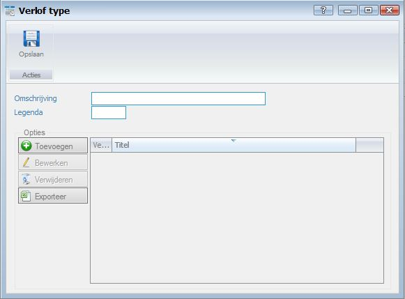

<properties>
	<page>
		<title>Verlof type aanmaken</title>
		<description>Verlof type aanmaken</description>
		<context>dlgleave-type*</context>
	</page>
	<menu>
		<position>Handleiding / Modules / F - O / HR Management</position>
		<title>Verlof type aanmaken</title>
		<sort>ea</sort>
	</menu>
</properties>

Ga terug <[HR Management](http://hybridsaas.support/pages/handleiding/modules/F-O/hr-management/introductie)>

----------

#Een verlof type aanmaken#
In dit artikel wordt het proces voor het aanmaken van een nieuw verlof type beschreven. Verlof types worden aangemaakt om verlof redenen te categoriseren in groepen.

- Omschrijving
	- Hier kunt u de omschrijving van het verlof type ingeven.
- Legenda

*Opties*

- Toevoegen
	- Om een optie toe te voegen aan het verlof type klikt u op de button Toevoegen.
- Bewerken
	- Om de regel te bewerken selecteert u een regel en klikt op de button Bewerken.
- Verwijderen
	- Om de regel te verwijderen selecteert u een regel en klikt op de button Verwijderen.
- Exporteren

----------

Ga terug <[HR Management](http://hybridsaas.support/pages/handleiding/modules/F-O/hr-management/introductie)>