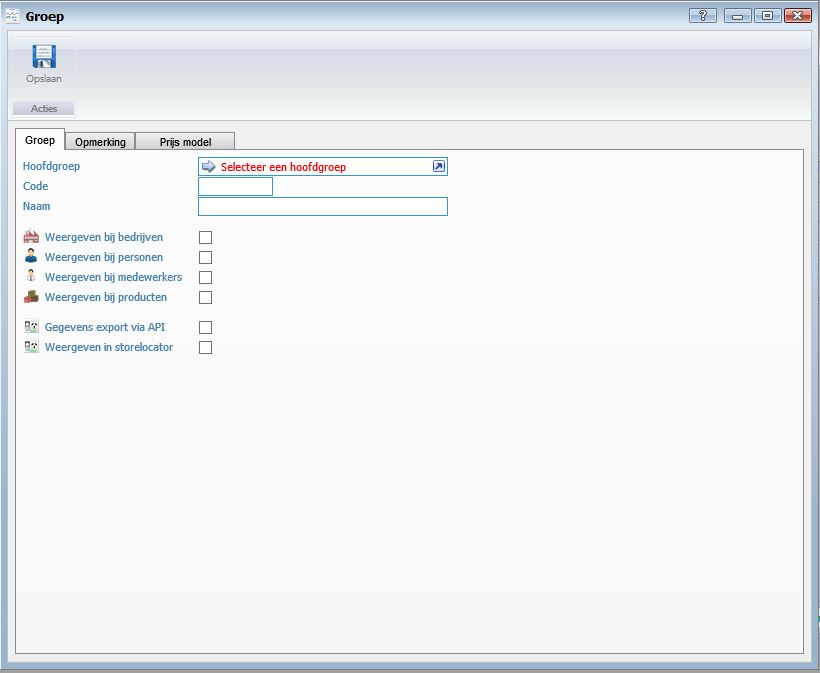
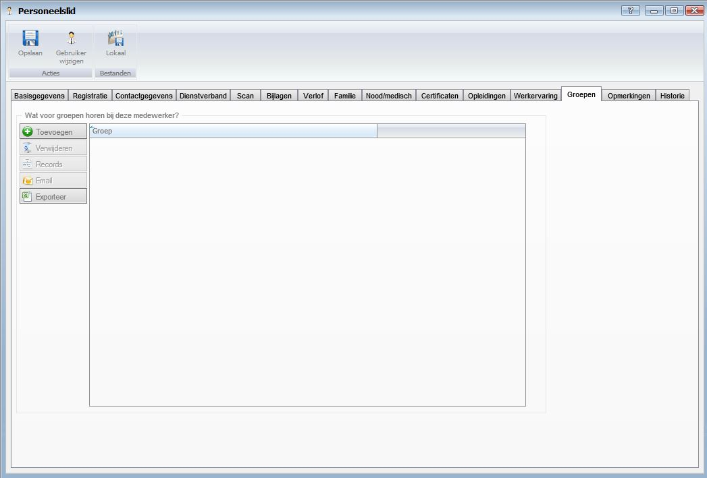
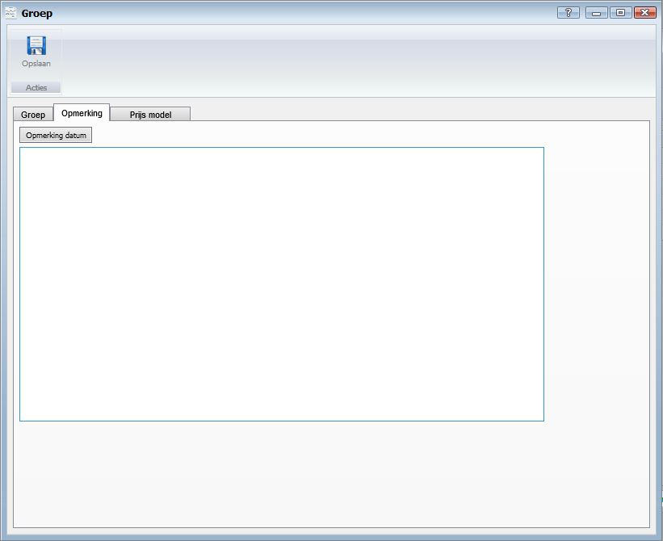
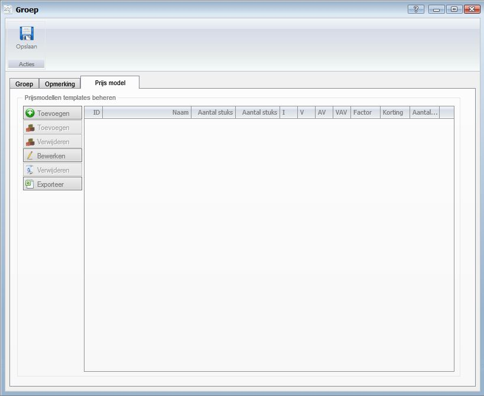

<properties>
	<page>
		<title>Relatie indelen in groep</title>
		<description>Relatie indelen in groep</description>
		<context>groups*</context>
	</page>
	<menu>
		<position>Handleiding / Modules / F - O / HR Management</position>
		<title>Relatie indelen in groep</title>
		<sort>f</sort>
	</menu>
</properties>

Ga terug <[HR Management](http://hybridsaas.support/pages/handleiding/modules/F-O/hr-management/introductie)>

----------

#Medewerkers indelen in groepen#

*Introductie*

In dit artikel wordt het proces voor het indelen van medewerkers in groepen beschreven. Medewerkers worden ingedeeld in groepen om de medewerkers te categoriseren. Nadat u de medewerkers in groepen heeft ingedeeld kan u eenvoudig een complete groep een email versturen.

Om medewerkers in te delen in groepen dient u eerst de groepen aan te maken. Volg onderstaande stap om de groep aan te maken. Heeft u de groepen al aangemaakt? Ga dan naar Medewerkers indelen in groepen.

**Tabblad groep**

- Hoofdgroep
	- Selecteer een hoofdgroep
- Code
- Naam
	- Geef de naam van de (sub)groep in.
- Weergeven bij bedrijven
	- Vink aan wat van toepassing is
- Weergeven bij personen
	- Vink aan wat van toepassing is
- Weergeven bij medewerkers
	- Vink aan wat van toepassing is
- Weergeven bij producten
	- Vink aan wat van toepassing is
- Gegevens export via API
- Weergeven in storelocator

Wanneer de lijst met hoofdgroepen nog leeg is klikt u in het geopende venster op Toevoegen. En volg onderstaande stap uit (u krijgt het zelfde scherm te zien als net.

Geef de naam van de groep in
- Vink aan wat van toepassing is
	- Weergeven bij bedrijven
	- Weergeven bij personen
	- Weergeven bij medewerkers
Klik op Opslaan

U heeft nu een hoofdgroep aangemaakt. Wanneer de groep niet op het scherm zichtbaar is klikt u op vernieuwen om de lijst te vernieuwen. Selecteer nu de hoofdgroep.

*Medewerkers indelen in groepen*

- Open de medewerker

Klik op Toevoegen

Selecteer de Groep en klik op Selecteren

**Tabblad Opmerking**

*Opmerking*

- Om een datum aan de opmerking toe te voegen klikt u op de button Datum.

**Tabblad Prijsmodel**

- Toevoegen
	- Om toe te voegen klikt u op de button Toevoegen.
- Toevoegen product
	- Om toe te voegen klikt u op de button Toevoegen.
- Verwijderen product
	- Om te verwijderen selecteert u een regel en klikt op de button Verwijderen.
- Bewerken
	- Om te bewerken selecteert u een regel en klikt op de button Bewerken.
- Verwijderen
	- Om te verwijderen selecteert u een regel en klikt op de button Verwijderen.
- Exporteren

----------

Ga terug <[HR Management](http://hybridsaas.support/pages/handleiding/modules/F-O/hr-management/introductie)>