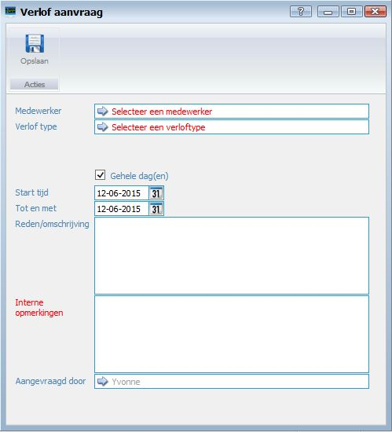
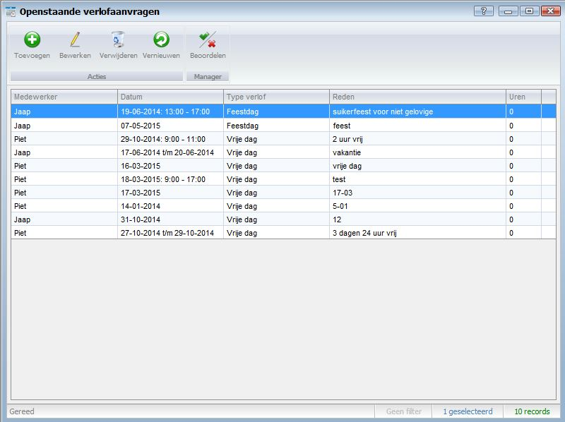
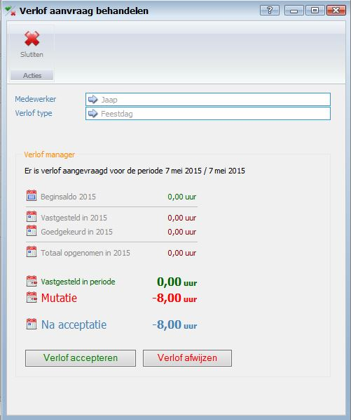

<properties>
	<page>
		<title>Verlof aanvragen/beoordelen</title>
		<description>Verlof aanvragen/beoordelen</description>
		<context>/leave-requests*</context>
	</page>
	<menu>
		<position>Handleiding / Modules / F - O / HR Management</position>
		<title>Verlof aanvragen/beoordelen</title>
		<sort>eb</sort>
	</menu>
</properties>

Ga terug <[HR Management](http://hybridsaas.support/pages/handleiding/modules/F-O/hr-management/introductie)>

----------

#Verlof aanvragen#
In dit artikel wordt het proces voor het aanvragen van verlof beschreven. Voordat u verlof kunt aanvragen dient u eerst een medewerker en een verlof type aan te maken.

- Medewerker
	- Hier kunt u de medewerker selecteren.
- Verlof type
	- Hier kunt u het verlof type selecteren.
- Gehele dag(en)
	- Vink aan wanneer het gehele dagen zijn.
- Start tijd
	- Hier kunt u de start tijd van het verlof ingeven.
- Tot en met
	- Hier kunt u de eind tijd / datum van het verlof ingeven.
- Reden / omschrijving
	- Hier kunt u de reden / omschrijving van het verlof ingeven.
- Interne opmerkingen
	- Hier kunt u een interne opmerking ingeven.
- Aangevraagd door

#Verlof Beoordelen#
In dit artikel wordt het proces voor het beoordelen van verlof beschreven. Voordat u verlof kunt beoordelen dient u eerst een verlof aanvraag aan te maken

- Hier kunt u de aanvraag beoordelen (let op je kan er maar 1 tegelijk doen)
door op de regel te gaan staan en door op de button beoordelen te klikken

- Hier kan je het verlof afwijzen of accepteren

----------

Ga terug <[HR Management](http://hybridsaas.support/pages/handleiding/modules/F-O/hr-management/introductie)>