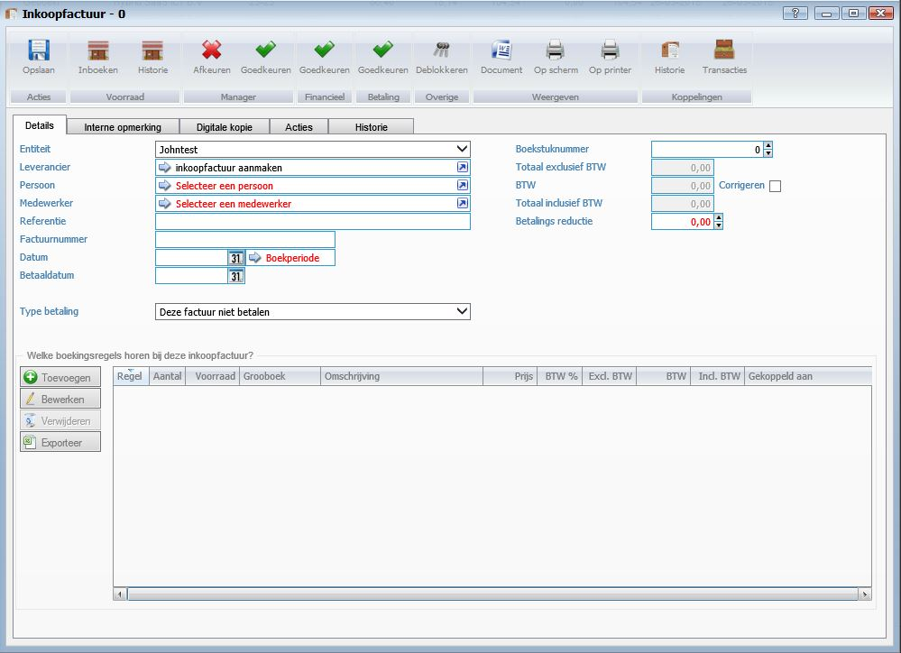
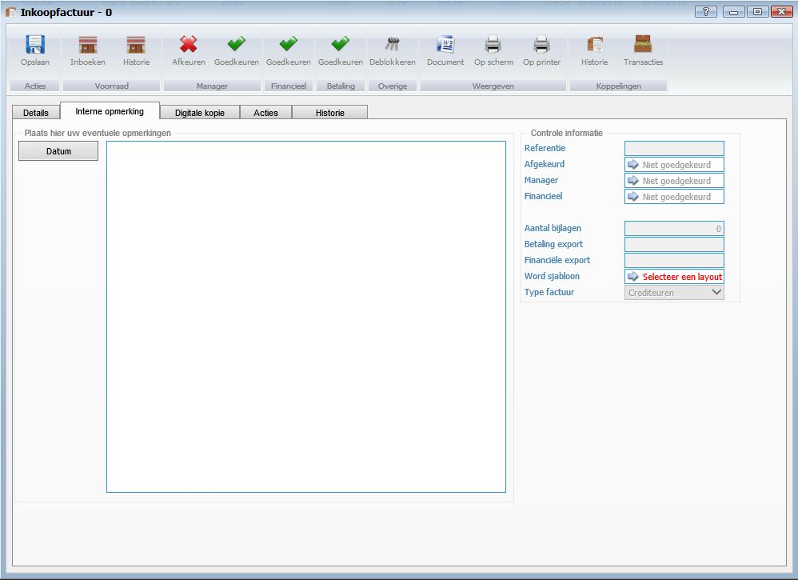
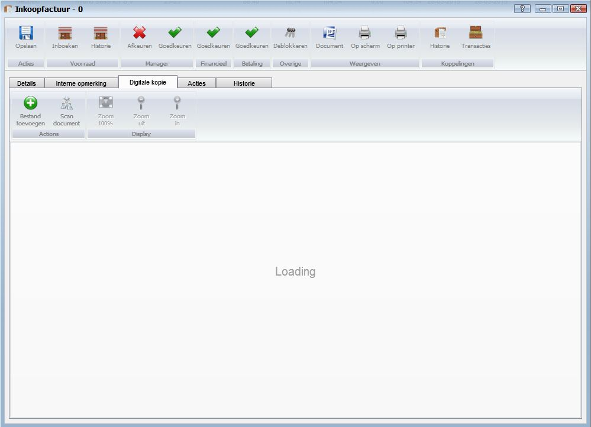
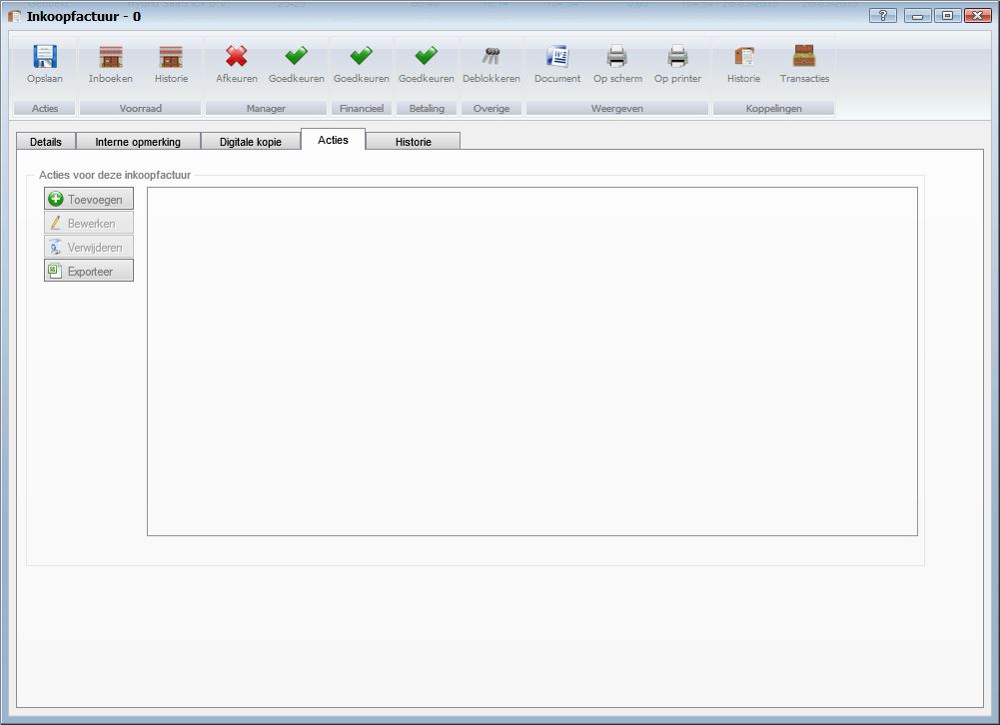
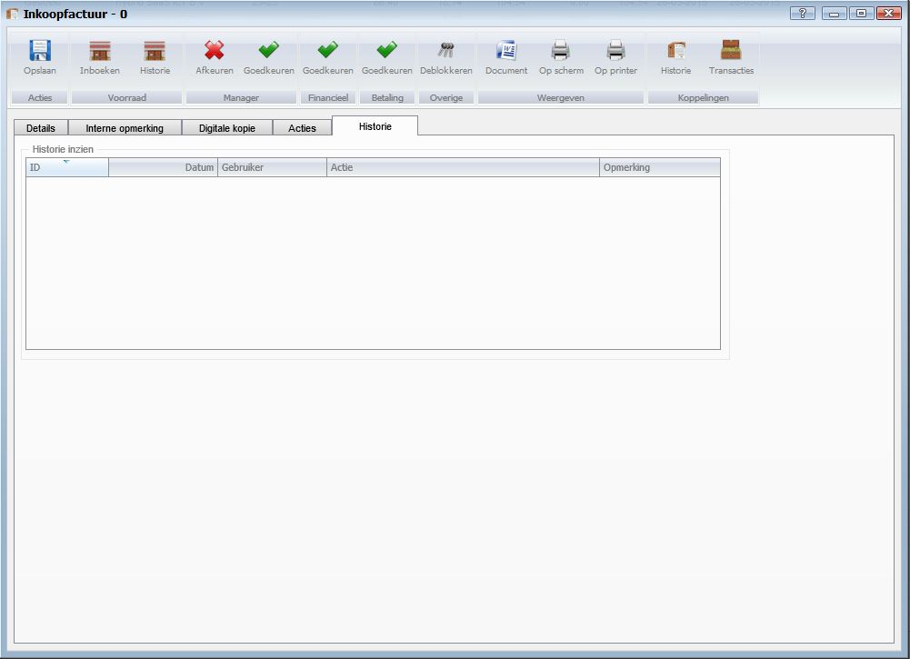

<properties>
	<page>
		<title>Inkoopfactuur aanmaken</title>
		<description>Inkoopfactuur aanmaken</description>
        <context>dlgpurchase-invoice*</context>
	</page>
	<menu>
		<position>Handleiding / Modules / F - O / Inkoopfacturen</position> 
		<title>Inkoopfactuur aanmaken</title>
	</menu>
</properties>

#Een inkoopfactuur aanmaken#

**Aanmaken van een nieuw inkoopfactuur**

**Tabblad Details**

- Entiteit
- Leverancier
- Persoon
- Medewerker
- Referentie
- Factuurnummer
- Datum
- Betaaldatum
- Type betaling
- Boekstuknummer
- Totaal exclusief BTW
- BTW
- Corrigeren
- Totaal inclusief BTW
- Betalings reductie

*Welke boekingsregels horen bij deze inkoopfactuur?*

**Tabblad Interne opmerking**

*Plaats hier uw eventuele opmerking*

*Controle informatie* 

- Referentie
- Afgekeurd
- Manager
- Financieel
- Aantal bijlagen
- Betaling export
- Financiële export
- Word sjabloon
- Type factuur

**Tabblad Digitale kopie**

**Tabblad Acties**

*Acties voor deze inkoopfactuur*

**Tabblad Historie**

*Historie inzien*