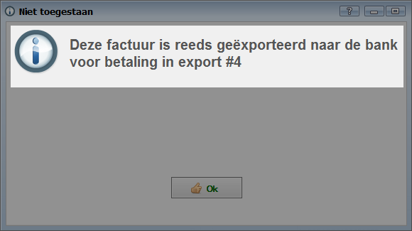
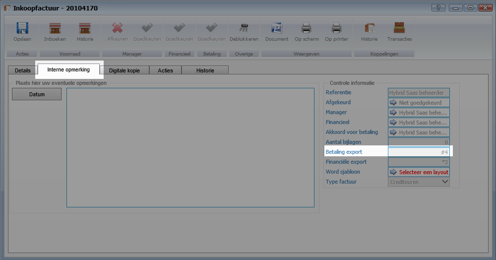
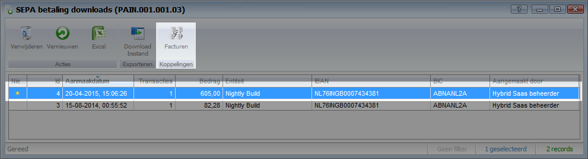
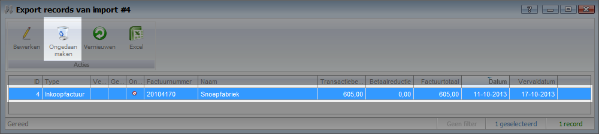

<properties>
	<page>
		<title>Betaalbatch ongedaan maken</title>
		<description>Betaalbatch ongedaan maken</description>
	</page>
	<menu>
		<position>Handleiding / Modules / F - O / Inkoopfacturen</position>
		<title>Betaalbatch ongedaan maken</title>
		<sort>C</sort>
	</menu>
</properties>

Ga terug <[Inkoopfacturen](http://hybridsaas.support/pages/handleiding/modules/F-O/inkoopfacturen/inkoopfacturen)>

----------

# Transactie inkoopfactuur verwijderen uit SEPA betaalbatch #

Bij het deblokkeren van een inkoopfactuur krijg je de volgende melding:" Deze factuur is reeds geëxporteerd naar de bank voor de betaling in export #XX "

Het is niet mogelijk om gegevens in inkoopfactuur aan te passen indien deze reeds is geëxporteerd naar de bank. Door de betaling uit de batch te verwijderen is het mogelijk om wijzigingen door te voeren. 

## Exportbatch achterhalen ##

Ga in de inkoopfactuur naar het tabblad "interne opmerking" om het nummer van de exportbatch te achterhalen.

In de overzichtslijst van de inkoopfacturen is het ook mogelijk om het nummer van de exportbatch te.

## Factuur opzoeken in de batch ##

Zoek de factuur in de juiste batch.

## Transactie ongedaan maken ##

Selecteer de transactie en maak deze ongedaan.

----------

Ga terug <[Inkoopfacturen](http://hybridsaas.support/pages/handleiding/modules/F-O/inkoopfacturen/inkoopfacturen)>