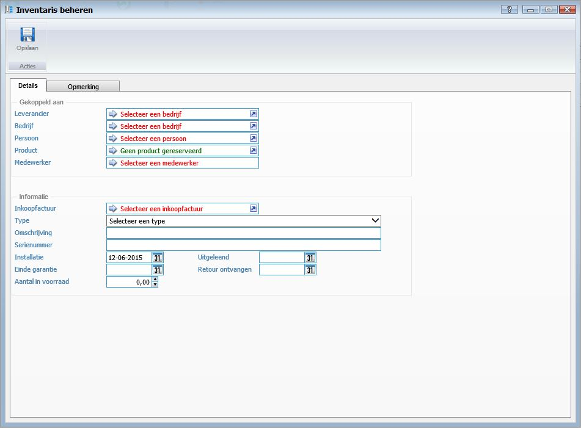
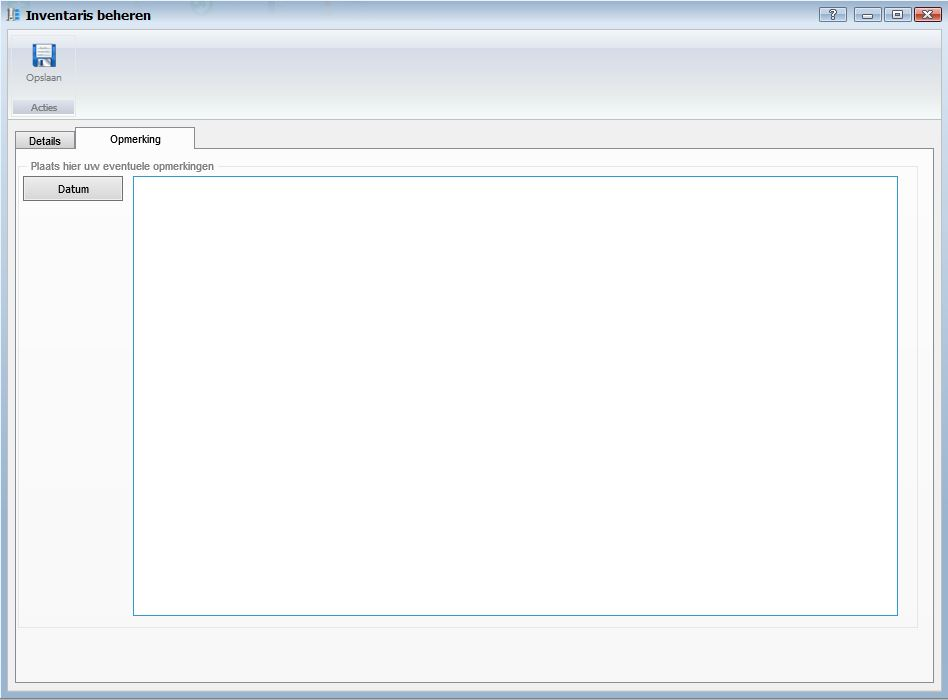

<properties>
	<page>
		<title>Inventarisbeheer aanmaken</title>
		<description>Inventarisbeheer aanmaken</description>
		<context>inventory*</context>
	</page>
	<menu>
		<position>Handleiding / Modules / F - O / Inventarisbeheer</position>
		<title>Inventarisbeheer aanmaken</title>
		<sort>b</sort>
	</menu>
</properties>

Ga terug <[Inventarisbeheer](http://hybridsaas.support/pages/handleiding/modules/F-O/inventarisbeheer/introductie)>

----------

#Inventaris item aanmaken#

**Tabblad Details**

*Gekoppeld aan*

- Leverancier
	- Om een leverancier te koppelen aan dit inventaris item selecteert u een Leverancier.
- Bedrijf
	- Om een bedrijf te koppelen aan dit inventaris item selecteert u een Bedrijf.
- Persoon
	- Om een persoon te koppelen aan dit inventaris item selecteert u een Persoon.
- Product
	- Om een product te koppelen aan dit inventaris item selecteert u een Product.
- Medewerker
	- Om een medewerker te koppelen aan dit inventaris item selecteert u een Medewerker.

*Informatie*

- Inkoopfactuur
	- Om een inkoopfactuur te koppelen aan dit inventaris item selecteert u een Inkoopfactuur.
- Type
	- Om de inventaris items te groeperen selecteert u een inventaris Type. U dient eerst Inventaris types aan te maken. zie [Inventaris type]()
- Omschrijving
	- Hier kunt u een vrije omschrijving van het inventaris item ingeven.
- Serienummer
	- Hier kunt u een serienummer van het inventaris item ingeven.
- Installatie
	- Hier kunt u de datum van de installatie selecteren.
- Uitgeleend
	- Hier kunt u de datum van het uitlenen van het inventaris item selecteren.
- Einde garantie
	- Hier kunt u de datum van het einde van de garantie selecteren.
- Retour ontvangen
	- Hier kunt u de datum van het retour ontvangen van het inventaris item selecteren.
- Aantal in voorraad

**Tabblad Opmerking**

*Opmerking*

- Om een datum aan de opmerking toe te voegen klikt u op de button Datum.

----------
Ga terug <[Inventarisbeheer](http://hybridsaas.support/pages/handleiding/modules/F-O/inventarisbeheer/introductie)>