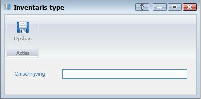

<properties>
	<page>
		<title>Inventarisbeheer aanmaken</title>
		<description>Inventarisbeheer aanmaken</description>
		<context>dlginventory-type*</context>
	</page>
	<menu>
		<position>Handleiding / Modules / F - O / Inventarisbeheer</position>
		<title>Inventarisbeheer aanmaken</title>
		<sort>c</sort>
	</menu>
</properties>

Ga terug <[Inventarisbeheer](http://hybridsaas.support/pages/handleiding/modules/F-O/inventarisbeheer/introductie)>

----------
#Een inventaris type aanmaken#
In dit artikel wordt het proces om een inventaris type aan te maken beschreven. Inventaris type worden aangemaakt om inventaris items te kunnen onderverdelen in groepen. Voorbeeld: U heeft een horeca zaak en wilt de inventaris items vastleggen in het programma. U kunt uw inventaris items onderverdelen in groepen zoals apparatuur, servies, lampen etc.

- Omschrijving
	- Hier kunt u de omschrijving van het inventaris type ingeven.