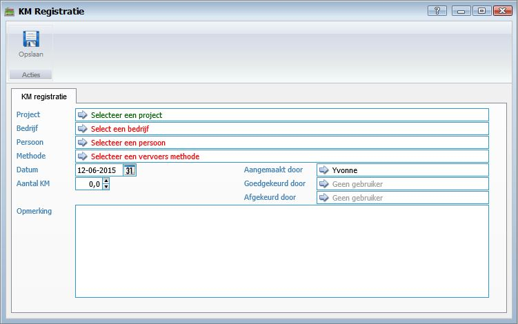

<properties>
	<page>
		<title>KM registratie aanmaken</title>
		<description>KM registratie aanmaken</description>
		<context>querydistance-registration*</context>
	</page>
	<menu>
		<position>Handleiding / Modules / F - O / KM registratie</position>
		<title>KM registratie aanmaken</title>
		<sort>b</sort>
	</menu>
</properties>

Ga terug <[KM registratie](http://hybridsaas.support/pages/handleiding/modules/F-O/km-registratie/introductie)>

----------

#KM registratie aanmaken#

- Project
	- Hier kunt u een project selecteren van de KM registratie. U bent verplicht een Project of Bedrijf of Persoon te selecteren.
- Bedrijf
	- Hier kunt u een bedrijf selecteren van de KM registratie. U bent verplicht een Project of Bedrijf of Persoon te selecteren.
- Persoon
	- Hier kunt u een persoon selecteren van de KM registratie. U bent verplicht een Project of Bedrijf of Persoon te selecteren.
- Methode
	- Hier kunt u de methode selecteren.
- Datum
	- Hier kunt u de datum selecteren van de gereden KM.
- Aantal KM
	- Hier kunt u het aantal gereden KM ingeven.
- Aangemaakt door
- Goedgekeurd door
- Afgekeurd door
- Opmerking
	- Hier kunt u een opmerking over de gereden KM ingeven.

----------

Ga terug <[KM registratie](http://hybridsaas.support/pages/handleiding/modules/F-O/km-registratie/introductie)>