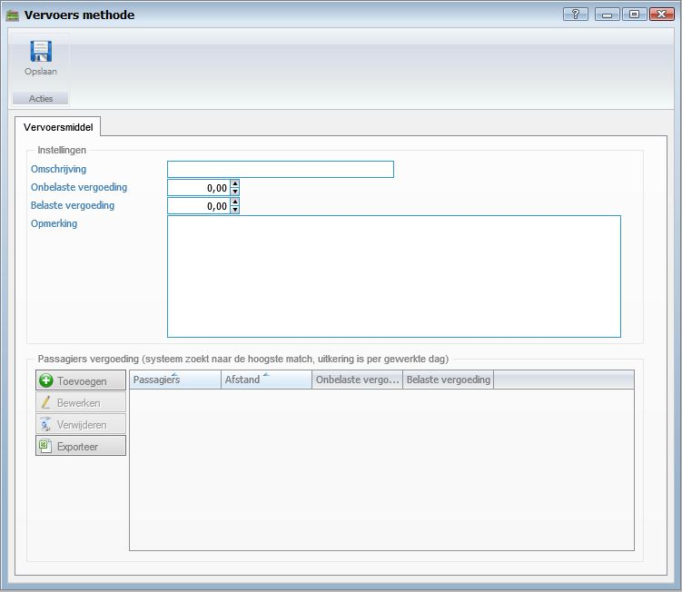

<properties>
	<page>
		<title>Vervoersmethode aanmaken</title>
		<description>Vervoersmethode aanmaken</description>
		<context>querydistance-registration-method*</context>
	</page>
	<menu>
		<position>Handleiding / Modules / F - O / KM registratie</position>
		<title>Vervoersmethode aanmaken</title>
		<sort>b</sort>
	</menu>
</properties>

Ga terug <[KM registratie](http://hybridsaas.support/pages/handleiding/modules/F-O/km-registratie/introductie)>

----------

#Vervoersmethode aanmaken#

*Instellingen*

- Omschrijving
- Onbelaste vergoeding
- Belaste vergoeding
- Opmerking

*Passagiers vergoeding*

- Toevoegen
	- Om toe te voegen klikt u op de button Toevoegen.
- Bewerken
	- Om te bewerken selecteert u een regel en klikt op de button Bewerken.
- Verwijderen
	- Om te verwijderen selecteert u een regel en klikt op de button Verwijderen.
- Exporteren

----------
Ga terug <[KM registratie](http://hybridsaas.support/pages/handleiding/modules/F-O/km-registratie/introductie)>