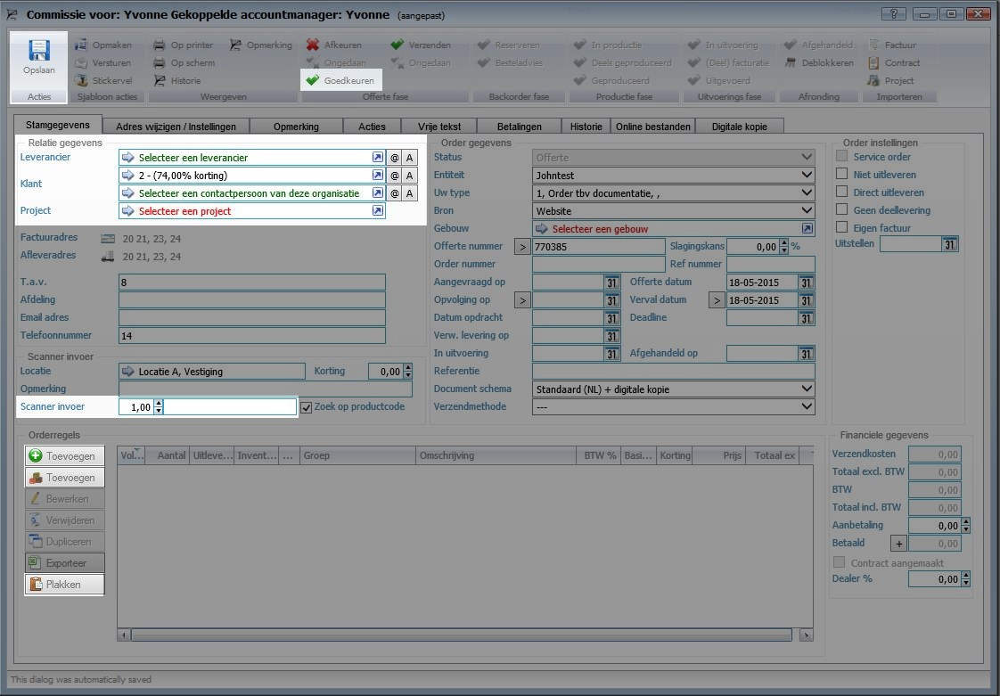
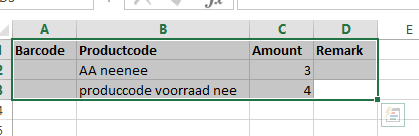

<properties>
	<page>
		<title>Offertes en Orders</title>
		<description>Offertes en Orders</description>
		<context>order-quote-all*</context>
	</page>
	<menu>
		<position>Handleiding / Modules / F - O / Offertes en orders</position> 
		<title>Offerte-Order aanmaken</title>
	</menu>
</properties>

#Een offerte of order aanmaken#
<description>

In dit artikel wordt het proces voor het aanmaken van een nieuwe offerte/order beschreven. Voor meer uitleg over het invoervensters gaat u naar [Invoervenster](http://hybridsaas.support/in/dialog/dlgorder).

Klik op

 

Het systeem vraagt automatisch om een bedrijf als klant. Wilt u de order voor particuliere klant maken klik dan op kruisje om het venster te sluiten. Volg anders onderstaande stap uit.

**Tabblad Stamgegevens**

In het geopende scherm vult u de velden in die betrekking hebben op het door u aan te maken offerte/order in.

*Selecteer een leverancier*

- Of een zakelijke klant en eventueel de contactpersoon
- Of een particuliere klant
- Of een project

*Product toevoegen*

Je kan op verschillende manieren een product toevoegen
Om een voorraad locatie in te geven bent u verplicht om met voorraad te werken.
Zie [Product locatie](http://hybridsaas.support/in/query/product-locations) en [Voorraad locatie](http://hybridsaas.support/in/query/stock-locations) voor meer informatie.

		
*Scanner invoer*

- Locatie
	- Selecteer een voorraad locatie. (Systeem pakt automatisch een voorraad locatie als bij het tabblad voorraad bij de entiteiten de voorraad locatie is gekoppeld.)
- Scanner invoer
	- Hier kunt u handmatig de barcode invullen. (Door aantal + Barcode in te voeren krijgt u het gewenst aantal producten). Wanneer u gebruik maakt van een scanner zal hier de barcode worden ingevuld.

*Toevoegen groene knop*

Voor een volledige uitleg van het nu geopende scherm zie [Orderregel](http://hybridsaas.support/in/dialog/dlgorder-line)

- Met deze button kan je een nieuw product toevoegen onder vermelding van een werkcode of product beschrijving alle velden zijn leeg en zijn zelf aan te passen 

*Toevoegen bruine knop*

- Met deze button krijg je de volledige lijst van al je bestaande producten. Alle velden zijn al ingevuld met de opgegeven gegevens (deze zijn wel aan te passen naar wens)

*Toevoegen plakken knop*

- Met deze button word je doorverwezen naar een Exel bestandje dit is makkelijk te gebruiken als je veel 
verschillende producten in een keer wilt toevoegen.
Hier vul je bij de productcode en amount je gegevens in daarna selecteer je alles ook de bovenste rij (barcode/productcode/amount/remark) en die kopieer je, dan kan je weer terug naar je HybridSaaS scherm en druk je weer op de plakken button, deze zullen dan bij je regel worden toegevoegd

Na het toevoegen van je producten is je offerte/order klaar.

Door direct te "Opslaan" is het een offerte, of door heb te "goedkeuren" en daarna te "Opslaan" is het een order

Hierna heb je 3 verschillende keuze voor het afhandelen van de orde zie de volgende stappen

[Met voorraad](http://hybridsaas.support/pages/handleiding/modules/F-O/offerte-en-orders/een-order-afhandelen-met-voorraad) --- [Zonder voorraad](http://hybridsaas.support/pages/handleiding/modules/F-O/offerte-en-orders/een-order-afhandelen-zonder-voorraad) --- [Gedeeltelijke voorraad](http://hybridsaas.support/pages/handleiding/modules/F-O/offerte-en-orders/een-order-afhandelen-gedeeltelijke-voorraad)