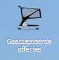
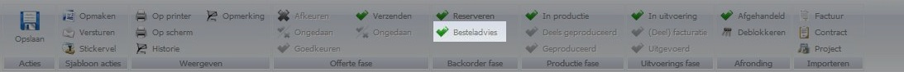

<properties>
	<page>
		<title>Orders zonder voorraad</title>
		<description>Orders zonder voorraad</description>
	</page>
	<menu>
		<position>Handleiding / Modules / F - O / Offertes en orders /  Order afhandelen</position> 
		<title>Order zonder voorraad</title>
		<sort>B</sort>
	</menu>
</properties>

Stap terug [offerte/orde aanmaken](http://hybridsaas.support/pages/handleiding/modules/F-O/offerte-en-orders/een-offerte-of-order-aanmaken)

#Een order afhandelen zonder voorraad#

Je zoekt je order op in

Alle goederen zijn niet op voorraad, je maakt hier een bestel advies van door middel van het vinkje "Besteladvies"

de Offerte is toegevoegd aan de map "besteld advies", daar vanuit kan je een "inkooporder aanmaken" naar je leverancier

In dit venster wordt het proces voor het bestellen van een inkooporde beschreven. Voor meer uitleg over het inkoopordevensters gaat u naar [inkoopordevenster](http://hybridsaas.support/in/dialog/dlgpurchase-order)

Stap terug [offerte/orde aanmaken](http://hybridsaas.support/pages/handleiding/modules/F-O/offerte-en-orders/een-offerte-of-order-aanmaken)