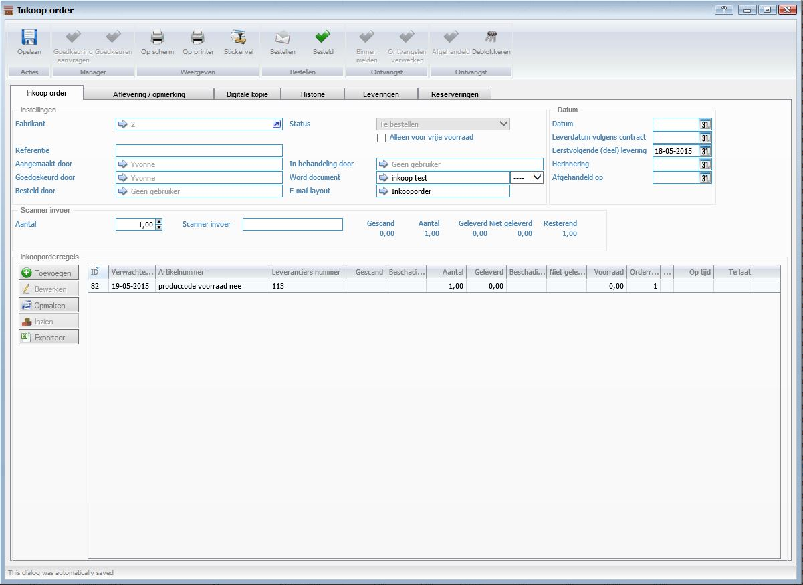
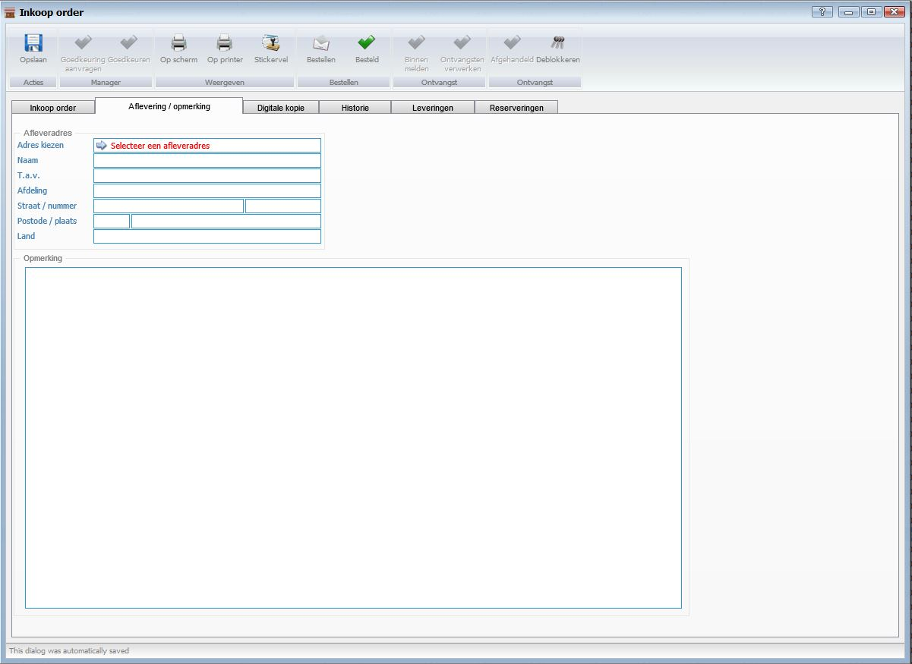
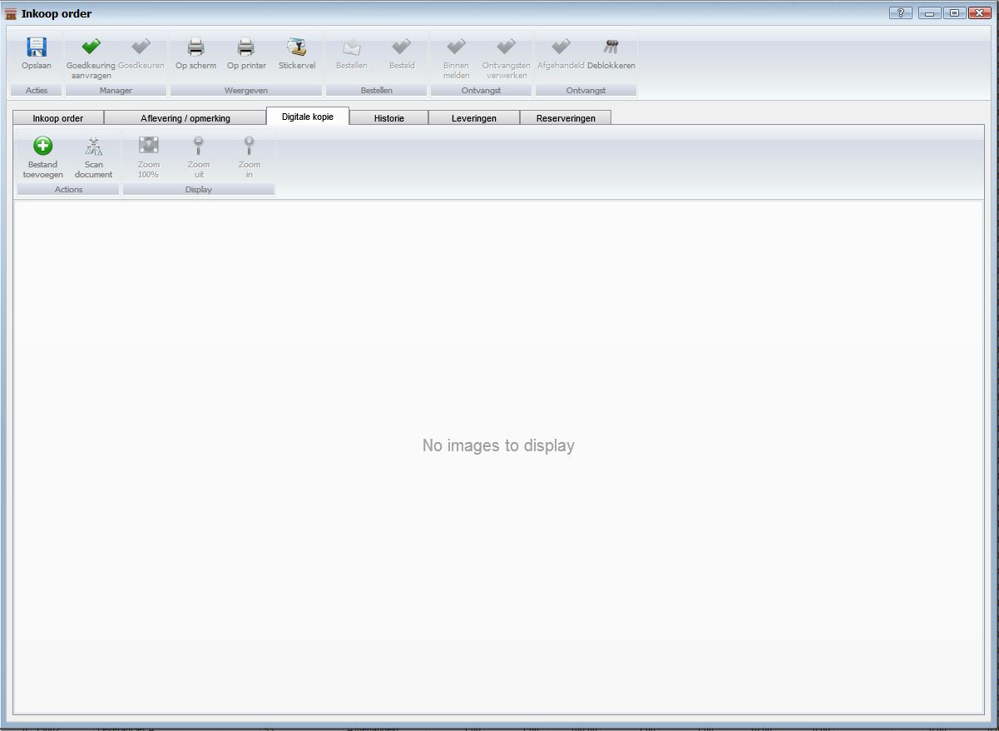
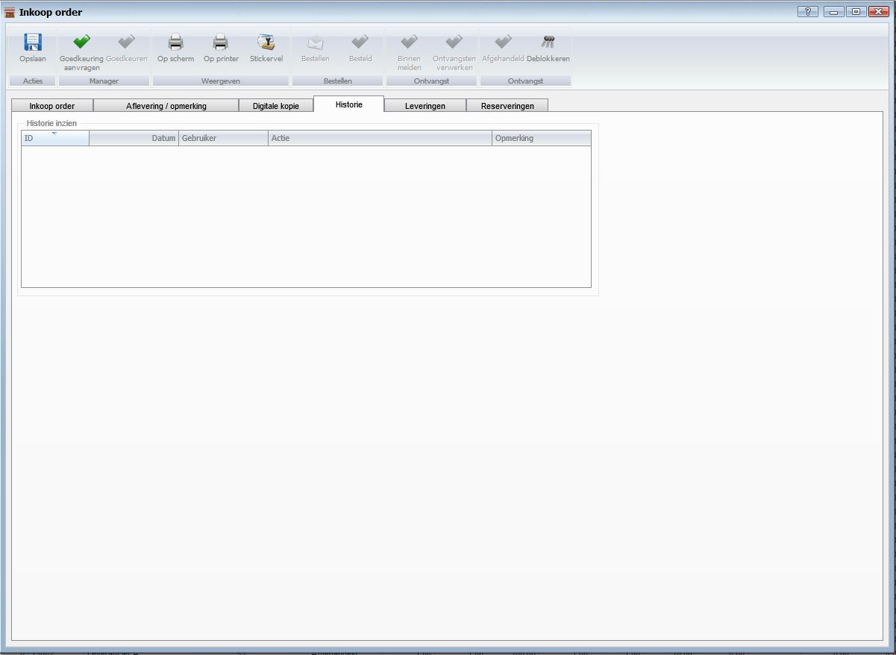
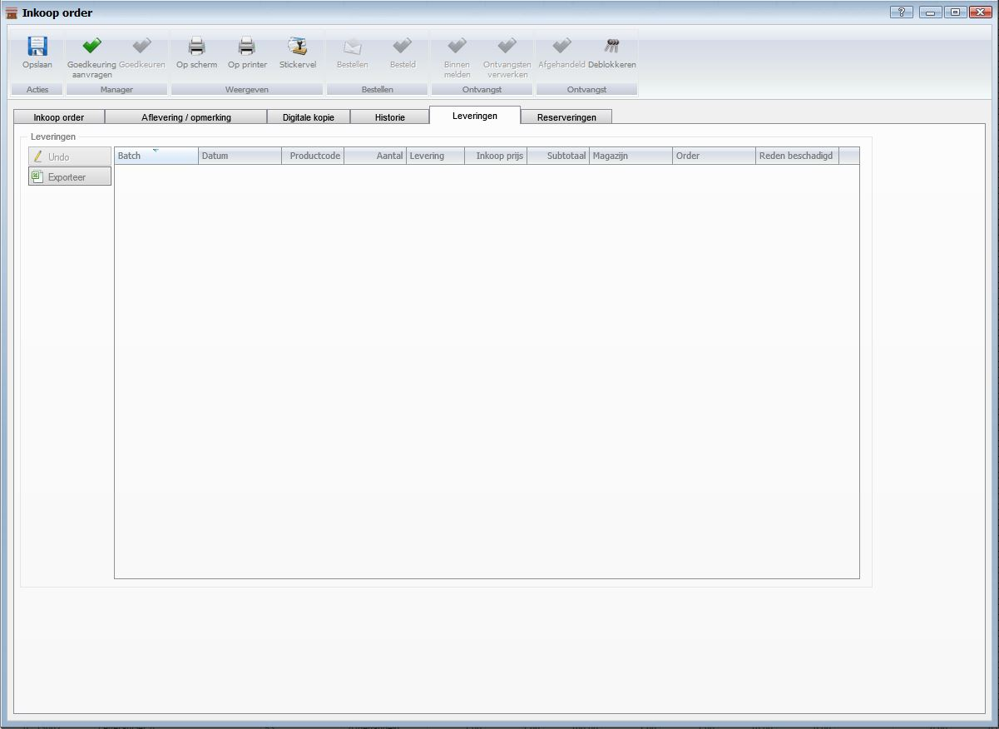
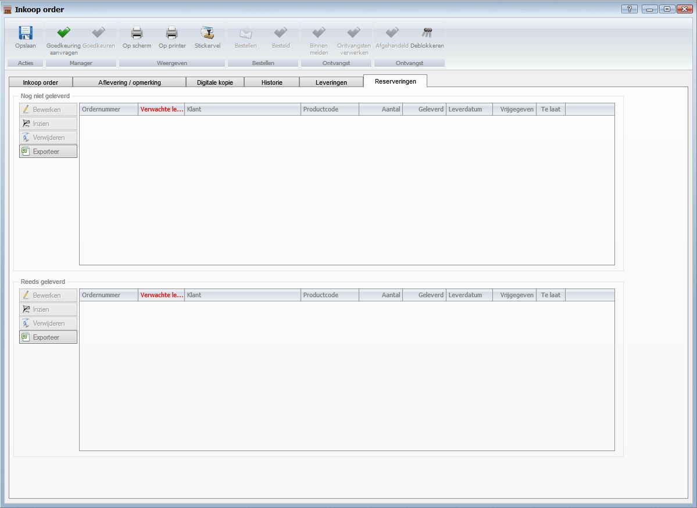

<properties>
	<page>
		<title>Inkoopordevenster</title>
		<description>Inkoopordevenster</description>
		<context>dlgpurchase-order*</context>
	</page>
	<menu>
		<position>Handleiding / Modules / F - O / Offertes en orders /  Order afhandelen</position> 
		<title>Inkoopordevenster/title>
		<sort>BA</sort>
	</menu>
</properties>

Ga terug <[afhandelen zonder voorraad](http://hybridsaas.support/pages/handleiding/modules/F-O/offerte-en-orders/een-order-afhandelen-zonder-voorraad)>

----------

#Inkoopordevenster#

De tabbladen en functies van het inkooporde venster word in dit artikel behandeld.

**Tabblad Inkoop order**

 

*Instellingen*

- Fabrikant
- Status
- Alleen voor vrije voorraad
- Referentie
- Aangemaakt door
- In behandeling door
- Goedgekeurd door
- Word document
- Besteld door
- E-mail layout

*Datum*

- Datum
- Leverdatum volgend contract
- Eerstvolgende (deel) levering
- Herinnering
- Afgehandeld op

*Scanner invoer*

- Aantal
- Scanner invoer
- Gescand
- Aantal
- Geleverd
- Niet geleverd
- Resterend

*Inkooporderegels*

**Tabblad Aflevering/Opmerking**

 

*Afleveradres*

- Adres kiezen
- Naam
- T.a.v.
- Afdeling
- Straat/nummer
- Postcode/plaats
- Land

*Opmerking*

**Tabblad Digitale kopie**

 

- Bestand toevoegen
	- Om een bestand toe te voegen klikt u op de button Toevoegen.
- Scan document
	- Om een document te scannen vanuit Hybrid SaaS dient een scanner gekoppeld te zijn aan de computer waarop u werkt. Klik op de button Scan document om een document te scannen en direct toe te voegen.
- Zoom 100%
	- Om het document 100% uit te zoemen klikt u op de button Zoom 100%.
- Zoom uit
	- Om het document uit te zoemen klikt u op de button Zoom uit.
- Zoom in
	- Om het document in te zoemen klikt u op de button Zoom in.

**Tabblad Historie**

 

*Historie inzien*

**Tabblad Leveringen**

 

*Leveringen*

- Undo
- Exporteren

**Tabblad Reserveringen**
 

*Nog niet geleverd*

- Bewerken
	- Om te bewerken selecteert u een regel en klikt op de button Bewerken.
- Inzien
- Verwijderen
	- Om te verwijderen selecteert u een regel en klikt op de button Verwijderen.
- Exporteren

*Reeds geleverd*

- Bewerken
	- Om te bewerken selecteert u een regel en klikt op de button Bewerken.
- Inzien
- Verwijderen
	- Om te verwijderen selecteert u een regel en klikt op de button Verwijderen.
- Exporteren

----------

Ga terug <[afhandelen zonder voorraad](http://hybridsaas.support/pages/handleiding/modules/F-O/offerte-en-orders/een-order-afhandelen-zonder-voorraad)>