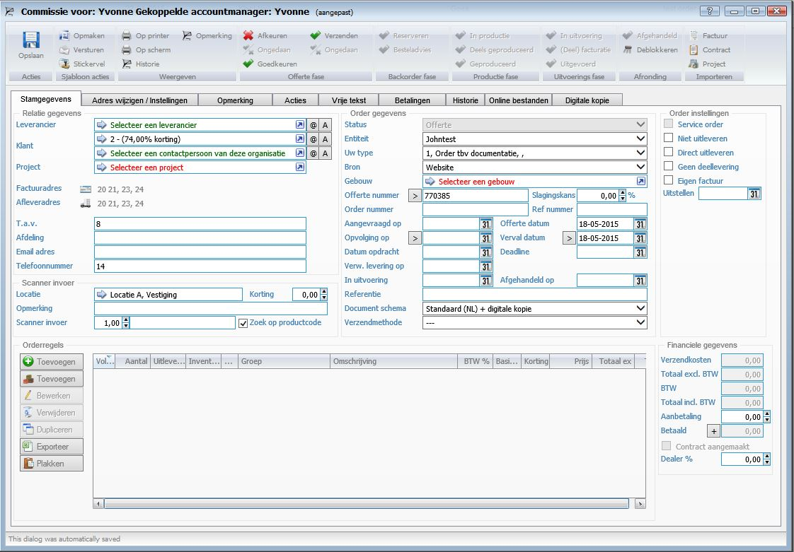
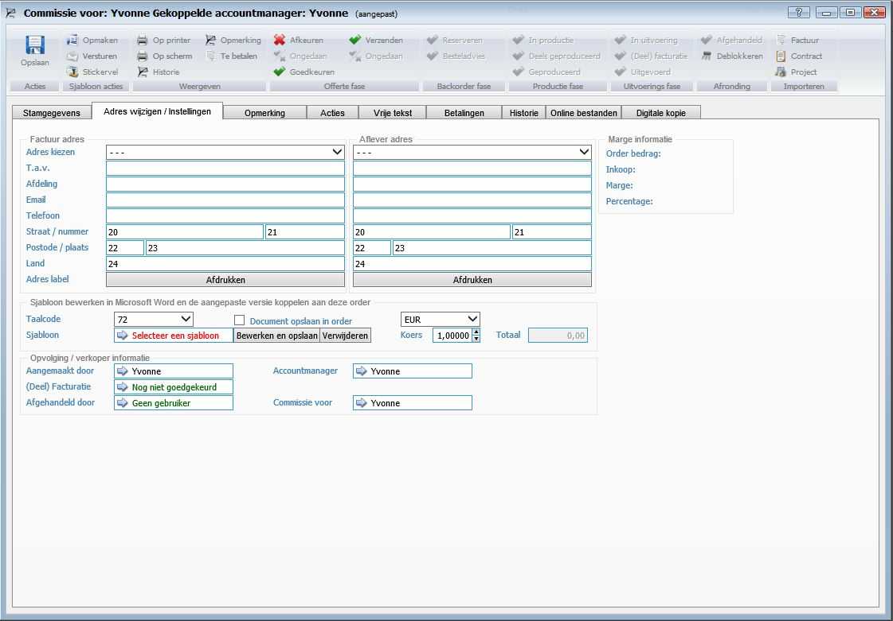
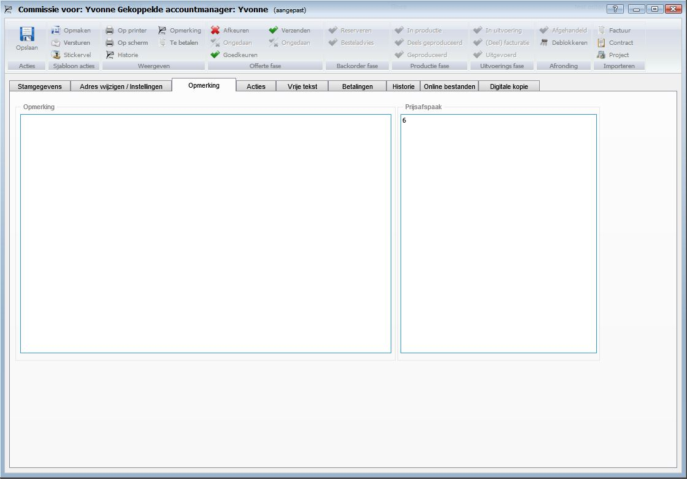
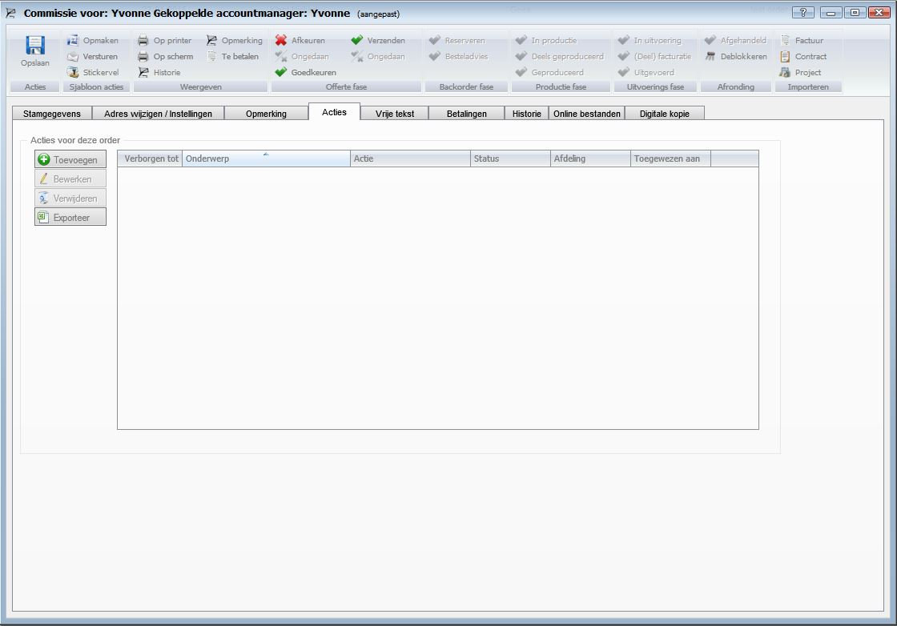
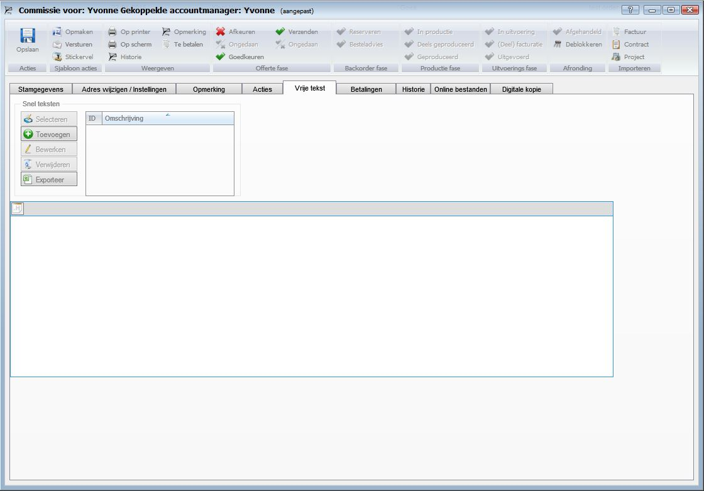
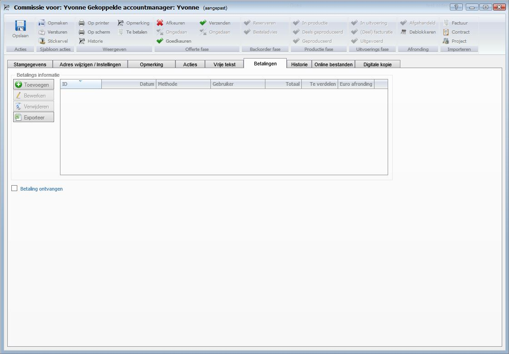
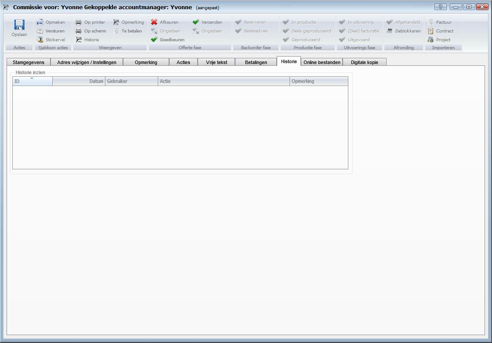
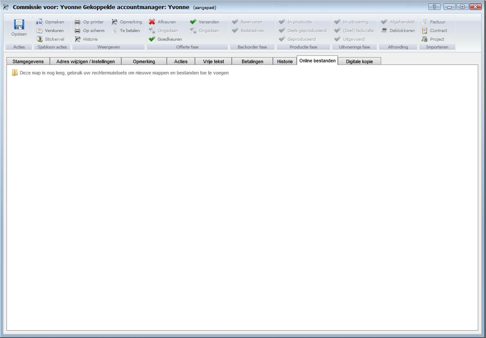
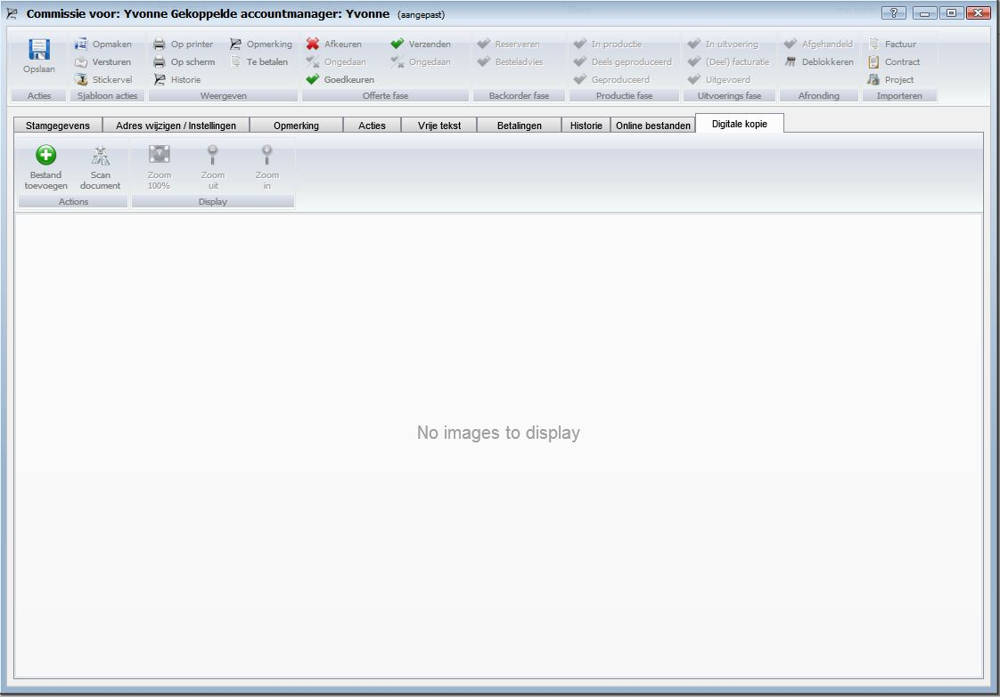

<properties>
	<page>
		<title>Invoervenster</title>
		<description>Invoervenster</description>
		<context>dlgorder*</context>
	</page>
	<menu>
		<position>Handleiding / Modules / F - O / Offertes en orders</position>
		<title>Invoervenster</title>
	</menu>
</properties>

#Invoervenster#
Introductie

De functies van het invoervenster offerte en order word in dit artikel behandeld.

**Tabblad Stamgegevens**
 

*Relatie gegevens*

- Leverancier 
	- Hier kunt u de leverancier selecteren.
- Klant 
	- Hier kunt u de klant en de contactpersoon van deze klant selecteren.
- Project 
	- Hier kunt u een project selecteren.
- @
- A
- Factuuradres
- Afleveradres
- T.a.v.
- Afdeling
- Email adres
- Telefoonnummer

*Scanner invoer*

- Locatie
- Opmerking
- Scanner invoer
- Korting
- Zoek op productcode

*Orderregels*

*Order gegevens*

- Status
- Entiteit
- Uw type
- Bron
- Gebouw
- Offerte nummer
- Slagingskans
- Order nummer
- Ref nummer
- Aangevraagd op
- Offerte datum
- Opvolging op
- Verval datum
- Datum opdracht
- Deadline
- Verw. levering op
- In uitvoering
- Afgehandeld op
- Referentie
- Document schema
- Verzendmethode

*Order instellingen*

- Service order
- Niet uitleveren
- Direct uitleveren
- Geen deellevering
- Eigen factuur
- Uitstellen

*Financiele gegevens*

- Verzendkosten
- Totaal excl. BTW
- BTW
- Totaal incl. BTW
- Aanbetaling
- Betaald
- Contract aangemaakt
- Dealer %

**Tabblad Adres wijziging/Instellingen**

 

*Factuuradres*
	- De velden van het factuuradres worden automatisch door het systeem meegenomen uit de relatiekaart. Indien dit niet ingevuld is bij de relatiekaart kunt u dit handmatig invoeren.
	
- Adres kiezen
- T.a.v.
- Afdeling
- Email
- Telefoon
- Straat/Nummer
- Postcode/Plaats
- Land
- Adres label afdrukken
	- Om een adreslabel te printen klikt u op de button Afdrukken

*Afleveradres*
	- De velden van het afleveradres worden automatisch door het systeem meegenomen uit de relatiekaart. Indien dit niet ingevuld is bij de relatiekaart kunt u dit handmatig invoeren.

- Adres kiezen
- T.a.v.
- Afdeling
- Email
- Telefoon
- Straat/Nummer
- Postcode/Plaats
- Land
- Adres label afdrukken 
	- Om een adreslabel te printen klikt u op de button Afdrukken

*Sjabloon bewerken in Microsoft Word en de aangepaste versie koppelen aan deze order*

- Taalcode
	- Om de taalcode te wijzigen selecteert u een andere taalcode.
- Sjabloon
	- Om een sjabloon te koppelen aan de order selecteert u een sjabloon.
- Document opslaan in order
- Koers
	- Hier kunt u de koers ingeven van de offerte / order.
- Totaal

*Opvolging/verkoper informatie*

- Aangemaakt door
	- Hier kunt u een medewerker selecteren.
- (Deel) Facturatie
- Afgehandeld door
	- Hier kunt u een medewerker selecteren.
- Accountmanager
- Commissie voor
	- Hier kunt u een medewerker selecteren die commissie ontvangt over de order
	
*Marge informatie*

- Order bedrag
- Inkoop
- Marge
- Percentage

**Tabblad Opmerkingen**

 

*Opmerking*
In het tabblad opmerking kunt u een vrije opmerking over de offerte / order ingeven.

*Prijsafpraak*

**Tabblad Acties**

 

**Tabblad Vrije tekst**

 

*Snel teksten*

In het tabblad vrije teksten kunt u teksten met opmaak ingeven die in de offerte / order zichtbaar zijn. De teksten die u hier ingeeft worden geheel met opmaak over genomen.

**Tabblad Betalingen**

 

**Tabblad Historie**

 

**Tabblad Online bestanden**

 

**Tabblad Digitale kopie**

 

- Toevoegen
	- Om een bestand toe te voegen klikt u op de button Toevoegen.
- Scan document
	- Om een document te scannen vanuit Hybrid SaaS dient een scanner gekoppeld te zijn aan de computer waarop u werkt.Klik op de button Scan document om een document te scannen en direct toe te voegen.
- Zoom 100%
	- Om het document 100% uit te zoemen klikt u op de button Zoom 100%.
- Zoom uit
	- Om het document uit te zoemen klikt u op de button Zoom uit.
- Zoom in
	- Om het document in te zoemen klikt u op de button Zoom in.